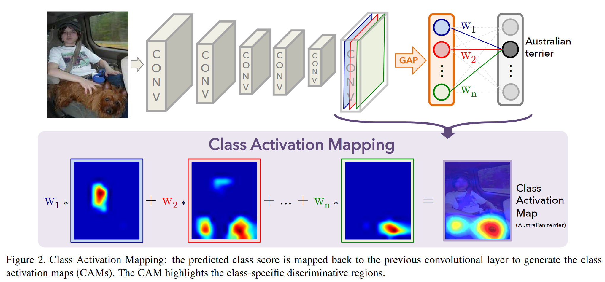
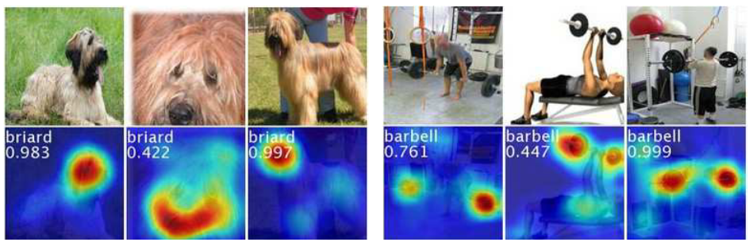
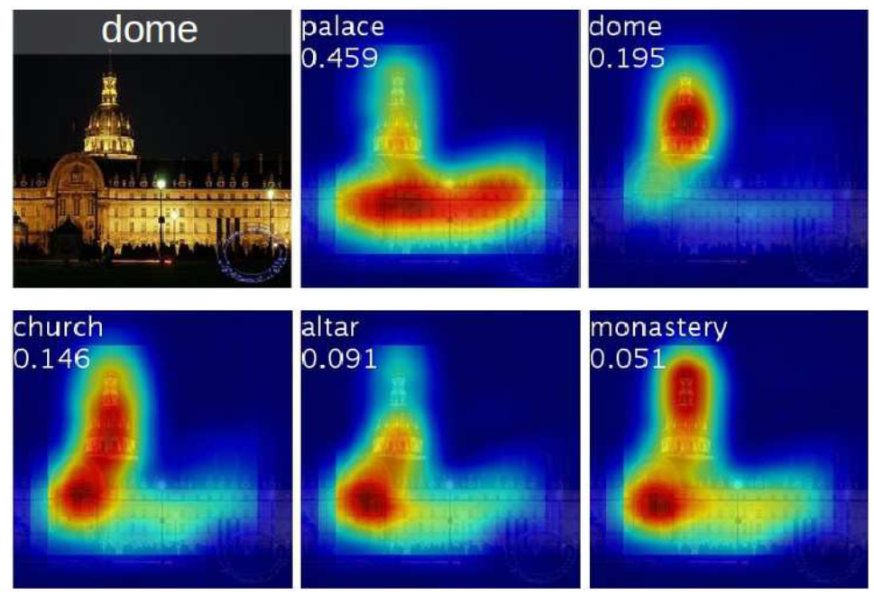

# Learning Deep Features for Discriminative Localization 

[CVPR 2016](https://openaccess.thecvf.com/content_cvpr_2016/html/Zhou_Learning_Deep_Features_CVPR_2016_paper.html)	[code in github](https://github.com/zhoubolei/CAM)

这项工作对于先前工作提出的全局平均池化(GAP)稍作调整，提出了类别注意力图(CAM)，使其能够识别网络在对于某个类别的判别区域

## Introduction 

我们发现全局平均池化层的优势不仅仅是正则化器的作用，秩序稍作调整网络就可以保持其卓越的定位能力直至最后一层。这种调整能够在单个前向传递过程识别各种任务的判别区域。

## Method

全局平均池化输出每个单元在最后一个卷积层的特征图的空间平均值，这些值的加权总和用于生成最终输出，因此我们计算最后一个卷积层的特征图的加权和，以获得我们的类激活图。

对于给定的图像，令$f_k(x,y)$代表空间位置(x,y)处最后一个卷积层中第k个通道的激活，对于第k个通道，全局平均池化的结果$F_k=\sum_{x,y}f_k(x,y)$，因此对于给定的类别c，softmax的输入$S_c=\sum_kw_k^cF_k$，其中$w^c_k$是对应于通道k的c类别的权重。从本质上讲，$w^c_k$表示$F_k$对于类别c的重要性，最终类别c的softmax输出$P_c=\frac{exp(S_c)}{\sum_cexp(S_c)}$。代入后有：
$$
S_c=\sum_kw^c_k\sum_{x,y}f_k(x,y)=\sum_{x,y}\sum_kw^c_kf_k(x,y)
$$
我们定义Mc为类别c的注意力类别图，计算如下L
$$
M_c(x,y)= \sum_k w^c_kf_k(x,y)
$$
因此:
$$
S_c=\sum_{x,y}M_c(x,y)
$$
Mc(x,y)直接表示(x,y)对于类别c的重要性。

#### 全局平均池化(GAP)与全局最大池化(GMP)

我们认为强调GAP与GMP之间的差异很重要，与GMP相比，GAP损失鼓励网络工作识别对象的范围，而GMP鼓励其识别一个判别性的部分。

这是因为在对特征图进行平均时，可以通过查找对象的所有判别部分来最大化该值，所有低激活都会减少特定特征图的输出；而GMP除了最具判别性的区域外，所有图像区域的低激活值不会影响最终的结果。

## Result

各种图像的判别区域被突出显示

使用不同类别生成的CAM的差异

