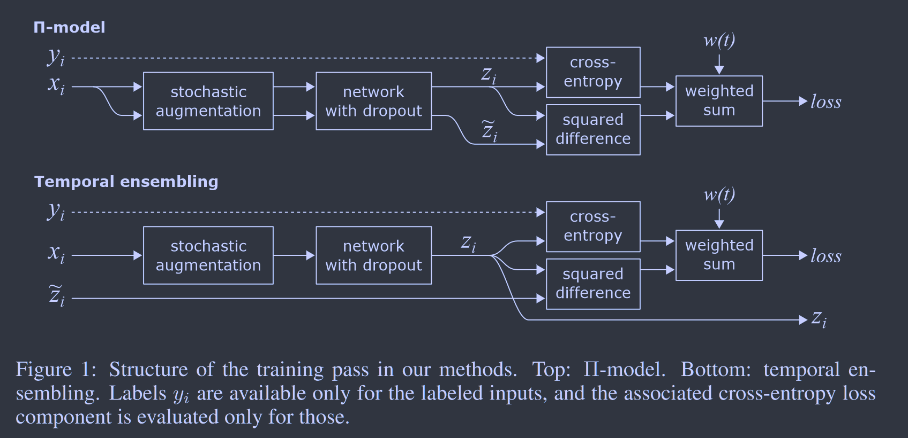
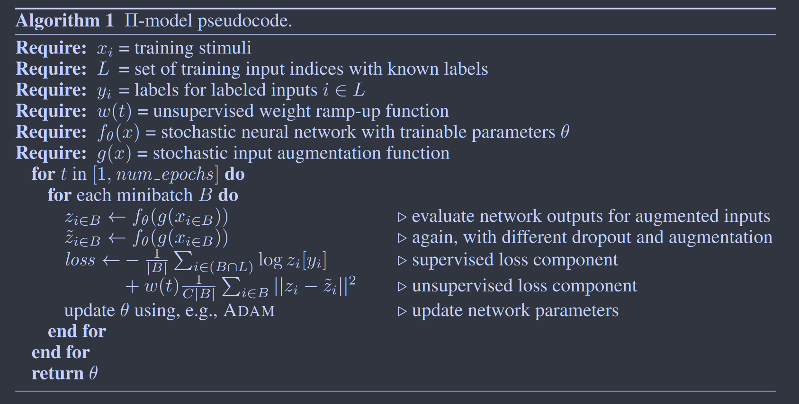

# Temporal Ensembling for Semi-Supervised Learning

**ICLR 2017	no code 	CIFAR10/100  SVHN  Tiny Images**

本文提出了一种基于集成网络的半监督学习方法，给出了两种不同的网络结构，通过有监督和无监督相结合的方式来进行学习，无监督的信号来源于不同的dropout,数据增强策略以及不同的eopch的输出，通过最小化当前输出与先前网络的输出或不同策略的输出，来获得最好的模型

## Introduction 

多个神经网络的集成通常比集成中的单个网络要有更好的预测效果，通过dropout等正则化方法训练单个网络时，训练好的网络可以看作是子网络的隐式集成，这项工作在不同的epoch和不同的正则化以及数据增强条件下集成网络，由于dropout的作用，不同的epoch相当于在多个不同的子网上集成。

我们提出两种实现自集成的方法，Π集成和时序集成

## Method

$\Pi$模型在两种不同的dropout条件下，鼓励在相同输入下形成一致的输出；时序集成通过考虑多个先前训练epoch上的网络预测来简化和扩展模型。

设训练数据由N个输入组成，其中M个输入拥有标签，训练数据记为$x_i \ i\in\{ 1 ... N \}$，集合L为具有标记的输入集合，|L| = M，对于每个$i\in L$，有正确的标签$y_i \in \{1...C\}$，C为不同类别的个数

## $\Pi$-Model

我们对每个训练输入$x_i$通过网络进行两次评估，得到预测输出$z_i,\widetilde{z_i}$。损失分为两部分，第一部分为标准交叉熵损失，仅对具有标签的输入进行评估，第二部分对所有进行评估，通过取两个**预测输出之间的均方误差来惩罚对相同训练输入$x_i$的不同输出**。通过一个时间相关的加权函数w来结合两者。】

由于dropout的作用，网络的输出是一个随机变量，添加高斯噪声和随机平移增强也会导致额外的变化，由于他们是来自于同一个目标，最小化输出预测向量之间的差异是合理的。

在训练时无监督损失训练的分量需要上升的足够慢，否则很容易陷入一个退化的方案。

### Temporal Ensembling

$\Pi$模型是基于单一网络评估的，因此时序集成将多个先前网络的评估预测聚合成一个集成预测，且这种方法在训练是只对网络进行一次评估，获得了更快的速度。

与$\Pi$模型的主要区别在于，每一个epoch每个输入值评估一次网络模型和数据增强模块，无监督损失的目标向量是基于先前网络而不是网络的二次评估输出。

在每个epoch后，通过更新$Z_i \leftarrow \alpha Z_i+(1-\alpha)z_i$将网络输出$z_i$累加到集成输出$Z_i$中，$\alpha$为动量项，最近的epoch要比历史epoch又更大的权重，即$\alpha$要取得小一点