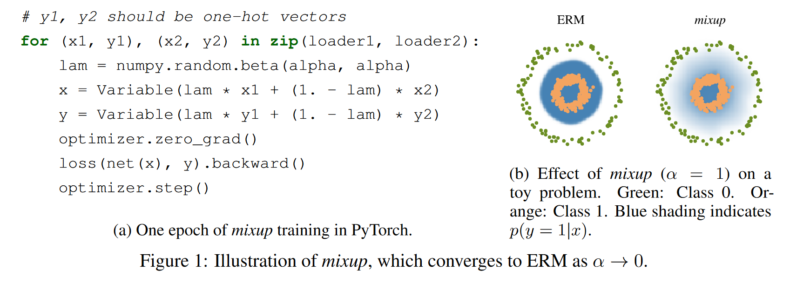
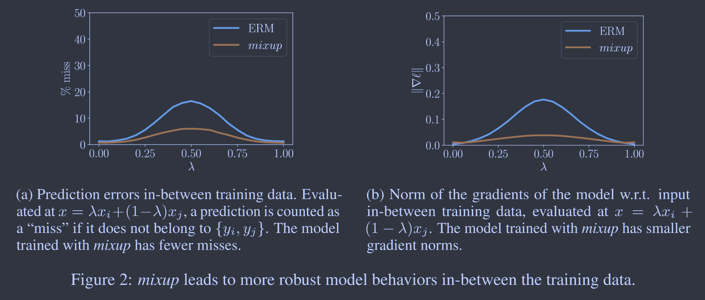
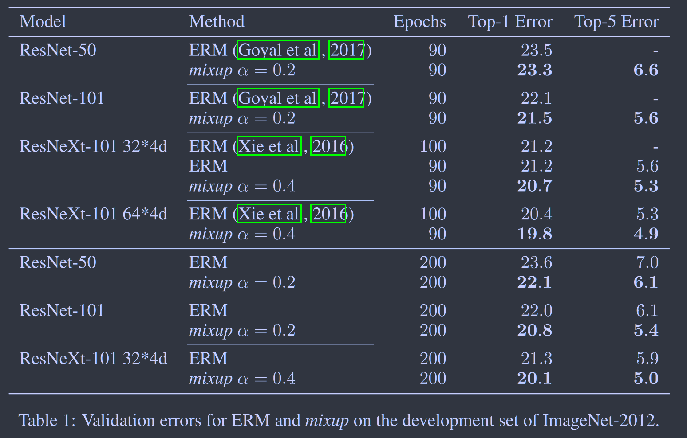

# MixUp: Beyond Empirical Risk Minimization

**[ICLR 2018](https://arxiv.org/abs/1710.09412)	[code in github](https://github.com/facebookresearch/mixup-cifar10)	CIFAR10/100  ImageNet**

*Hongyi Zhang, Moustapha Cisse, Yann N. Dauphin, David Lopez-Paz*

这项工作提出了一项数据增强方法，传统的增强方法是最小化经验风险，依赖于数据集需要专业知识，并且这种方式大型的神经网络可以直接记住训练数据；基于此我们改变优化策略，用最小化临近风险来替代它，提出了一个通用的临近分布mixup，易于实现且能够更有效的提升模型的泛化性能。

## Introduction

目前的神经网络有两个共同点，他们被训练为最小化他们在训练数据上的平均误差，称为经验风险最小化ERM；这些神经网络的规模与训练样本的数量呈线性关系。

ERM允许大型神经网络记住(而不是泛化)训练数据，即使是在存在强正则的情况下；使用ERM训练的神经网络在分布之外的示例上进行评估会极大的改变其预测结果，也称之为对抗性示例。**这一证据表明ERM无法解释或概况与训练数据略有不同的数据分布。What is the alternative to ERM?**

在与训练数据相似但不同的示例上进行训练的选择方法称为数据增强，由附近风险最小化原则VRM形式化。在VRM中需要人类知识来描述训练数据中每个示例周围的邻域，从示例样本周围邻域抽取更多的虚拟样本，以扩大对训练分布的支持。虽然数据增强能提升泛化性，但该过程依赖于数据集，需要专业知识。

受此启发，我们引入了一种简单且数据无关的增强，称为mixup：
$$
\tilde{x} = \lambda x_i + (1-\lambda)x_j \\
\tilde{y} = \lambda y_i + (1-\lambda)y_j
$$
(xi, yi), (xj, yj)为我们从训练数据中随机抽取的两个例子，混合通过整合先验知识来扩展训练分布，即特征向量的线性插值将导致相关目标的线性插值。

## Method

在监督学习中，我们期望找到一个$f\in \mathcal{F}$描述了随机特征向量X和随机目标向量Y之间的关系，他们服从联合分布P（X，Y），我们首先定义一个损失函数$l$来惩罚预测值$f(x)$与实际标签y之间的差异，我们将损失函数$l$的平均值最小化到数据分布P上，称为预期风险：
$$
R(f) = \int l(f(x), y)dP(x, y)
$$
然而大多数情况下分布P是未知的，我们有一组数据$\mathcal{D}\{ (x_i, y_i)\}^n_{i=1}$, 其中$(x_i, y_i) \sim P$，使用训练数据，我们通过经验分布来近似PL
$$
P_\delta(x, y) = \frac{1}{n}\sum^n_{i=1}\delta(x=x_i, y=y_i)
$$
其中$\delta(x=x_i, y=y_i)$是以$(x_i, y_i)$为中心的狄拉克质量，使用经验分布$P_\delta$，我们可以通过经验风险来近似预测风险：

狄拉克函数：
$$
\delta(x) = \begin{cases}
\begin{aligned}
& +\infty &x=0 \\
& 0 &x\leq 0
\end{aligned}
\end{cases} \\
\int^\infty_{-\infty}\delta(x)dx = 1
$$

$$
R_\delta(f) = \int l(f(x), y)dP_\delta(x, y) = \frac{1}{n}\sum^n_{i=1}l(f(x_i), y_i)
$$

通过最小化上式来学习函数f被称为经验风险最小化ERM原则，虽然效率很高但其仅在一组有限的n个样本中监控f的行为，当具有相当多参数的函数（神经网络），一种简单的ERM方法是记住训练数据，而这种记忆会导致训练数据之外f的不良结果。

我们使用附近风险最小化VRM，分布P近似于：
$$
P_{\mathcal{V}}(\tilde{x}, \tilde{y}) = \frac{1}{n}\sum^n_{i=1}\mathcal{V}(\tilde{x}, \tilde{y}|x_i, y_i)
$$
v是一个临近分布，用于衡量在训练特征目标对(xi, yi)附近找到虚拟特征目标对$(\tilde{x}, \tilde{y})$的概率，高斯临近$\mathcal{V}(\tilde{x}, \tilde{y}|x_i, y_i) = \mathcal{N}(\tilde{x}-x_i, \sigma^2)\delta(\tilde{y}=y_i)$相当于添加高斯噪声来增强训练数据，为了使用VRM进行学习，我们对临近分布进行采样构建数据集$\mathcal{D_v}\{ (\tilde{x}, \tilde{y})\}^m_{i=1}$，最小化经验邻域风险：
$$
R_{\mathcal{V}}(f) = \frac{1}{m}\sum^m_{i=1}l(f(\tilde{x}_i), \tilde{y}_i)
$$
**本文的贡献在于提出一个通用的临近分布，称之为mixup：**
$$
\mu(\tilde{x}, \tilde{y}|x_i, y_i) = \frac{1}{n}\sum^n_j \underset{\lambda}{\mathbb{E}}[\delta(\tilde{x}=\lambda ·x_i + (1-\lambda)·x_j, \tilde{y}=\lambda·y_i+(1-\lambda)·y_j)] \\
\lambda \sim Beta(\alpha,\alpha), \ \alpha \in (0, \infty)
$$
简而言之，从混合临近分布中采样会产生虚拟特征目标向量：
$$
\tilde{x} = \lambda x_i + (1-\lambda)x_j \\
\tilde{y} = \lambda y_i + (1-\lambda)y_j
$$
混合超参数$\alpha$控制插值强度，$\alpha \rightarrow 0$退化为ERM

## Result

