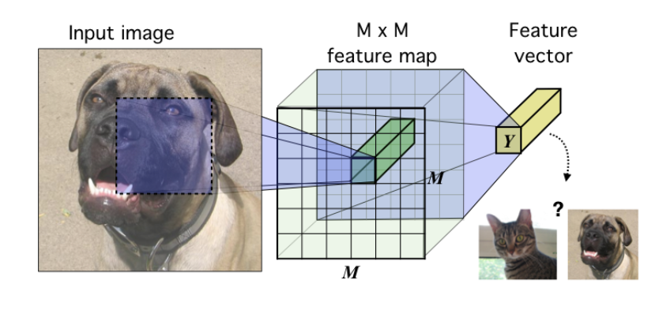

# Learning deep representations by mutual information estimation and maximization

AAAI 2019 

## Introduction 

--

## Method

设$\mathcal{X}, \mathcal{Y}$是连续且可微的参数函数$E_{\psi}:\mathcal{X}\rightarrow \mathcal{Y}$的域和范围，参数为$\psi$， 参数$\Psi$定义了一系列编码器$\mathcal{E}_\Phi = \{ E_{\psi}\}_{\psi\in \Psi}$。假设我们在输入空间$\mathcal{X}:X=\{ x^{(i)}\in \mathcal{X} \}^N_{i=1}$得到一组经验概率分布为$\mathbb{P}$的训练样本，我们将$\mathbb{U}_{\psi, \mathbb{P}}$定义为将样本从$\mathbb{P}$推到$E_{\psi}$的边际分布，也就是说，$\mathbb{U}_{\psi, \mathbb{P}}$是通过观测值$x \sim \mathcal{X}$进行采样，然后对$y\sim E_{\psi}(x)$进行采样而产生的编码$y\in \mathcal{Y}$上的分布。

### Mutual Information Estimation and Maximization

What is J and M?  Need to read previous work MINE.

### Local Mutual Information Maximization

