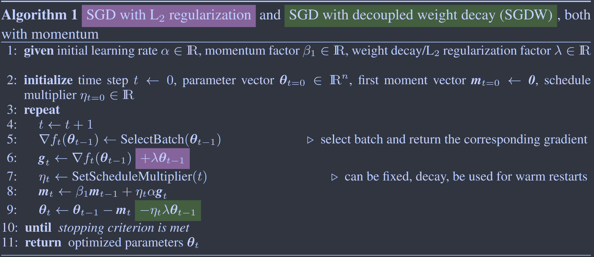
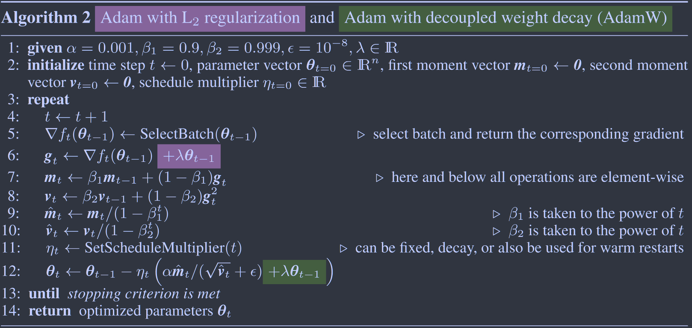
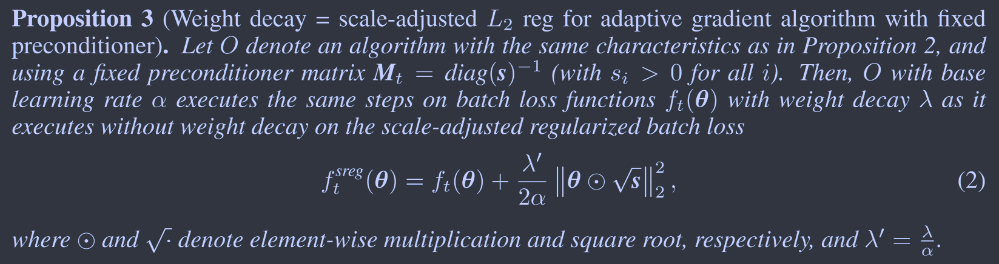
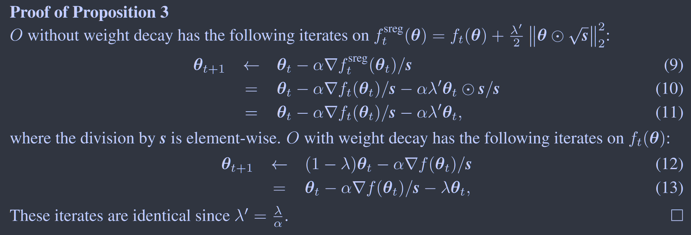

# Decoupled Weight Decay Regularization

这项工作区分了L2正则化与权重衰减的区别，指出在标准的随机梯度下降，L2正则化与权重衰减是等价的，但是在自适应梯度算法中并非如此，提出了一种权重衰减的解耦策略，将权重衰减系数与SGD和Adam的学习率解耦，提高了其泛化性能。

## Introduction 

## Method

在1988提出的权重衰减中，描述为：
$$
\theta_{t+1} = (1-\lambda)\theta_t - \alpha\nabla f_t(\theta_t)
$$
$\lambda$定义了每一步权重衰减的速率，$\nabla f_t(\theta_t)$是第t批次的梯度，$\alpha$为学习率。对于标准SGD，其等价于L2标准化

### Proposition 1 	Weight decay = L2 reg for standard SGD

学习率为$\alpha$的标准SGD，对具有权重衰减$\lambda$的$f_t(\theta)$优化步骤与不具有权重衰减的$f^{reg}_t(\theta) = f_t(\theta) + \frac{\lambda'}{2}||\theta||^2_2, \lambda' = \frac{\lambda}{\alpha}$优化步骤相同。

#### Proof 1:

$$
\nabla f^{reg}_t(\theta) = \nabla f_t(\theta) + \lambda' \theta \\
\theta_{t+1} = \theta_{t} - \alpha( \nabla f_t(\theta) + \lambda' \theta) = (1-\alpha\lambda')\theta_t - \alpha \nabla f_t(\theta) \\
when\ \lambda' = \frac{\lambda}{\alpha},\ \theta_{t+1} = (1-\lambda)\theta_t - \alpha\nabla f_t(\theta_t)
$$

由于这种等价性，L2正则化被非常频繁的称之为权重衰减，我们要证明在自适应梯度方法中这种等价性并不成立，对于SGD的简单情况，这种等价性我们经常忽视他的条件$\lambda' = \frac{\lambda}{\alpha}$，即如果存在**一个最佳的权重衰减参数$\lambda$，他的L2正则化参数$\lambda'$是与学习率紧密耦合在一起的**，我们想要解耦这两个超参数的影响。

### Proposition 2	Weight decay $\pmb{\neq}$ L2 reg for adaptive grad

令O表示在无权重衰减的批次损失函数$f_t(\theta)$上运行迭代$\theta_{t+1} \leftarrow \theta_t - \alpha M_t\nabla f_t(\theta_t)$，和在有权重衰减运行迭代$\theta_{t+1} \leftarrow (1-\lambda)\theta_t - \alpha M_t\nabla f_t(\theta_t)$的优化。则不存在L2系数$\lambda'$使得在带无权重衰减的损失函数$f^{reg}_t(\theta) = f_t(\theta) + \frac{\lambda'}{2}||\theta||_2^2$上运行O等价于在带有权重衰减的$f_t(\theta)$上运行O。

#### Proof 2:

$$
\nabla f^{reg}_t(\theta) = \nabla f_t(\theta) + \lambda' \theta \\
\theta_{t+1} = \theta_{t} - \alpha M_t( \nabla f_t(\theta) + \lambda' \theta) = (1-\alpha M_t\lambda')\theta_t - \alpha M_t\nabla f_t(\theta) \\
due\ to\ M_t \neq k\mathbf{I}, k\in \R, no\ \lambda'\ make\ the\ equation\ valid.
$$

### Proposition 3	Weight decay = scale-adjusted L2 reg for adaptive gradient algorithm with fixed preconditioner

#### Proof 3:

