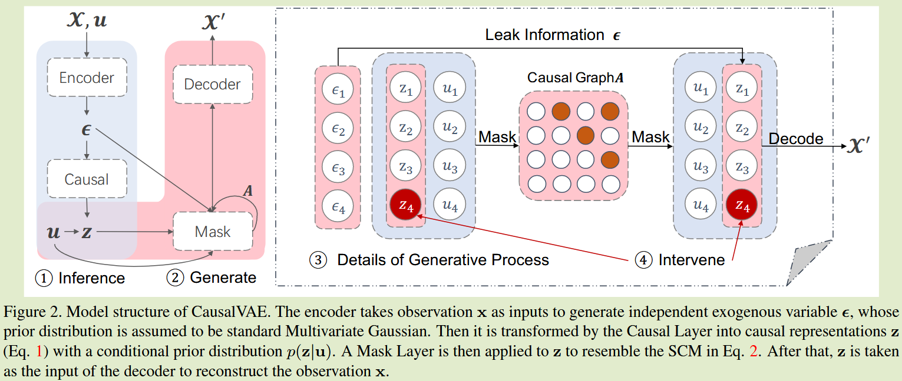

# CausalVAE: Disentangled Representation Learning  via Neural Structural Causal Models

**[2021 CVPR](https://openaccess.thecvf.com/content/CVPR2021/html/Yang_CausalVAE_Disentangled_Representation_Learning_via_Neural_Structural_Causal_Models_CVPR_2021_paper.html)	no code	CelebA	20241105**

本文提出利用因果矩阵来改进VAE的方法，基于贝叶斯原理和贝叶斯变分法，似乎对我的研究没什么帮助

## Introduction 

解耦表示学习最常见的框架之一为变分自动编码器。现有的解耦表示学习都有一个假设，即现实世界的观察是可数的独立因素产生的，而我们认为许多现实世界的应用中，具有兴趣语义的潜在因素是因果相关的，我们需要一个因果解耦的新框架。

我们提出一种新的结构因果模型层，提出一个基于VAE的因果模型解耦表示学习框架，它使我们能够通过因果DAG（有向无环图）恢复具有语义和结构的潜在因素，输入信号通过编码器获得独立的外生因素，通过因果层生成因果表示，解码器采用该因果表示来重建原始输入。

- 我们提出一个新框架支持因果解耦
- 提供了模型的可识别性和理论论证
- 对合成和真实人脸进行了全面实验，来证明学习的因素具有因果语义

## Method

因果层本质描述了结构因果模型SCM引入到传统的VAE网络

### 将独立的外生因素转化为因果表征

我们考虑了数据中感兴趣的n个概念，由具有邻接矩阵的有向无环图A（DAG）构成因果关系，虽然非线性SCM是首选，但是为了简单起见我们选择线性的SCM来实现因果层：
$$
z = A^Tz + \epsilon = (I-A^T)^{-1}\epsilon, \epsilon \sim N(0, I)
$$
A表示因果层需要学习的参数矩阵，$\epsilon$为独立的外生因素，z表示由DAG生成的n个概念结构的因果化表示，因此其可以排列成一个严格的上三角矩阵。

先前工作证明无监督学习可能是不可行的，因此采用与真实因果概念相关的附加信息u作为监督信号，我们通过两种方式利用这部分信息，我们提出一个条件先验概率$p(z|u)$来正则化z的学习后验，这保证了学习的模型是可识别的，我们还利用u的信息来学习因果结构A。

### 结构因果模型层

获得因果表示z后，通过掩码层来重建自身，它描述了子项如何由其相应的父变量生成，设zi为向量中第i个变量，与因果图关联的邻接矩阵为$A = [A_1|...|A_n]$，其中$A_i \in \R^n$为权重向量，表征从zj到zi的因果强度，我们有一组温和的非线性可逆函数$[g_1, g_2, ..., g_n]$，将父变量映射到子变量，有：
$$
z_i = g_i(A_i\circ z;\eta_i) + \epsilon_i
$$
$\circ$为元素乘法，$\eta_i$为gi的参数，由于我们假设其为线性函数，可以简单写为$z_i = A^T_iz + \epsilon_i$，然而我们发现一个更温和的非线性函数gi会导致更稳定的性能

### 因果VAE的概率生成模型

我们给出了所提出的生成模型的概率公式，$x\in\R^d$表示观察到的变量，$u\in \R^n$表示附加信息，ui表示数据中第i个感兴趣概念的标签

设$\epsilon\in \R^n, z\in \R^n$分别为潜在外生变量和潜在内生变量，其语义表示为$z = A^Tz + \epsilon = (I-A^T)^{-1}\epsilon$，为了表示方便，令$C = (I-A^T)^{-1}$，考虑由$\theta = (f, h, C, T, \lambda)$参数化的条件生成模型：
$$
p_\theta(x, z, \epsilon|u) = p_\theta(x|z, \epsilon, u)p_\theta(\epsilon, z|u)
$$
设$f(z), h(x, u)$表示为可逆函数的解码器和编码器，我们定义生成和推理模型：
$$
p_\theta(x|z,\epsilon, u) = p_\theta(x|z) \equiv p_\xi(x - f(z)) \\
q_\Phi(z, \epsilon|x, u) \equiv q(z|\epsilon)q_\zeta(\epsilon - h(x, u))
$$
其中：
$$
x = f(z) + \xi \\
\epsilon = h(x, u) + \zeta
$$
$\xi,\zeta$分别表示相互独立的随机噪声向量，z与$\epsilon$的联合先验分布表示为：
$$
p_\theta(\epsilon, z|u) = p_\epsilon(\epsilon)p_\theta(z|u)
$$
$p_\epsilon(\epsilon)$为标准概率分布。
$$
p_\theta(z|u) = \prod^n_ip_\theta(z_i|u_i);\ p_\theta(z_i|u_i) = N(\lambda_1(u_i), \lambda^2_2(u_i))
$$
