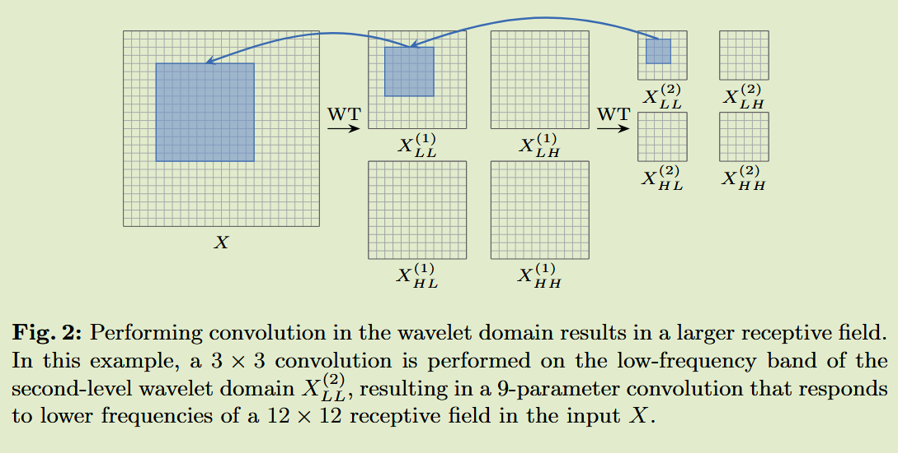
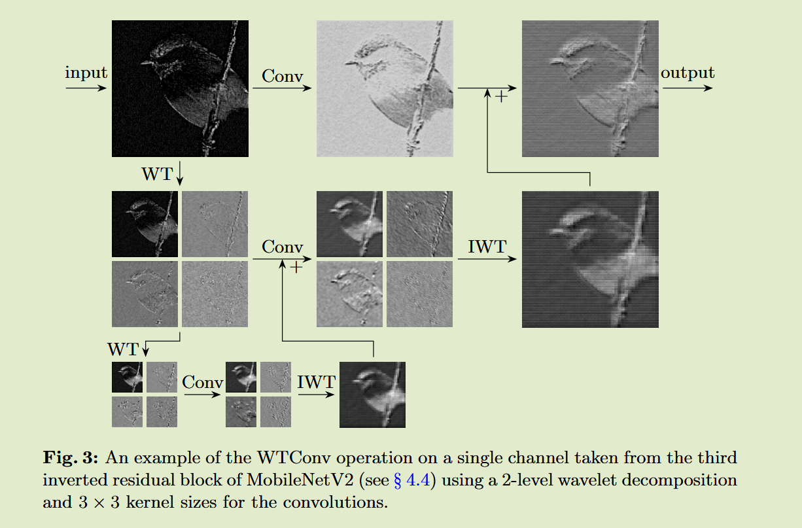

# Wavelet Convolutions for Large Receptive Fields

[2024 ECCV](https://arxiv.org/abs/2407.05848)	[code in github](https://github.com/BGU-CS-VIL/WTConv)	ImageNet ADE20k  COCO	20241104

Shahaf E. Finder, Roy Amoyal, Eran Treister, Oren Freifeld

本文提出了通过小波变换来增大卷积感受野的方法，先前扩大卷积和的方法会在实现全局感受之前就达到饱和，并且会增加很多参数，本文通过多级小波变换，对分解后的层进行叠加来施加一个较小的卷积核，来实现扩大感受野的目的。

## Introduction

现在人们认为ViT优于CNN的优势主要归因于其多头自注意力层，该层有助于特征的全局混合，有些工作试图增加卷积神经网络的内核大小来模拟ViT自注意力模块的全局感受野，但这在实现全局感受野之前很早就达到了饱和，我们证明了通过小波变换可以获得非常大的感受野而不会受到过参数化的影响。

研究发现使用更大的卷积核会使CNN更加偏向于提取形状信息，也就是倾向于低频信息，而卷积层通常倾向于对输入的高频信息做出反应。基于此我们希望利用图像处理工具有效的增加卷积的感受野，而不增加过拟合的风险，我们利用小波变换来使感受野很好的扩大，使用级联小波变换分解并执行一组小卷积核的层，每个卷积核都集中在越来越大的感受野中的不同频带中。

- 提出通过小波变换来有效的增加卷积的感受野
- WTConv旨在成为CNN的替代品

## Method

增加卷积核的大小会以二次方增加参数的数量，因为我们提出：使用WT对输入的低频和高频内容进行过滤和缩小，然后在使用IWT重建输出之前，对不同频率图进行小核深度卷积：
$$
Y= IWT(Conv(W, WT(X)))
$$
卷积通道数是X的四倍：
$$
X^{(i)}_{LL}, X^{(i)}_{H} = WT(X_{LL}^{(i-1)}) \\
Y^{(i)}_{LL}, Y^{(i)}_{H} = Conv(W^{(i)}, (X^{(i)}_{LL}, X^{(i)}_H))
$$
LL层表示低频层，H表示三个水平方向、垂直方向和对角方向的高频层，为了组合不同频率的输出，我们使用WT以及其逆运算为线性运算的事实，即$IWT(X+Y) = IWT(X) + IWT(Y)$，执行；
$$
Z^{(i)} = IWT(Y^{(i)}_{LL} + Z^{(i+1)}, Y^{(i)}_H)
$$
其中Zi为从级别i开始的聚合输出

我们不能对小波变换后的通道进行归一化处理，因为这与原始域中的归一化并不一样，我们通过通道缩放来衡量每个频率分量的贡献

- WT的每一级都会增加感受野的大小，而参数只是略微增加
- WTConv层比标准卷积更能捕获低频，因为对于低频部分的重复小波变换分解，强调并增加了对这部分的响应