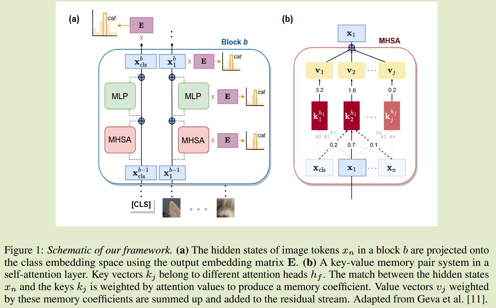

# Analyzing Vision Transformers for Image Classification in Class Embedding Space

**[2024 NeurIPS](https://proceedings.neurips.cc/paper_files/paper/2023/hash/7dd309df03d37643b96f5048b44da798-Abstract-Conference.html)	[code in github](https://github.com/martinagvilas/vit-cls_emb)	ImageNet	20241017**

*Martina G. Vilas, Timothy Schaumlöffel, Gemma Roig*

提出了一种对MLP和MHA的解耦策略，将其看作是键值的乘积，将MLP和MHA分解后的矩阵看作是对隐藏层重要因素的表达

## Introduction

目前还没有类似的方法能够应用于逆向工程ViT中进行图像分类，我们引入一种方法，将这些网络的中间表示和参数矩阵投影到类嵌入空间来表征这些网络的分类构建过程，我们的方法表明：

- 模型早期训练阶段，图像token越来越与类原型表示保持一致
- 注意力机制和上下文信息在这种一致性中发挥作用
- 类别构建过程部分依赖于自注意力和MLP层之间的差异
- 我们讨论了如何使用该框架来识别图像中最有利于构建类表示部分
- 我们证明我们的方法比线性探测方法能更高效、更准确的表征图像中类表示的出现

## Method

为了研究ViT中类表示是如何产生的，我们分析token中间表示与最终的投影矩阵E编码的类原型之间的对齐关系，输入$x_i^b\in \R^d$，则第i个token中间表示的类分布$p^b_i = E·x^b_i\in \R^{|C|}$

为了量化对齐，我们评估了第j幅图像的正确类别cj是如何从第i个token中恢复的，定义类别可识别性的度量：
$$
r^j_i = 1 - \frac{argwhere(argsort(p_i) = c_j)}{|C|}
$$
argsort将分配的每个类的logits进行从高到低的排序，argwhere返回排序后满足条件的索引序号。当分配正确时则排序后序号0的位置应为cj，此时$r^j_i = 1 - 0 = 1$为最大，正确类的logits最大

#### 参数空间投影和键值记忆对

先前研究表明，学习到的Transformer参数可以投入到输出向量空间，用作反向工程。这些研究进一步提出，参数矩阵可以解释为实现键值记忆对机制的系统，以更好地理解模型输入与其预测之间的映射关系。

如上图b所示，键值记忆由j个成对向量$M = {(k_1, v_1), ..., (k_j, v_j)}$组成的集合，键ki用于量化输入中存在的一组模式，值vi表示检测到该模式后应如何修改输入。
$$
MLP(X) = GELU(XW_{inp})W_{out}
$$
$X \in \R^{n\times d}$表示n-token输入，每个token的维数为d，$W_{inp} \in \R^{d\times |M|}, W_{out} \in \R^{|M|\times d}$表示参数矩阵，主要思想是将Winp的列和Wout的行看作是一对键值匹配，矩阵中元素ij包含由token i 和 key j点积得到的系数，该矩阵衡量隐藏层中某些模式的存在。

Wout表征了应该如何变化来响应这种模式的检测，为了修改网络隐藏层，将键值记忆的加权值向量求和并加入到残差中

**对于自注意力层**，在对隐藏层表示xi时，自注意力可以认为是实现了一个键值记忆对的系统，key不仅检测xi中存在的某种模式，还检测序列S中所有其他令牌的隐藏状态，一个token与key的系数由xi和一个自注意力头中所有令牌之间的注意力值加权得到：
$$
MHSA(X) = hconcat[A^1XW^1_{V_{attn}}, ..., A^fXW^f_{V_{attn}}]W_{out}
$$
其中$A_h\in \R^{n\times n}$是第h个头的注意力权重，f为头的个数，$W^h_{V_{attn}} \in \R^{d \times \frac{d}{f}}$，水平级联的输出是一个维数为$n\times |M|, |M| = d$的矩阵，然后与包含值向量的$W_{out} \in \R^{|M|\times d}$相乘，**我们可以说每个注意力头的矩阵$W^h_{V_{attn}}$代表了系统的关键向量**