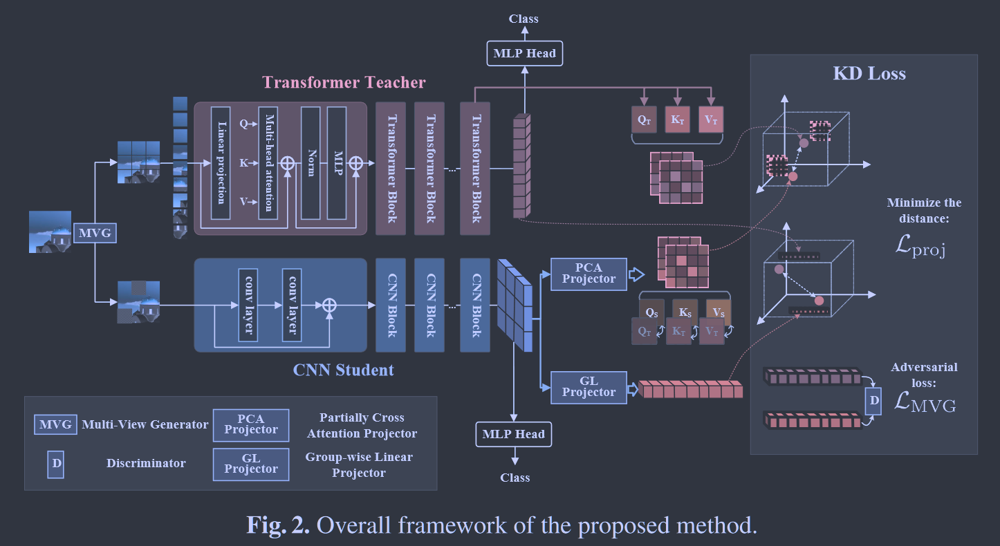

# Cross-Architecture Knowledge Distillation

**[ACCV 2022 CCF-C](https://openaccess.thecvf.com/content/ACCV2022/html/Liu_Cross-Architecture_Knowledge_Distillation_ACCV_2022_paper.html)	no code	CIFAR ImageNet	20240607**

这项工作提出了一个跨架构的蒸馏方案，将Transformer的知识传递给CNN网络，提出部分交叉注意力层和分组线性层来促进师生模型特征之间的可转移性，为了使模型更加鲁棒，还提出一个多视角的鲁棒训练方案，引入多种数据增强手段来提升学生学生的鲁棒性。

- 将Transformer知识转移到CNN中，提出部分交叉注意力投射层和分组线性投射层来映射学生特征使之与教师特征更相似
- 提出一个多视角的增强方案，增加学生网络的鲁棒性

## Introduction

随着加速技术的发展以及Transformer的出色性能，将Transformer的知识转移到紧凑的CNN的架构成为一种很自然的想法，然而这种跨架构的情况其余弦相似度很低，可迁移性较差，如何跨架构提取有用的知识是一个具有挑战性的问题。

这项工作提出一个跨架构知识蒸馏方法来弥合Transformer与CNN之间巨大的差距，他鼓励学生模型从原始的CNN模型学习局部空间特征和从Transformer教师模型中学习全局特征，设计了两个投影层，部分交叉注意力投影层(Partially Cross Attention, PCA)和分组线性投影层(Group-wise Linear, GL)

为了缓解跨架构蒸馏的不稳定性，还提出一种鲁棒训练方案，生成多视角样本对学生网络进行扰动，构建多视角对抗判别器，区分教师特征和受干扰的学生特征。

- 提出一个跨架构知识蒸馏框架，提炼Transformer知识来指导CNN，提出部分交叉注意力层和分组线性层来促进师生特征之间的可转移性
- 提出一个多视角的鲁棒训练方案，来提高学生网络的稳定性和鲁棒性
- 所提出方法在各种规模数据集上均优于14种技术

## Method

### Framework

上层粉色网络为Transformer教师网络，下称蓝色网络表示CNN学生网络，对于教师网络$\Theta^T$，输入样本$x\in\R^{3\times H\times W}$被切分为N个patches$\{x_n\in\R^{3\times h\times w}\}^N_{n=1}, N=\frac{HW}{hw}$，对几个transformer block推理之后得到教师特征$h_T\in\R^{N \times (3hw)}$，经过MLP计算得到概率分布；对于学生模型$\Theta^S$，接收整个图像，经过几个CNN块推理之后得到学生特征$h_S\in\R^{c \times (h'w')}$，c表示通道号，$h'w'=\frac{HW}{2^{2s}}$，s表示CNN级数（通常为4）。

由于架构的差异直接进行知识迁移并不可行，我们提出了跨架构投影层，由部分交叉注意力投影层PCA和分组线性投影层GL组成。

### Cross-Architecture Projector

#### Partially Cross Attention Projector

PCA投影层将学生特征空间映射到Transformer 注意力空间，将CNN特征映射到QKV矩阵中来模拟注意力机制，由三个$3\times 3$卷积组成：
$$
\{ Q_S, K_S, V_S\} = Proj_1(h_S) \tag{1}
$$
$Q_S, K_S, V_S$来对齐教师的QKV矩阵，学生的自注意力计算公式为：
$$
Attn_S = softmax(\frac{Q_S(K_S)^T}{\sqrt{d}})V_S \tag{2}
$$
最小化师生注意力图之间的距离来指导学生网络，为了进一步提升鲁棒性，我们构建学生的部分交叉注意力来代替原始的Attns：
$$
\begin{aligned}
& PCAttn_S = softmax(\frac{g(Q_S)(g(K_S))^T}{\sqrt{d}})g(V_S) \\
& s.t.\ g(M_S(i, j)) = 
\begin{cases}
M_T(i, j),\ p\geq0.5\\
M_S(i, j),\ p<0.5
\end{cases},(M=Q, K, V)

\end{aligned}	\tag{3}
$$
(i, j)表示M的矩阵元素索引，函数g(·)以p概率将学生QsKsVs替换为教师对应的矩阵，p服从均匀分布，损失函数为：
$$
\mathcal{L}_{proj1} = ||Attn_T - PCAttn_S||^2_2 + ||\frac{V_T·V_T}{\sqrt{d}} - \frac{V_S·V_S}{\sqrt{d}}||^2_2	\tag{4}
$$

#### Group-wise Linear Projector

组线性投影同样将学生特征映射到Transformer特征空间，由若干个共享权重的全连接层组成：
$$
h'_s = Proj_2(h_S) \in \R^{N\times (3hw)}	\tag{5}
$$
h's被对齐为与教师特征hT相同的维度，对于$224\times 224$的图像输入，维度为$h_S\in \R^{256\times 196}, h'_S\in\R^{196\times768}$，此时投影层需要196个FC层，每个有$256\times 768$个参数，这引入了大量的计算负担，为了获得更紧凑的投影层，提出分组线性投影，$4\times 4$的邻域共享一个FC层，此时GL投影层只包含16个FC层，我们还引入了dropout来减少计算量提高鲁棒性：
$$
\mathcal{L}_{proj_2} = ||h_T - h'_S||^2_2 \tag{6}
$$

### Cross-view Robust Training

由于师生架构之间存在巨大差异，为了提高学生网络的鲁棒性和稳定性，提出一种交叉视图的鲁棒训练方案，包括多视图生成器MVG和多视图对抗判别器。

MVG以原始图像为输入，以一定概率生成具有不同变换的图像：
$$
\tilde{x} = MVG(x) = 
\begin{aligned}
\begin{cases}
Trans(x), &p \geq 0.5 \\
x, &p <0.5
\end{cases}
\end{aligned}	\tag{7}
$$
Trans(·)包括常见的变换，（色彩变换、随即裁剪、旋转、分块掩码等）,概率p服从均匀分布，将变换后的图像输入到学生网络，构建多视角对抗判别器来区分教师特征hT和转换后的学生特征h‘S，该判别器由三层FC网络组成，跨视图鲁棒训练的目标是混淆判别器并获得鲁棒的学生特征，判别器训练损失为：
$$
\mathcal{L}_{MAD} = \frac{1}{m}\sum^m_{k=1}[-logD(h_T^{(k)}) - log(1-D(h_S^{'(k)}))] \tag{8}
$$
D(·)表示多视图对抗判别器，m是训练样本的总数，学生网络的损失：
$$
\mathcal{L}_{MVG} = \frac{1}{m}\sum^m_{k=1}[log(1-D(h_S^{'(k)})] \tag{9}
$$
最小化该损失有助于生成与教师特征更相似的特征

### Optimization

学生网络的总体损失：
$$
\mathcal{L}_{total} = (\mathcal{L}_{proj_1} + \mathcal{L}_{proj_2}) + \lambda·\mathcal{L}_{MVG}  \tag{10}
$$
