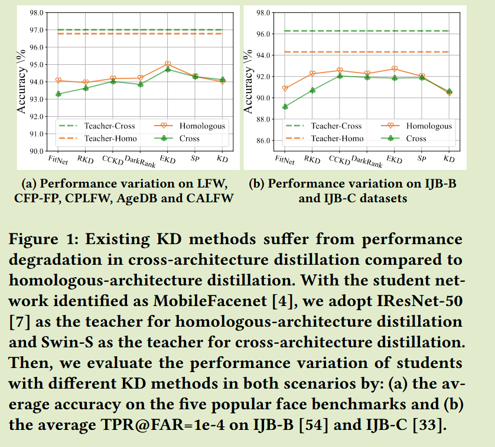
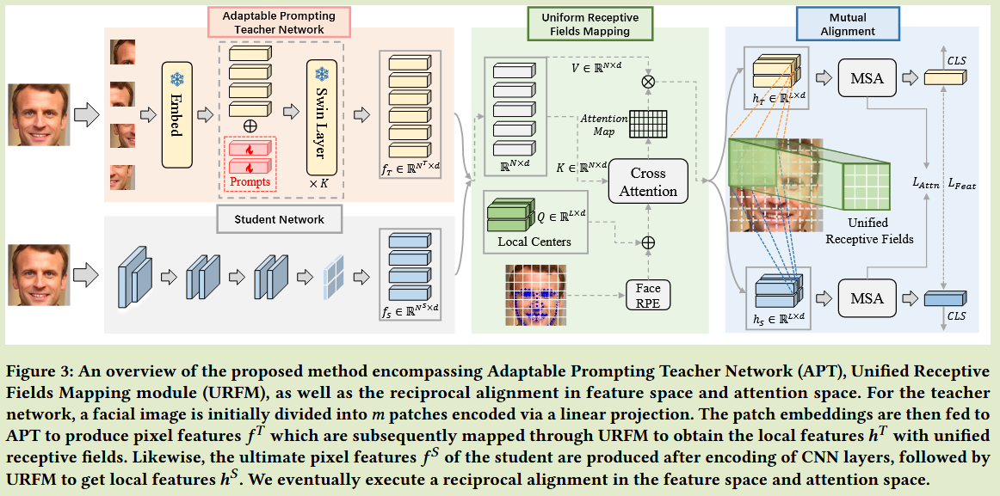
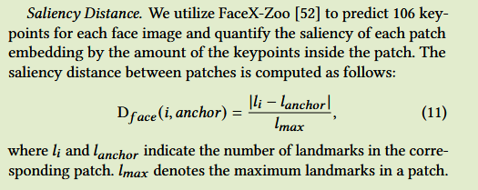
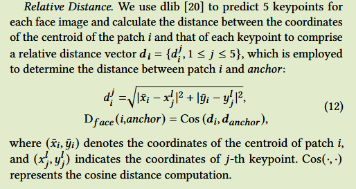

# Cross-Architecture Distillation for Face Recognition

[2023MM](https://dl.acm.org/doi/10.1145/3581783.3611711)	no code	MS1MV2	20250218

本文提出了一种将Transformer特征迁移到CNN的方案，通过将TR模型和CNN模型都映射到相同的局部特征空间中进行特征的对齐，具体是引入一组可学习的通道数为L的中心特征向量来实现特征的映射。

## Introduction

现有的KD技术主要集中与同源结构蒸馏（CNN to CNN），Transformer模型在各种视觉任务中表现处非凡的能力，但其高计算要求和对平台加速的支持不足阻碍了在移动设备的部署；而CNN具有硬件友好的加速库。

目前的KD方法忽略了教师和学生网络之间的架构差异，导致Transformer to CNN的性能要低于CNN to CNN。

我们计算了从同源架构到交叉架构场景下不同方法的性能变化，大多数方法在跨架构场景存在性能下降的问题。

跨架构蒸馏主要有两大挑战：

- 师生网络在像素级感受野方面存在显著的结构差异，教师网络为滑动窗口的注意力机制，学生网络为卷积操作。
- 教师网络对蒸馏知识的管理，需要一个辅助模块，能够管理蒸馏特定的知识，并且保持其判别能力

我们提出：

- 统一感受野映射模块 URFM，将教师和学生模型的像素特征映射为具有一致感受野的局部特征。
- 开发了一个可适应的提示教师网络APT，使其能够管理蒸馏特定的知识

## Method

#### Framework

教师模型为Swin Transformer，学生模型为卷积神经网络。

教师网络经过APT抽取特征$f^T\in \R^{N^T\times d}$输入到URFM模块中，得到具有统一像素感受野的局部特征$h^T\in \R^{L\times d}$；学生网络经过CNN编码$f^S\in \R^{N^S\times d}$通过URFM得到局部特征$h^S \in \R^{L\times d}$。最后我们在教师网络和学生网络的注意力空间和特征空间上进行了相互对齐：
$$
L_{Attn} = MSE(Attn_T, Attn_S) \\
L_{Feat} = MSE(MSA(h^T) - MSA(h^S))
$$
$Attn_T Attn_S$分别表示教师和学生的最终注意力图，MSE表示均方误差，MSA表示多头自注意力。

#### Adaptable Prompting Teacher APT

考虑到教师模型在训练时不知道学生模型的能力，一个解决方案是让教师进行蒸馏优化。在教师中插入提示，使其能够在保留模型判别能力的同时管理蒸馏的特异性知识。

Transformer的骨干网络由预训练的模型初始化，并保持冻结，在蒸馏过程中只有提示进行优化，提示只插入到每个Transformer的基本层，第i层Transformer补充的提示token为一组d维向量，记为$p_i = \{p^i_j \in \R^d|1\leq j \leq t\}$，APT前向过程描述为：
$$
[\hat{x}_{i+1}, \hat{p}_{i+1}] = B_i([\tilde{x}_i, p_i]) \\
[\tilde{x}_{i+1}] = PM([\hat{x}_{i+1}]) \\
[\hat{x}_{i+2}, \hat{p}_{i+2}] = B_{i+1}([\tilde{x}_{i+1}, p_{i+1}]) \\
[f] = [\hat{x}_K, \hat{p}_K]
$$
B表示Transformer的基本层，PM表示块合并操作，在计算窗口偏移注意力时将提示作为基本组成部分，而在patch合并时忽略提示token。在后续层中，初始化新的提示p向量插入到输入中， 作为后续层的基本输入，最后将第k层的输出进行堆叠和拼接，作为师生模型的像素特征f

#### Unified Receptive Fields Mapping URFM

URFM模块的主要目的是将主干提取的像素特征映射为具有统一感受野的局部特征，

- 自注意力模块SA通常保持数量相同的输入和输出token，但教师和学生网络一般具有不同数量的像素特征，阻碍了特征空间的对齐
- 原始的位置编码只考虑了token之间的空间距离，而忽略了token中面孔（人脸识别）的结构变化

因此提出的URFM通过使用可学习的查询向量和面部位置编码来修改SA缓解这些问题。*（URFM中Local Center应为可学习参数）*

在我们的设定中，QK的数量不一定相等，因此提出绝对位置编码来用于查询：
$$
e_{ij} = \frac{(f_iW_q+b_i)(f_jW_k)^T}{\sqrt{d}}
$$
其中$b_i$表示块i的绝对位置参数索引：
$$
b_i= P[I(D(i, anchor))]
$$
I表示指标函数，这里选择PIF（ICCV 2021 一种Transformer的相对位置编码）作为指标函数，P表示随机初始化的参数桶，D()表示块i与锚点的位置距离度量，常见方法是通过欧氏距离度量。

在面部识别任务中，我们提出将面部结构距离融入到位置编码中：
$$
D(i, anchor) = \tilde{D}(i, anchor) + \gamma·D_{face}(i, anchor)
$$

#### Facial Structure Distance  面部结构距离

##### 显著性距离

##### 相对距离

