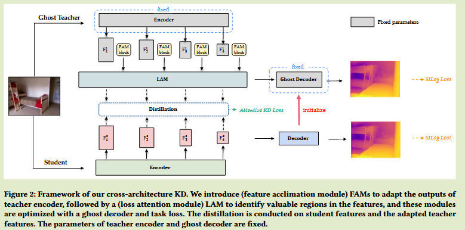
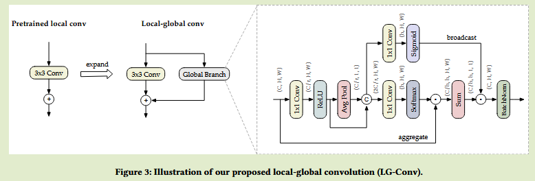
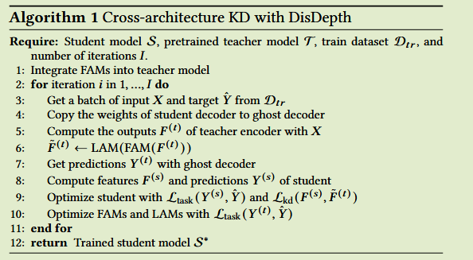
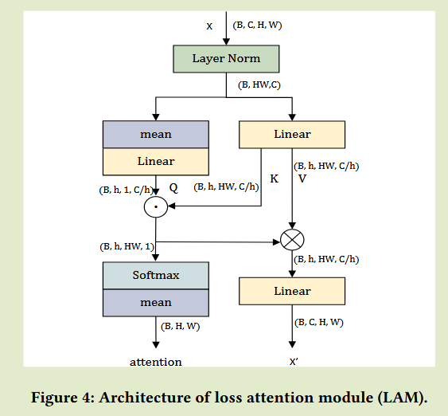
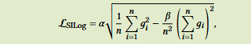

# Promoting CNNs with Cross-Architecture Knowledge Distillation for Efficient Monocular Depth Estimation

2024arXiv	no code	KITTI NYU-Depthv2	20250219

本文提出一种跨架构的蒸馏方法，首先在卷积学生模型中提出一种局部-全局卷积来模拟Transformer的全局自注意力机制；并且认为教师知识可以分为架构内知识和任务知识，前者学生模型由于能力问题无法模仿而后者则可以轻松学习，提出幽灵解码器，将学生模型解码器的副本作为教师解码器并结合可学习特征调整模块FAM对教师进行微调，以便更好对齐师生模型特征；最后提出损失注意力模块，对教师特征进行选择，筛选处更具有价值的模型进行蒸馏。

## Introduction

为了将性能更佳的Transformer架构单目深度估计MDE模型用于边缘设备中，本文提出一种跨架构的知识蒸馏方法，将Transformer特征调整并提取到CNN中。

我们认为Transformer中自注意力的作用是在token之间聚合和全局广播信息。

- 我们提出一个简单的CNN框架用于MDE，提出局部-全局卷积模块来增强全局表示
- 提出一种跨架构蒸馏方法，有效抑制架构的内在信息，并调整Transformer教师特征中与任务相关的信息，以便于更好的蒸馏给CNN学生

## Method

#### Enhanced CNNs with Local-Global Convolutions 全局-局部卷积

Transformer具有全局自注意力，被认为具有更好的全局表征能力；为了增强CNN的全局表达能力，我们提出局部-全局卷积LGConv，仅由卷积和池化组成。

- LGConv不需要重新训练骨干网络
- LGConv被证明是高效的
- LGConv易于部署

具体而言，我们在卷积中扩展一个全局分支，与原始卷积输入相同，首先通过conv和relu层进行特征变换，将局部特征与通过平均池化得到的全局特征进行拼接得到隐藏特征。

我们利用隐藏特则会那个来预测空间维度上的多头注意力结果，并将其结果聚合为一个特征，还引入一个广播分支来预测是否应该将聚合的全局特征应用于每个像素的概率。（模拟Transformer中多头注意力的作用机制）

为保证预训练的语义信息不会因全局分支的特征补充受到干扰，建议将最后一层的BN层尺度参数设置为较小的值，该策略可以确保全局分支对原始特征影响最小。

#### Acclimating Teacher with A Ghost Decoder  幽灵解码器

**我们发现：**通过固定的学生模型解码器来替换预训练的教师模型的解码器，通过任务损失来优化教师，新的教师与原始模型取得了相似的性能

**我们提出一个假设：**教师特征可以解耦为两种类型的信息：**架构内信息和外在信息**，架构内信息是独立于架构的，学生模型由于其容量较小很难模拟这些信息；外在信息与任务相关，并且在不同的架构中是通用且一致的，学生模型可以很容易的调整模仿这些功能。

因此我们引入一个幽灵解码器，其为学生解码器在训练期间的副本，使用额外的可学习特征适应模块FAM、幽灵解码器和任务损失来调整原有的教师模型特征。在适应后的教师模型特征和学生模型之间进行蒸馏。

我们添加了一个热身的过程，在学生模型训练几个epoch后才开始蒸馏。

#### Attentive Knowledge Distillation

尽管我们能够适应教师特征，但是如何从密集的特征图中选择有价值的特征进行蒸馏也是一个关键问题。

我们在教师特征和解码器之间添加注意力模块，来获得特征的重要性信息，我们提出损失注意力模块LAM，使用输入特征的均值作为Q来捕获每个像素的重要性

 对于相同的图片输入，我们由教师模型和学生模型的特征输出$F^{(t)}_l\in\R^{C\times H\times W}, F^{S}_{l}\in \R^{C\times H\times W}$，l表示主干网络中内部块索引，首先通过教师特征生成空间注意力$A_l$，将其作为特征重要性来约束学生模型，KD损失表示为：
$$
L_{kd} = \sum^L_{l=1}||A_l(F^{(S)}_l - F^{(t)}_l)||^2_2
$$
任务损失：

总体损失：
$$
L = L_{SILog} + L^{(t)}_{SILog} + \lambda L_{kd}
$$
