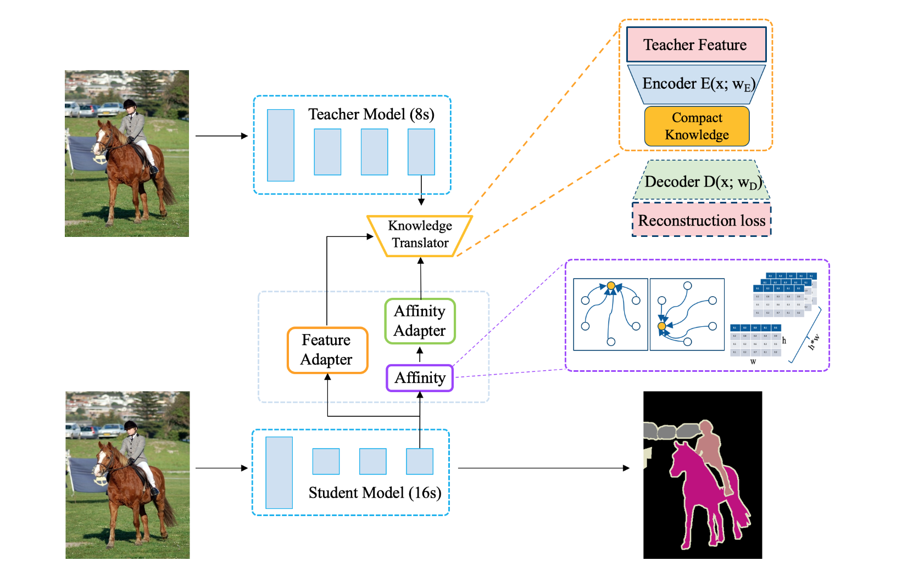
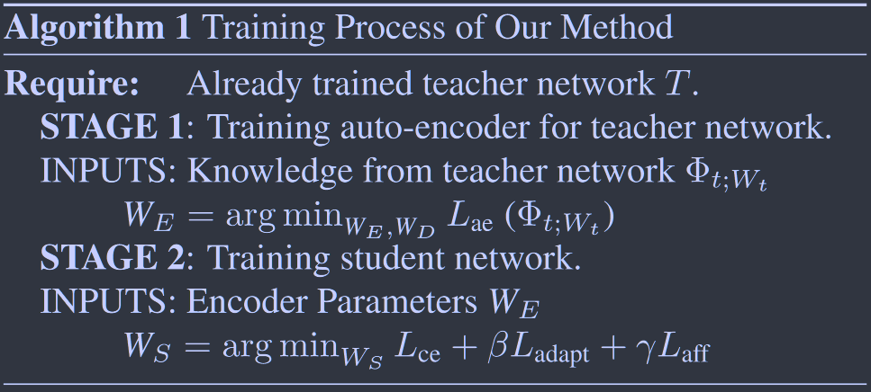

# Knowledge Adaptation for Efficient Semantic Segmentation

**[CVPR 2019](https://openaccess.thecvf.com/content_CVPR_2019/html/He_Knowledge_Adaptation_for_Efficient_Semantic_Segmentation_CVPR_2019_paper.html)	no code	Pascal VOC  Cityscapes  Pascal Context**

*Tong He  Chunhua Shen   Zhi Tian   Dong Gong   Changming Sun  Youliang Yan*

## Introduction 

准确率和效率对于语义分割任务至关重要，现有的FCNs由于一系列高分辨率特征图导致计算量大，通过下采样操作降低特征图分辨率虽然能够提高效率但是会显著降低精度。

我们与其他迫使学生直接模仿教师网络输出值的方法不同，我们先将教师丰富的语义知识重新表述为紧凑的表示，这个过程是通过对教师特征的无监督预训练的自动编码器来实现，将知识转化为学生更容易理解的紧凑格式，且紧凑的表示可以帮助学生除去冗余知识和噪声从而能够专注于最关键的部分。

我们还提出一个亲和蒸馏模块，小模型参数少难以捕获长程依赖关系，并且由于有限的感受野，在统计上是脆弱的，所提出的亲和模块通过显示的计算跨整个图像的成对非局部相互作用来缓解这种情况。

> 提出一种新的针对语义分割的知识蒸馏方法，将教师网络的输出重新解释为一个重新表示的潜在域，更容易被学生模型学习
>
> 提出一个亲和蒸馏模块来帮助学生网络中捕获长程依赖关系
>
> 我们在各种设定下验证了方法的有效性。我们的方法在没有引入额外的参数和计算量的情况下，将学生模型的性能提高了一个很大的幅度(%2) ；我们的模型在仅有8 %的FLOPS的情况下，取得了至少与高分辨率输出的模型相当甚至更好的结果。

## Method

知识定义为两部分：

第一部分旨在将教师网络中的知识转化为更具信息含量的压缩空间，翻译器通过训练一个自动编码器来实现，将知识压缩到一个紧凑的格式，更容易被学生网络学习，否则由于固有的结构差异而变得不容易学习；第二部分旨在从教师网络中捕获长距离的依赖关系，这对于小型模型来说由于有限的感受野和抽象能力而难以被学习。

### Knowledge Translation and Adaptation

受益于空洞卷积，FCNs可以在捕获较大感受野的同时保持细节信息，虽然性能有所提升，但引入了较大的计算开销，我们提出利用具有高特征分辨率的大型教师模型来教授具有低特征分辨率的轻量级学生模型。

我们训练了一个自动编码器来挖掘隐含的结构信息，并将知识翻译成更容易被学生网络理解和复制的格式。相比于低层和中层特征，这些特征要么是跨不同模型的通用特征要么是固有网络差异而难以迁移的特征，高层特征更适合我们的情况。

自编码器将来自教师模型的最后一个卷积特征作为输入，由三个跨步的卷积层和对称的反卷积组成，设学生网络和教师网络分别为S，T，两个网络的最后一个特征图分别为$\Phi_s,\Phi_t$，我们定义重构损失：
$$
L_{ae}=||\Phi_t - D(E(\Phi_t))||^2 + \alpha||E(\Phi_t)||_1
$$
其中$E(·),D(·)$分别代表编码器和解码器，为了解决特征不匹配问题并减少两种模型固有网络差异的影响，通过增加卷积层来使用特征适配器，依托预训练的自动编码器，该过程被形式化为：
$$
L_{adapt} = \frac{1}{|I|}\sum_{j\in I}||\frac{C_f(\Phi_s^j)}{||C_f(\Phi_s^j)||_q} - \frac{E(\Phi_t^j)}{||E(\Phi_t^j)||_q}||_p
$$
其中E表示预训练的自编码器，I表示所有位置上的师生模型特征对，Cf是学生特征适配器，使用3*3的卷积核，padding=1，通过BN和ReLU激活，p和q是不同的归一化类型，用于对稳定性知识进行归一化处理。

### Affinity Distillation Module

捕获长程依赖是很重要的，可以为语义分割任务提供帮助，它更容易被具有大感受野的深度堆叠卷积层捕获；小型网络由于抽象能力不足，学习这些知识的能力有限。我们显式的从大教师模型中提取长程的非局部的依赖关系，提出一个新的亲和蒸馏模块。

在学习的过程中，通过提供额外的差异信息或亲和性信息来学习新知识会更有效，受此启发我们通过直接计算任意两个位置之间的相互作用来定义网络中的亲和信息而不管他的空间距离。具有不同标签的像素会产生一个低响应而相同标签的像素之间会产生高响应，令最后一层特征图$\Phi$，尺寸为$h\times w\times c$，亲和矩阵$A\in \mathbb{R}^{m*m},m=h\times w$，$\Phi_i, \Phi_j \in \R^c$为向量化的特征图:
$$
A(\Phi)_{i,j}=\frac{1}{h\times w}·\frac{\Phi_i}{||\Phi_i||_2}·\frac{\Phi_j}{||\Phi_j||_2}
$$
使用l2损失来匹配师生模型之间的亲和力矩阵:
$$
L_{aff}=\sum_i||A_s(C_a(\Phi_s)) - A_t(E(\Phi_t))||_2
$$
其中$E(\Phi_t)$为翻译后的教师知识，Ca为学生亲和度适配器（L_adapt）

### Training Process

教师网络是预训练的，学生网络由三个损失来监督

