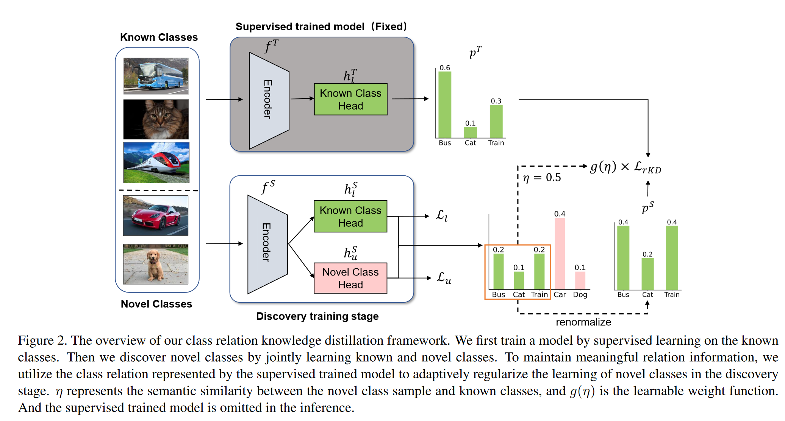
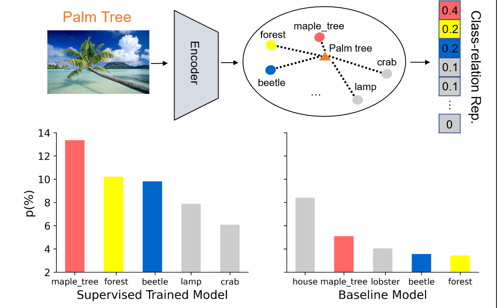

# Class-relation Knowledge Distillation for Novel Class Discovery

[ICCV 2023](https://openaccess.thecvf.com/content/ICCV2023/html/Gu_Class-relation_Knowledge_Distillation_for_Novel_Class_Discovery_ICCV_2023_paper.html)	[code in github](https://github.com/kleinzcy/Cr-KD-NCD)	

## Introduction 

大多数视觉识别任务都集中在封闭的环境中，所有视觉类都是预先定义的，很难将学习到的模型部署在具有潜在新类别的现实环境中。现有工作发现新类的一个关键策略是在已知类中迁移知识，以促进新类的学习，包括监督训练和发现两个阶段。在有监督训练阶段，通常通过从已知类中学习来初始化表示；在发现阶段，通过共享特征表示空间将学习到的知识迁移到新的类别中。

他们在捕获已知和新类之间的关系时效率较低，限制了共享知识的范围，可能会导致新类的低质量表示。并且新类别是未知的，很难再NCD中建模已知类别和新类别之间的语义关系.

我们根据新类与已知类的相似度，提出一个新类的类关系表示，我们利用暗知识，用训练好的模型的预测分布来编码类间关系，我们首先用监督学习子啊已知类上训练一个模型，然后将训练好的模型应用到新类别的数据上。

> 我们提出一个简单有效的学习框架来促进知识从已知类别到新类别的迁移，这为解决新类发现问题提供了一个新的视角
>
> 我们提出一个新颖的正则化策略，通过分类器输出空间来捕获已知类和新类之间的类别关系，并开发一个简单但有效的可学习权重函数，根据类关系的强度自适应的传递知识

## Method

我们模型分为两个阶段，在有监督的训练阶段，我们用已知的类数据训练我们的模型，以获得一个初始的特征表示，它包含有意义的语义信息，从而为聚类新的类提供一个很好的初始化；在发现训练阶段，我们同时使用已知类别和新类别数据训练模型，并采用典型的交叉熵损失和自标记损失分别学习已知类别和新类别，为了更好地迁移知识，我们提出一个新的自适应正则化向来从预训练模型的已知类中提取关系知识。

### Class Relation Distillation Framework

首先给出NCD(Novel Class Discovery)的问题设置和符号，训练数据有两部分组成，已标记的已知类$\mathcal{D}^l=\{x^l_i, y^l_i\}_{i=0}^{|\mathcal{D}^l|}$和未标记的新类$\mathcal{D}^u=\{x^j_u\}_{j=0}^{|\mathcal{D}^u|}$，x,y表示输入数据和对应的标签，我们使用$Y^l=\{1, 2, ..., C^l\}, Y^u=\{C^l+1, C^l+2, ..., C^l+C^u\}$来分别表示已知类和新类的类别空间。

我们采用一个NCD的通用模型结构，包括一个编码器f，和两个余弦分类器头，hl用于已知类，hu用于新类，编码器可以是卷积神经网络或是ViT。给定一个来自已知或新类的图像，首先通过共享编码器来将其投影到嵌入空间中，对嵌入空间进行归一化处理，将其输送到已知类和新类分类头上，无论输入是已知的还是新的，都会经过两个头产生两个输出，最后将两个输出串联起来作为最终的预测结果。这个过程可以写为：
$$
p(y|x) = Softmax((h^S_l(f^S(x)) \oplus(h^S_u(f^S(x))) /\tau)
$$
其中S表示发现训练阶段的模型，$p(y|x)\in \R^{C^l+C^u}$为模型的预测分布，$\tau$为softmax函数的温度系数。

为了发现新类别，我们首先使用已知类的监督学习初始化我们的表示能力，然后通过对已知和新  类别数据联合训练来发现新类别，在发现阶段我们的损失由三项组成：已知类别数据的监督损失$\mathcal{L}_l$；新类别数据的无监督损失$\mathcal{L}_u$；新类别数据的类关系知识蒸馏损失$\mathcal{L}_{rKD}$：
$$
\mathcal{L} = \mathcal{L}_l + \alpha\mathcal{L}_u + \beta\mathcal{L}_{rKD}
$$

### Loss for Known and Novel Classes

对于已知类别数据上的监督损失，我们采用标准的交叉熵损失；对于新类数据的无监督聚类损失，我们采用广泛使用的自标记损失，通过求解一个最优传输问题为新类别数据分配伪标签，然后利用生成的为标签对模型进行自我训练。

这种自标注过程假设新类别的数据被均匀地划分到簇中，利用Sinkhorn-knopp算法寻找一个近似分配，记$y^q = q(y^u|x^u)$为伪标签，$y^p = p(y^u|x^u)$为模型的预测，且$y^p, y^q\in \R^{C^u\times 1}$，令$Q=[y^q_1, y^1_2, ..., y^q_B]\frac{1}{B}, P=[y^p_1, y^p_2, ...,y^p_B]\frac{1}{B}$为B个采样数据的联合分布，我们通过求解一个最优传输OT问题来估计Q：
$$
\langle \pmb{Q}, -log \pmb{P} \rangle _F \\
s.t.\ \pmb{Q}\in \{ \pmb{Q}\in\R^{C^u\times B}_+|\pmb{Q1}_B=\frac{1}{C^u}\pmb{1}_{C^u}, \pmb{Q}^T\pmb{1}_{C^U}=\frac{1}{B}\pmb{1}_B \}
$$

其中$\langle· \rangle_F$为矩阵的F范数，我们令最优解为$q^*(y^u|x^u)$，自标记损失为：
$$
\mathcal{L}_u = \frac{1}{B} \sum^B_{i=1}-q^*(y^u_i|x^u_i)log\ p^*(y^u_i|x^u_i)
$$
为了在已知类和新类之间进行知识迁移，以往的方法通过共享编码器S来耦合新知识和旧知识，并通过交叉熵损失和自标记损失来学习模型。这种方法有助于学习新类的表示，然而这种隐式的知识迁移方法无法充分利用已知类中蕴含的知识进行新类的聚类。我们引入一个新类关系知识蒸馏项来约束发现训练阶段的模型学习。

### Class-Relation Knowledge Distillation

为了更有效地进行知识迁移，我们引入基于已知分类器模型输出分布的类关系表示，这种分布编码了一个新类数据和已知类之间的相似性结构，现有的方法通过一个共享编码器来传递知识，对于新类别的类别关系捕捉效果较差，我们发现有监督预训练模型中包含有意义的类别关系，我们推测这样的类关系对于学习新类别的良好表征很重要，而常规的发现阶段训练改变了表征空间而弱化了已知类别和新类之间的关系。

我们提出一种新的关系知识蒸馏损失rKD来提取有监督训练模型中包含的知识，以增强类别的学习，对于不同的新类别样本，类别关系可能不同，我们考虑了一种基于类别关系强度的自适应方案，对于与已知类更相似的新样本，我们施加更大的正则化权重。

#### Knowledge Distillation

在发现训练阶段，对于新类别，我们保留有监督训练好的模型，并将每个新类别样本输入到模型中，以计算一个初始关系表示，使用模型$f^S$来获得当前的类关系：
$$
p^T=softmax((h^T_l(f^T(x^u)))/t) \in \R^{C^l} \\
p^S=softmax((h^S_l(f^S(x^u)))/t) \in \R^{C^l}
$$
$p^T, p^S$分别表示监督阶段和发现阶段模型的关系表示，t为温度系数，$p^T$的值越高，表示新样本在语义上越0接近于某个已知的类别，为了在发现阶段规则化模型学习，引入蒸馏损失项：
$$
\mathcal{L}^u_{rKD} = \frac{1}{B}\sum^B_{i=1}KL(p^T_i||p^S_i)
$$
通过这种方式来保持新类别样本与监督训练模型表示的已知类别之间的相对关系

#### Learn-able Weight Function

新样本具有不同的语义相似性，而对于语义不相似的样本，用pT表示的关系是噪声，这需要对新类别数据进行自适应的正则化，我们提出一个可学习的权重函数来控制不同新类别样本的正则化强度，我们首先利用$p(y|x)$的已知类的概率之和来表示与已知类的关系强度，对于对i个样本：
$$
\eta_i = \sum^{C^l}_{k=1}p_{i,k}(y^u_i|x^u_i)
$$
其中$p_{i,k}(y^u_i|x^u_i)$表示样本$x^u_i$在第k个类别上的概率，较高的$\eta$表示与已知类由更强的语义关系，然后引入一个可学习的权重函数g，作为$\eta$的正相关函数，计算批次上的归一化关系强度：
$$
g(\eta_i) = Norm(\eta_i) = B\frac{\eta_i}{\sum^B_{j=1}\eta_j}
$$
在我们的实验中，批次大小足够大以确保均值的统计量是稳定的。新的类别自适应关系知识蒸馏损失：
$$
\mathcal{L}_{rKD} = \frac{1}{B}\sum^B_{i=1}g(\eta_i)KL(p^T_i||p^S_i)
$$
