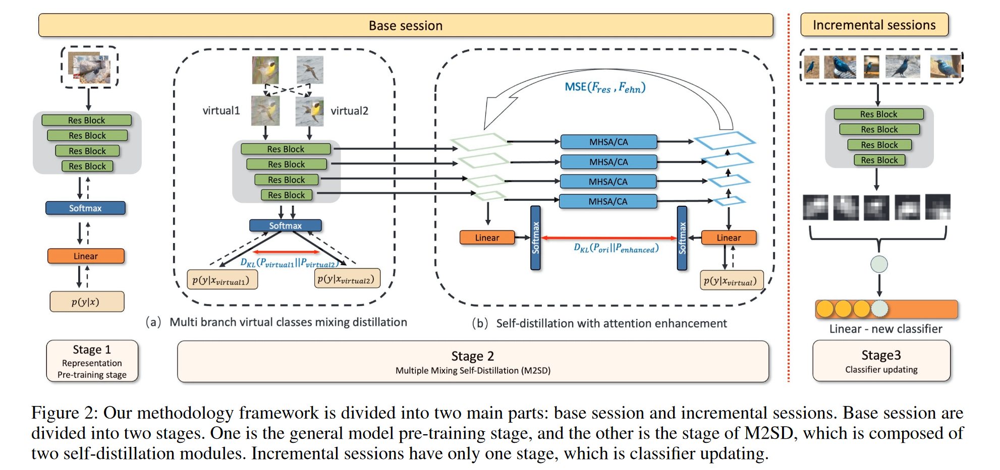

# M2SD: Multiple Mixing Self-Distillation for Few-Shot Class-Incremental Learning

**[AAAI 2024](https://ojs.aaai.org/index.php/AAAI/article/view/28129)	no code	CUB200  CIFAR100	20240531**

*Jinhao Lin  Ziheng Wu  Weifeng Lin  Jun Huang  RongHua Luo*

这项工作提出一种混合多重自蒸馏方法，来解决小样本增量学习的灾难性遗忘问题，其核心思想是构造一个能够识别不同类别数据的特征空间，提出构造虚拟类来训练模型，来扩大模型的特征空间范围，通过mixup和cutup来构造虚拟实例，并提出了一种基于注意力的分层特征融合方式，将通过虚拟类和注意力特征融合后的知识蒸馏给源模型。

- 提出虚拟类的方式来扩大模型特征空间
- 提出基于自注意力和坐标注意力的分层特征融合方式

## Introduction

尽管大量公开的数据集在各种场景下都取得了很好的效果，但分类任务仍然存在很大的局限性，有的工作将小样本学习FSL引入到类增量学习CIL中，FSCIL面临的一个问题是灾难性遗忘，引入的新类可能会导致对新类过分强调而对现有类性能下降。

我们提出了一种称为M2SD的多重混合自蒸馏方法，为增量学习准备了特征空间，并在后续增量学习中强调了特征的可扩展性和包容性。

整个训练阶段分为基础会话和增量会话，我们将模型解耦为特征学习和分类器学习。

- 据我们所知，我们是第一个将自蒸馏引入FSCIL的工作，提高了模型的判别分类精度
- 我们提出了一种双分支虚拟类间蒸馏，在使用mixup的基础上，引入了使用cutmix构建的虚拟类
- 在cifar100 cub200 miniIimageNet取得SOTA

## Problem Set-Up

FSCIL包括按顺序完成的多个学习课程，在每个会话期间模型将扩展导数据集的新子集，而无法访问先前会话中的训练子集，每一个会话阶段的评估都会考虑先前和当前类别。整个训练过程分为基础阶段和多个增量阶段。

### Base Session

在该阶段，模型从训练集$\mathcal{D}^0_{train} = (x_i, y_i)^{n_{train}}_{i=1}$得到充分的数据并在测试集$\mathcal{D}^0_{test} = (x_i, y_i)^{n_{test}}_{i=1}$，xi为寻来你数据集的一个实例，其标签$y_i \in Y_0$，Y0表示数据集D0的标签空间。

### Incremenal Sessions

新类以增量的方式到达，但这些会话的实例不足，按顺序出现的一系列数据集$\{ \mathcal{D}^1,\mathcal{D}^2, ..., \mathcal{D}^B  \}$，B表示总共有B个增量会话，$\mathcal{D}^b = (x_i, y_i)_{i=1}^{NK}, y_i\in Y_b$表示增量会话b的标签空间，$Y_b\cap Y_{b'}=\varnothing, b\neq b'$，该子集表示为N-way K-shot形式，每个会话数据集在有N个类，每个类有K个实例。使用新会话的数据集训练后，模型使用此会话和先前所有会话中的类测试模型。

## Method

我们的FSCIL框架由三个阶段组成，前两个阶段在基本会话中执行，最后一个阶段在增量会话中执行，核心部分在于Stage 2

### Representation Pre-Training Stage  (Stage 1)

给定数据集$\mathcal{D}^0$，此阶段重点是是模型能够快速吸收数据集的特征，并为下一阶段获取最合适的特征空间。$f_\theta(x), \phi(x), W$分别表示模型、骨干网络和线性分类器：
$$
f_\theta(x) = W^T\phi(x) \\
J(\theta) = \frac{1}{m}\sum^m_{i=1}L_{CE}(y_i, W^T\phi(x_i))
$$
m表示样本数量。此阶段对后续的自蒸馏非常重要，如果没有合适的预训练主干网络而是用随机的初始化模型只能传递随机知识，从而无法支持成功的蒸馏。

### Multi Branch Virtual Classes Mixing Distillation  (Stage 2-1)

引入多实例，从不同的集成角度构建虚拟类，是模型能够学习虚拟类，这些虚拟类可以保留特征空间以备将来插入新类。我们使用MixUp和CutUp来构建虚拟实例。

MixUp通过线性插值来生成虚拟实例，专注于产生更大的多样性；CutUp通过剪切和粘贴来组合成对的图像，专注于生成更逼真的实例。由于增量学习中的新类是真实的，因此生成的虚拟类也要是真实的，更多样化和更现实的分支是从新到达的类的实例特征提取出来的，并非每个虚拟实例都接近于真实，这位方法添加了随机性使其更健壮。

这个阶段仍是基础阶段的一部分，使用D0数据集，对于同一批量数据随机取两个不同类别的样本xi xj：
$$
x_{I}^{virtual} = mixup(x_i, x_j) = \lambda x_i + (1-\lambda)x_j \\
x_{II}^{virtual} = CutMix(x_i, x_j) = M \odot x_i (1-M) \odot x_j \\
\lambda \in \beta(\alpha, \alpha)
$$
M表示一个区域的二值mask掩码，为了得到M$(r_x, r_y, r_w, r_h)$，定义均匀分布：
$$
r_x \sim Unif(0+r_w/2, W-r_w/2), r_w = W\sqrt{1-\lambda} \\
r_y \sim Unif(0+r_h/2, H-r_h/2), r_h=H\sqrt{1-\lambda}
$$
虚拟类的标签：
$$
y_{I}^{virtual} = y_{II}^{virtual} = \lambda y_i + (1-\lambda)y_j
$$
我们强制模型拟合虚拟类的分布，虚拟类的信息不会再后续增量会话中直接使用，然而他鼓励模型适应从未见过的类型，这是增量会话的特征。
$$
\mathcal{L}^v_{ce} = \sum\mathcal{L}_{ce}(y_{i}^{virtual}, f_{\theta}(x_{i}^{virtual})), i=I, II
$$
并且还要求从两个虚拟类获得的分布是一致的：
$$
\mathcal{L}^v_{KL} = \mathcal{D}_{KL}(f_\theta(x_I^{virtual}) || f_\theta(x_{II}^{virtual})) + \mathcal{D}_{KL}(f_\theta(x_{II}^{virtual}) || f_\theta(x_{I}^{virtual}))
$$

### Self-Distillation with Attention Enhancement  (stage 2-2)

为了融合网络多个阶段的特征，获得更多的判别特征，设计了一个特征增强模块FE(x)来进行自蒸馏：
$$
FE(x) = FPN(EN(\phi(x))) = FPN(\phi'(x))
$$
利用注意力EN(·)来增强从骨干网络获得的特征，得到高质量特征分布$\phi'(x)$，然后引入多尺度特征融合，通过FPN从注意力增强的虚拟类特征中获得更多的语义信息，最后应用一个自蒸馏模块，使用增强功能来对齐原始网络功能。

#### Attention Enhanced

为了充分利用输入的特征信息，我们使用注意力机制来增强$\phi(x)$中每个块的特征，有助于减少不相关的信息：
$$
\phi(x) = [\phi_1(x), \phi_2(x), \phi_3(x), \phi_4(x)]
$$
每个块都通过注意力机制得到增强，第一层和最后一层使用多头自注意力MHSA，中间层使用坐标注意力CA，第一层使用MHSA可以为后续模块的构建提供坚实的基础，第二第三个模块，CA有选择的关注特征图中不同的空间位置，再最后一个模块使用MHSA来进一步集成完善前面学到的特征：
$$
\phi_i'(x) = EN(\phi_i(x)) = MHSA/CA(\phi_i(x))
$$

#### Feature Fusion

为了在注意力增强后对齐上述特征并利用虚拟类特征的多尺度信息，我们使用BiFPN来融合他们。
$$
T_i= FPN(\phi'_i(x))
$$
Ti为注意力增强的精细化特征图，i表示第i个块，使用临时分类器W‘来预测结果：
$$
\hat{p} = W'(T_{last})
$$
$\hat{p}$为软标签

#### Attention Transfer Loss 

我们引入注意力损失来提炼原始激活的注意力图和FE生成的多尺度注意力增强激活的注意力图之间的信息
$$
\mathcal{L}_{AT} = D_{KL}(\hat{p}, f_\theta(x)) + \sum^N_{i=1}||at(T'_i) - at(\phi_i(x))||^2_2
$$
at(·)表示计算的特征图，第一项是模型输出和特征融合的软标签之间的KL散度，第二项是融合特征于原始特征注意力图之间的差异，第二阶段的总损失为：
$$
\mathcal{L} = \mathcal{L}_{ce}^v + \mathcal{L}_{KL}^v + \mathcal{L}_{AT}
$$

### Classifier Updating Stage  (Stage 3)

此阶段侧重于增量学习过程，我们冻结在基础模型中训练的模型参数，删除FE结构，在后续增量任务中更新分类器参数W，总共考虑B+1个会话，1表示基本会话，B表示增量会话，为了表示这些数据集中的每个类，我们对该类对应的所有实例的数据进行平均，我们通过将这些类特征附加到权重矩阵中来更新分类器：
$$
W_{new} = [W_{new}; w_i, i\in Y^b] \\ 
w_i = \frac{1}{K}\sum^{|\mathcal{D}^b|}_{j=1} \mathbb{I}(y_j=i)\phi_{f_\theta}(x_j)
$$
