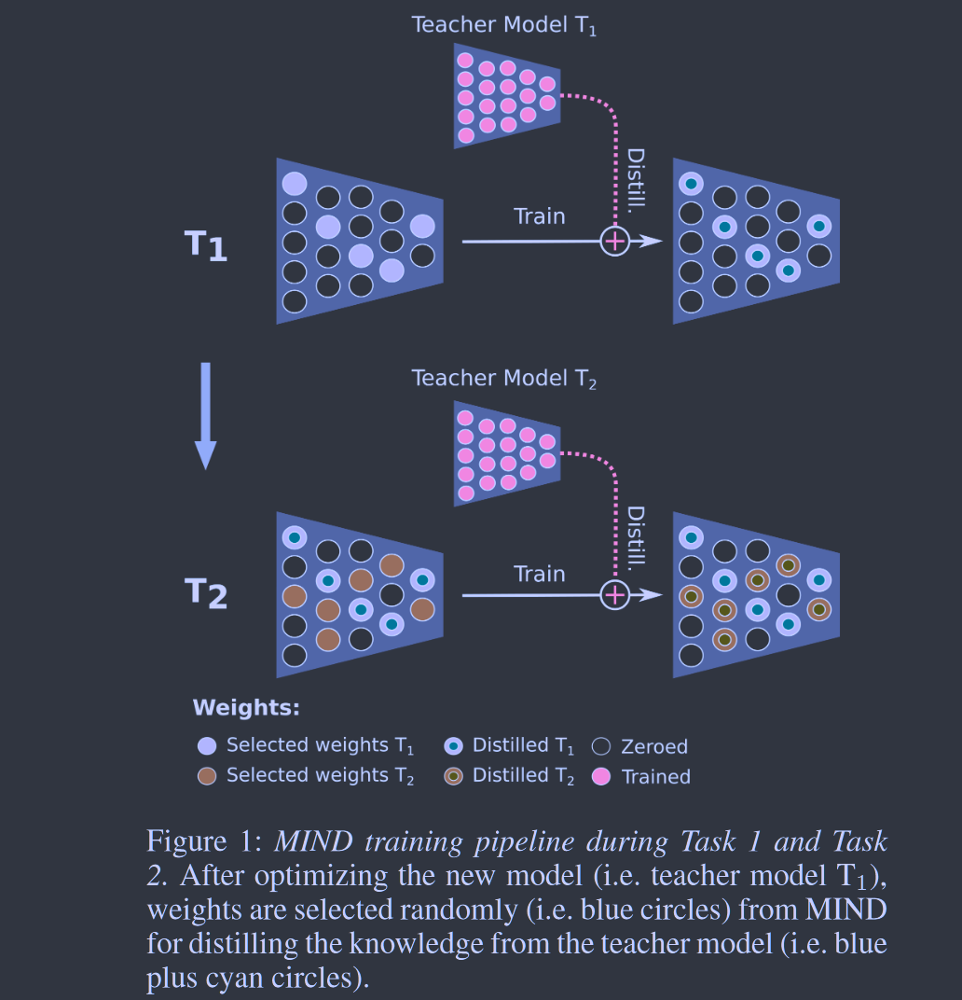
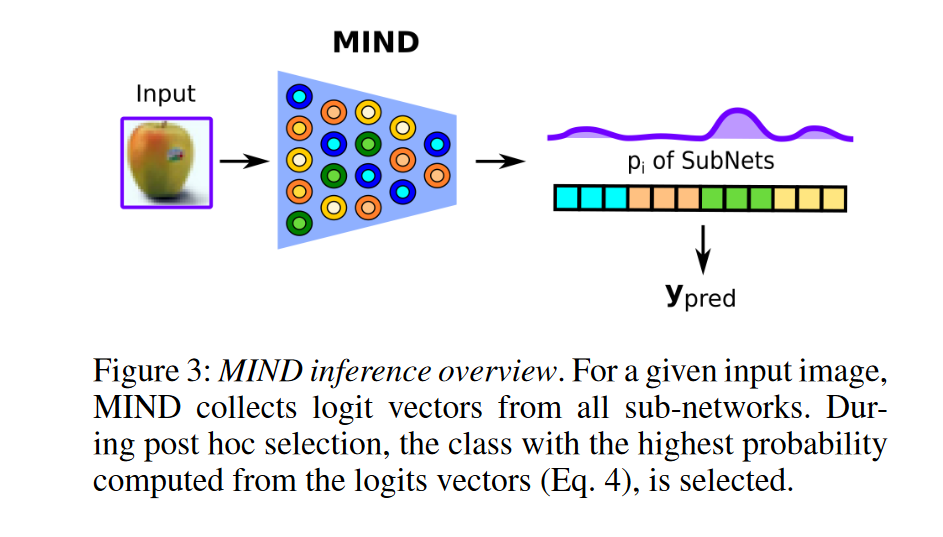

# MIND: Multi-Task Incremental Network Distillation

**[AAAI 2024](https://ojs.aaai.org/index.php/AAAI/article/view/28987)	[code in github](https://github.com/Lsabetta/MIND)	CIFAR  TinyImageNet  Core50/10  Synbols	20240531**

*Jacopo Bonato  Francesco Pelosin  Luigi Sabetta  Alessandro Nicolosi*

这项工作提出了一种新的增量学习框架，通过蒸馏技术来保存先前任务的知识，对于每一个子任务提出随机权重选择微调后融合到主干模型中，模型训练时前向计算会使用先前类的知识，优化时先前类的权重被冻结只更新当前任务的权重，通过二进制的掩码来保存每一阶段的子网权重位置。为了适应内存受限的环境将其扩展到自蒸馏模型。选择主干中最重要的权重来获得子网。最终性能达到SOTA

- 配备蒸馏机制的参数隔离增量学习方法
- 为蒸馏和自蒸馏范式提出了不同的剪枝策略获得子网
- 提出了门控机制，通过二进制掩码来保存子网权重，来引导反向传播

## Introduction

深度学习有个尚未解决的挑战是在深度神经网络中实现终身学习，对于灾难性遗忘问题的处理称为了研究的重点。先前工作引入了重放缓冲区来近似旧数据，有的工作在新任务出现时实例化新的参数，还有的工作利用参数空间中的正则化项来解决这一问题。

我们提出了一种名为MIND的新方法，属于参数隔离的范畴，网络的子区域被用于处理单个任务，这些子区域并不是完全脱节的其共享一部分参数，MIND利用蒸馏技术将每个新任务训练的新模型的知识封装压缩到子网络片段中。

我们提出了在内存限制下工作的MIND优化程序的变体，MIND显著提高了标准参数隔离方法的性能，保留过去信息的同时，在学习新数据方面表现出卓越的性能。

> 开发了一种配备蒸馏机制的新型参数隔离方法，该优化过程利用每个新任务训练的新型模型获得知识，并通过匹配新模型的输出概率分布的MIND的子网络片段中。提出了一种不同的蒸馏机制，MIND在单个子网中自我蒸馏
>
> 提出了不同的策略来为每个任务选择子网
>
> 引入了门控机制，应用于主干，门控机制在反向传播中引导梯度流更准确的进行计算

## Method

考虑一个增量的场景，数据流被拆分为单独的N个任务Ti，每个人物Ti都由一组数据Xi以及其各自的标签Yi表征，每个Ti有 M/N 类，M为类别总数，这些类别不在其他任务中共享$Y_i\cap Y_j = \varnothing, i\neq j$，我们的任务在Ti的学习阶段无法访问先前阶段的数据，在测试期间，Xtest包含N个任务中所有的M类样本。

MIND属于参数隔离方法的类别，它包括针对每个特定任务优化的子网，为了提高这些方法的性能，我们在每个任务的子网微调过程中采用了蒸馏技术，这种方法消除了访问过去数据的需要。

### Sub-Network Optimization

基本程序包括三个关键步骤：在特定任务上训练网络f，修剪其权重的一定比例，然后对修建后的网络重新训练，此步微调结束后与当前任务的可用参数的值即使冻结。

一旦一个新任务被引入训练，所有的权重都会在前向传播中被用于计算输出，但是优化时仅优化与当前任务相关。在选择性优化之后在应用上述的修剪和再训练策略，整个训练过程迭代继续宁，先前任务中获取并存储每个子网的冻结权重中的所有知识始终用作新任务的初始化知识，即任务3的子网执行前向传递时使用任务1和任务2 的子网权重。

**通过将子网络封装成一个网络来进行权重共享**
$$
\mathcal{L}_{CE} = \sum^C_{i=1}t_ilog(p_i)
$$
C表示当前任务的类别数量，ti表示真实标签pi为softmax对第i个类的概率输出

### MIND

对于设计子网的优化方法，一个关键步骤时重新新联修建后的网络，网络容量降低会导致性能下降。我们引入蒸馏机制来解决这个问题。

在每个新任务Ti的训练期间，一个新的网络g被初始化，并在其该任务的数据集上训练，一旦g被训练，他会在Ti的蒸馏阶段作为教师模型，MIND中使用的网络视为学生模型，f使用随机策略RP(random policy)进行迭代修剪，f选择先前任务未选择的权重，将来自新网络g的知识提炼到与Ti对应的f子网中。

用Jensen-Shannon损失优化剪枝网络；在任务Ti中，给定以权重$\psi$参数化的新网络g和以权重$\phi_i$参数化修剪后的网络$\hat{f}$：
$$
\mathcal{L}_{SD} = \frac{1}{2}\sum_{x_i\in X} D_{KL}(p(z|x, \psi)||p(z_i|x_i, \phi_i)) + D_{KL}(p(z_i|x_i, \phi_i) || p(z|x, \psi))
$$
z表示softmax输出的logits，在反向传播中只有Ti选择的权重$\phi_i$被更新，其余参数冻结来保留过去的知识，总损失：
$$
\mathcal{L} = \mathcal{L}_{CE} + \beta\mathcal{L}_{SD}
$$

#### Gating Mechanism

我们引入一个二进制门控掩码作为学习路由机制来指导反向传播过程，将梯度的流量重定向到MIND的活动单元。若参数被分配到任何的子网络，则权重被定义为活跃的（掩码设为1）；若参数还没有被分配，则权重被定义为不活跃的（权重设为0），在活动权重中，旧的子网权重被冻结，而当前的子网权重在反向传播中被更新，前向计算也考虑了旧的子网知识，通过这种门控机制，梯度计算更加精确。

#### Batch Norm

为了增强MIND在CI(Class Incremental)和DI(Domain Incremental)场景的适应性，我们在每个任务中训练Batch-Norm层，并保存每个子网络对应的学习参数。推理阶段利用与所选子网对应的BN参数，我们证明了这一设定是有效的。

**消融实验证明这一步带来了巨大的性能提升**

### MIND with Self-Distillation

我们的基础蒸馏方法依赖于为每个新的任务初始化一个新的模型，然而在某些应用场景中可能会加以限制，因此我们进一步探索了自蒸馏程序减少了内存使用量。

自蒸馏的方案不在每个任务上重新初始化的新网络，而是直接在任务Ti上训练MIND的自由权重，然后进行剪枝，在Ti上选择最重要的参数（MIP, most important parameters），这是我们蒸馏的目标，损失函数与上式相同，用剪枝前的MIND网络代替新模型g。

MIP的策略是为每一层选择绝对值最高的一小部分权重，我们为每个任务分配相同比例的权重。

### Inference

在推理阶段，每个输入图像x通过MIND的所有子网，收集相应的logit zi，子网通过先前描述的二进制掩码机制进行检索，所有子网对图像进行处理后有温度系数缩放后计算其概率分布：
$$
p_i = softmax(z_i/\tau)
$$
i=0, 1, ...N-1,对N个任务都进行计算，选择概率最大的作为输出结果。