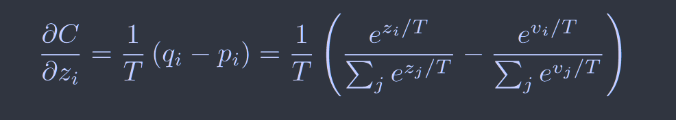
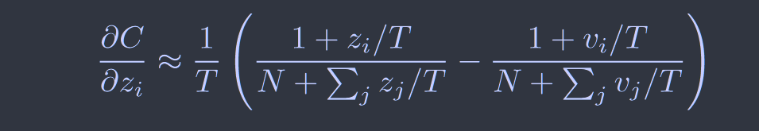
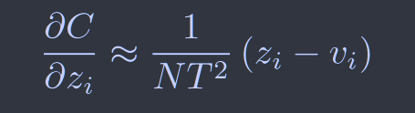

# Distilling the Knowledge in a Neural Network 

[NeurIPS2014](https://arxiv.org/abs/1503.02531)	MNIST JFT

提出了使用软标签来训练学生网络，并提出了温度系数的概念来加强概率较低的标签概率对于模型的影响

## Introduction

在大规模机器学习中，我们通常在训练和部署阶段使用非常相似的模型，尽管他们要求非常不同，对于一些任务向语音物体识别等，训练从非常大且冗余的数据集中进行，可以使用巨大的计算量不需要实时操作，但还有很多任务需要部署到大量用户可以使用的场景，这些场景要求计算量和延迟都比较高

因此一旦复杂的模型训练完成，我们使用一种称之为蒸馏的方式，将复杂的模型转移到更易于部署的小模型中。将复杂模型产生的类概率作为软标签用于训练小模型，软标签定义了数据的相似性结构，这是一个有价值的信息，但由于概率非常小接近于0，在传输阶段对交叉熵代价函数的影响非常小，我们引入温度系数来提高其影响。

## Method

神经网络通常使用softmax输出层来产生类概率：
$$
q_i = \frac{exp(x_i/T)}{\sum_jexp(x_j/T)}
$$
T为温度系数，使用一个较高的T会在类上产生一个较软的概率分布，在训练蒸馏模型时使用相同的温度，在训练完成后做推理令T=1

对于训练时的梯度：

如果温度值相比于logit的值要大得多，我们给出近似（泰勒展开）：

若假设logit对每个转移都做了0均值处理，则有$\sum_jz_j=\sum_jv_j=0$，上述简化为：

因此在高温的限制下，蒸馏等价于最小化$\frac{1}{2}(z_j-v_j)^2$，只要对logit做0均值处理即可，在较低温度下，蒸馏对比均值更负的logit的值关注更少，另一方面非常负的logit可能会传递繁琐模型获取知识的有用信息，我们证明当蒸馏模型太小以至于不能捕获复杂模型中所有知识时，中间温度最佳