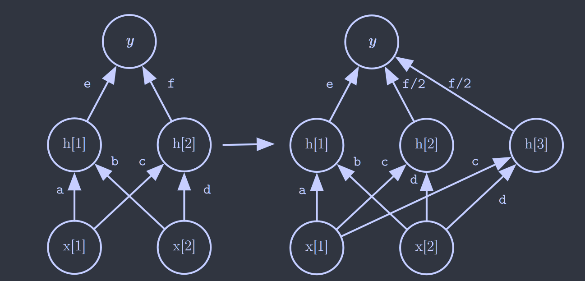
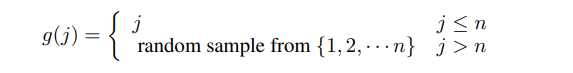
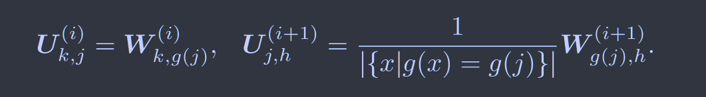
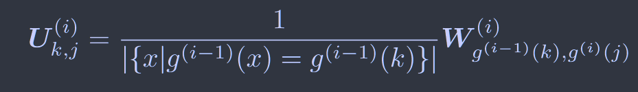
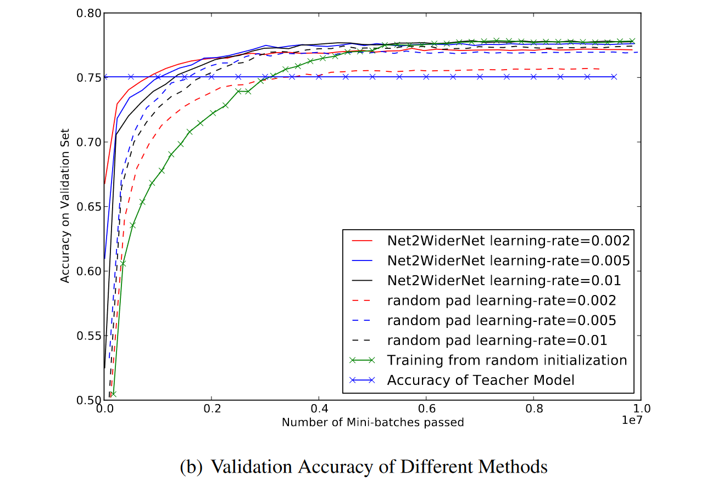
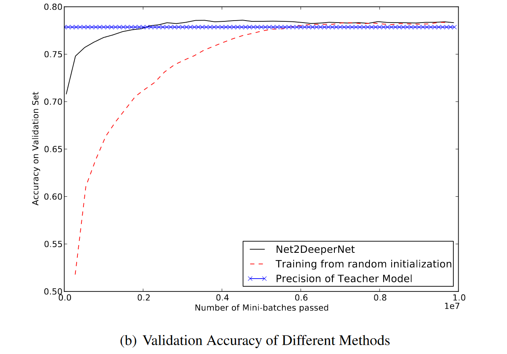
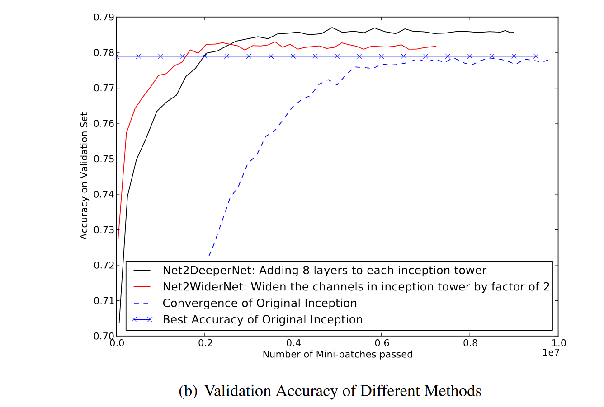

# Net2Net: Accelerating Learning via Knowledge Transfer

[ICLR2016](https://arxiv.org/abs/1511.05641)  **No code**

通过将知识从先前的网络转移到新的更深或者更宽的网络来加速实验过程

本文通过将先前的知识从一个小的神经网络快速转移到一个较大的神经网络中，将原网络转移到更深或更宽的网络中，并给出了一套扩展网络权重的转移计算方法，实验证明使用这种方式训练的更大的神经网络可以提高ImageNet的识别性能。

## Introduction

Net2WiderNet，使用更宽的等效替换模型；Net2DeeperNet，使用更深的等效替换模型。

在初始化较大的网络中包含所有较小网络中获取的知识之后，可以继续训练较大的网络来提高其性能。

实验者可以使用Net2Net从先前最佳模型学习的函数开始在更短的时间内训练模型。

## Method

> 新的、更大的网络立即表现的与原始网络一样好，而不是花时间经历一段低性能的时期
>
> 只要保证每个局部步骤都是改进，初始化之后对网络的所有更改都是改进；以前的方法不能在baseline上进行更改，因为对较大模型初始化的更改可能导致性能恶化
>
> 优化网络中所有参数始终是安全的，不会出现某些层收到有害梯度而必须冻结的阶段

### Net2WiderNet

允许使用更宽的层，对卷积来说是拥有更多的通道

对于$W^{i}\in\mathbb{R}^{m \times n}$和$W^{(i+1)}\in\mathbb{R}^{n \times p}$，net2widerNet 允许替换层i到数量为q的输出（q>n） ，定义节点选择函数如下，对于下标大于n的节点从之前节点中随机选择

网络中的新权重矩阵用$U^{(i)}$和$U^{(i+1)}$表示

对于前n列直接从$W^i$复制即可，对于n+1之后的列，通过g(j)来进行随机选择，$W^i$中的某些列会被复制很多次，因此我们需要考虑这种情况，对多次复制的节点权重用$\frac{1}{|{x|g(x)=g(j)}|}$进行缩放，以保持所有单位的值保持与原网络相同。

然后将该公式推广到更为广义的形式：$g^{(i-1)}$随机选取前一层的节点，$g^{(i-1)}$随机选取后一层的节点

### Net2DeeperNet

Net2DeeperNet将单层网络$h^{(i)}=\phi(h^{(i-1)T}W^{(i)})$替换为$h^{(i)}=\phi(U^{(i)T}\phi(W^{(i)T}h^{(i-1)}))$，新矩阵U被初始化为单位矩阵

## Experience & Discussion

我们的实验证明Net2Net在某些架构下可以将小型神经网络快速转移到更大的神经网络中，并且使用这种方式训练的更大的神经网络可以提高ImageNet的识别性能。

在未来研究中希望能够揭示更多更通用的知识转移方法来快速初始化学生网络，其架构不限于类似于教师网络的架构。

