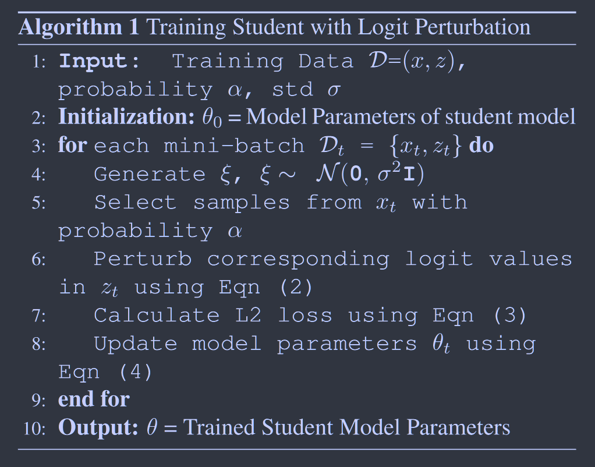
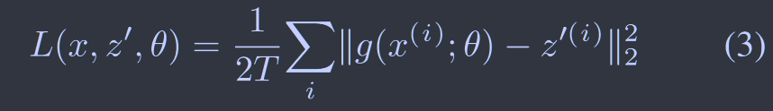
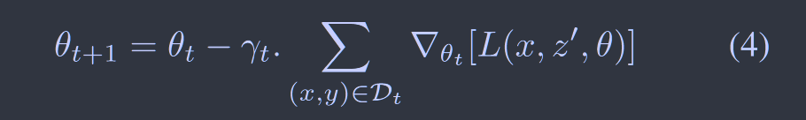
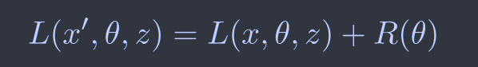
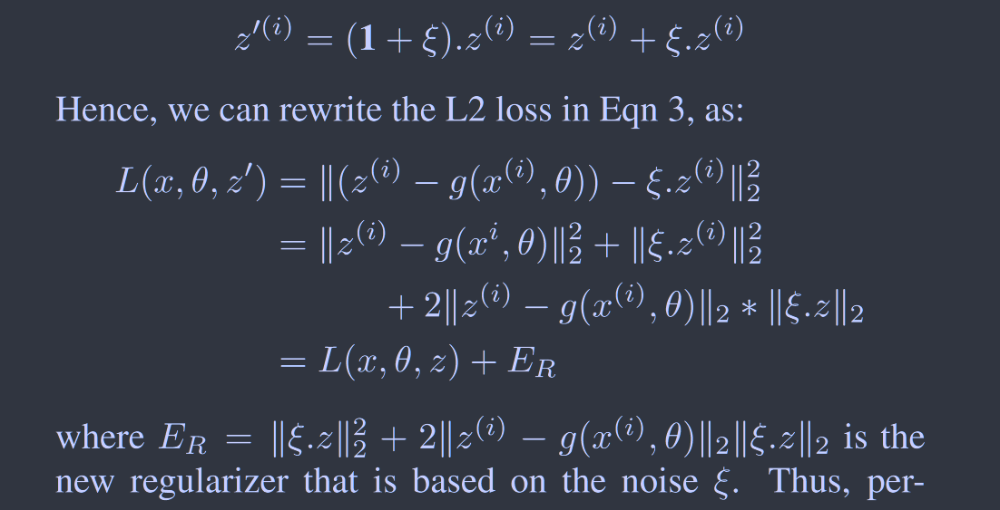

# Deep Model Compression: Distilling Knowledge from Noisy Teachers
[2016arXiv](https://arxiv.org/abs/1610.09650)   no code

**通过对教师输出的Logit添加噪声来模拟同一专业的不同教师，并且添加噪声相当于正则化项的作用**

## Introduction

目前有大量的模型压缩方法，但大多数压缩方法都只专注于降低模型的存储复杂性,

我们提出一种简单的基于噪声的正则化方法来模拟来自多个教师的学习，以实现更好的深度模型压缩

基于Hinton等人的工作，师生模型的好处:

> 教师输出的暗知识即是学生模型的标签也是其正则化器，因为他提供了共享有用信息的软目标
>
> 其收敛速度比仅使用硬标签更快，因为软标签有助于训练
>
> 少量的训练数据足以训练学生网络

Ba and Caruana等人的工作，直接在logits上做回归而不是在softmax激活之后

## Method

如果一个学生向多个老师学习怎么办？ 学生可以通过该领域的多位专家学习同一主题来磨砺对某个主题的理解

我们提出一种模拟多个教师的方法，通过注入噪声并扰乱教师的logit输出，扰动输出不仅模拟量多教师设置，而且还产生了噪声，相当于正则化器的作用，我们称之为logit扰动

### logit扰动

$\xi$为$\mu=0$标准差为$\sigma$的高斯分布，$\xi$的维度与logit的维度相同，若$z^{(i)}$表示教师网络对于样本$x^{(i)}$的logit，则我们对其进行扰动：
$$
Z^{'(i)}=(\pmb1+\xi)z^{(i)}\qquad(2)
$$
则有损失函数：

并不是所有样本都需要进行扰动，以概率a选择需要扰动的样本

参数更新如下：

### 正则化

现证明加噪声相当于正则化项，常规的正则化如下：

改写eq3的损失函数，有：

因此证明在教师网络中的扰动相当于在损失函数中添加了一个正则化器。
