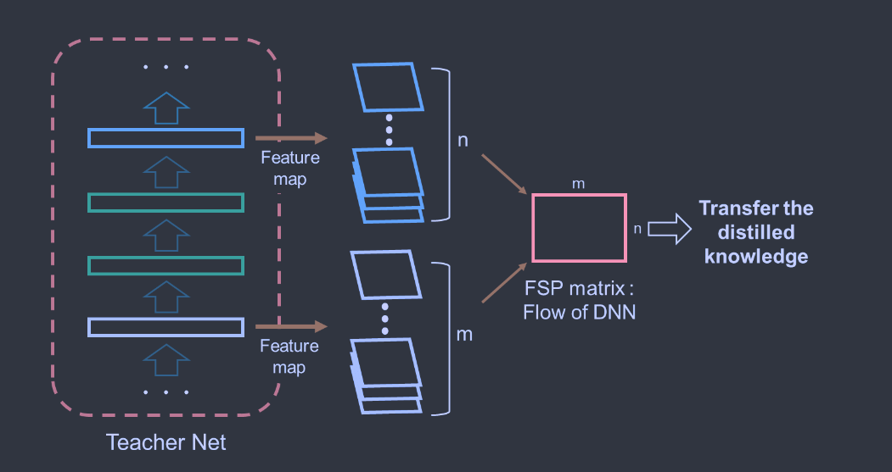
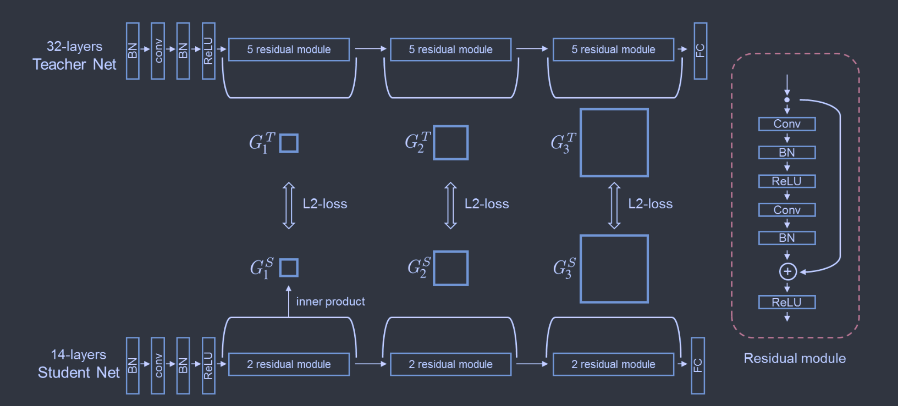

# A Gift from Knowledge Distillation: Fast Optimization, Network Minimization and Transfer Learning

*Junho Yim  Donggyu Joo  Jihoon Bae  Junmo Kim* 

**[CVPR 2017](https://openaccess.thecvf.com/content_cvpr_2017/html/Yim_A_Gift_From_CVPR_2017_paper.html)	no code	CIFAR10/100**

提出了一种新的知识转移策略，提出FSP矩阵来表示网络层中间问题求解的过程，最小化师生模型中间层的L2损失来进行知识的转移

## Introduction 

知识转移的性能对如何定义知识非常敏感，考虑到真正老师教授学生的过程，我们将高级蒸馏知识定义为解决问题的流程，由于DNN按顺序使用多个图层从输入空间映射到输出空间，因此解决问题的流程可以定义为两个图层之间的关系。

> 提出一种蒸馏知识的新技术
>
> 这种方法对于快速优化很有效
>
> 提出的蒸馏知识来初始化权重，可以提高小型网络的性能
>
> 即使学生网络与教师网络任务不同，所提炼的知识也能够提高学生网络的表现

## Method

我们这项工作的重点是如何定义教师DNN的重要信息，并将提取的知识传递给另一个DNN。

### Proposed Distilled Knowledge

DNN逐层生成特征，更高层的特征更接近与执行主要任务的有用特征，如果我们将DNN输入看作是问题，输出看作是答案，则DNN中间出生成的特征可以看作是求解过程中的中间结果。模仿教师的DNN生成特征可以称为学生DNN的硬约束。

因此这个过程可以看作是教师讲解一个问题的解决过程，学生学习解决过程的流程。我们认为演示问题的求解过程比讲授中间结果提供了更好的泛化性。

### Mathematical Expression of the Distilled Knowledge

我们设计了FSP(Flow of Solution Procedure)矩阵来表示求解过程的流程，FSP矩阵$G\in\mathbb{R}^{m\times n}$由两层特征生成，选择层之一生成特征图$F_1\in\mathbb{R}^{h\times w\times m}$，另一个层生成特征图$F_2\in\mathbb{R}^{h\times w\times n}$，h,w,m,n分别表示宽、高、F1特征图的通道数和F2特征图的通道数，则FSP矩阵G计算如下：
$$
G_{i,j}(x, W) = \sum^h_{s=1} \sum^w_{t=1} \frac{F_{s,t,i}^1(x;W) \times F^2_{s,t,j}(x,W)}{h\times w}
$$
其中x，W分别表示输入图像和DNN的权重。

### Loss for the FSP Matrix

我们假设由n个FSP矩阵$G_i^T,i=1,...,n$由教师网络产生，以及n给FSP矩阵$G_i^S,i=1,...,n$由学生网络产生，这项工作仅考虑一堆具有相同空间大小的师生网络之间的FSP矩阵$(G_i^T,G_i^S)$，利用l2范数发平方来作为每对的代价函数，则损失定义为：
$$
L_{FSP}(W_T,W_S)=\frac{1}{N}\sum_x\sum^n_{i=1}\lambda_i\times ||G_i^T(x;W_t) - G_i^S(x;W_s)||^2_2
$$
其中$\lambda_i,N$分别表示每个损失项的权重和数据点数，我们假设每一对损失同等重要，对所有实验设置相同的$\lambda_i$值

### Learning Procedure

教师网络应当通过一些数据集进行预训练，该数据集可以与学生网络将要学习的数据集相同或不同，迁移学习的情况下使用的应当不同；教师网络可以比学生网络更深或更浅，但是我们认为教师网络与学生网络相同或更深更好。学习过程分为两个阶段，首先最小化LFSP损失，使师生网络的FSP矩阵相似，第二阶段利用任务损失来训练。

