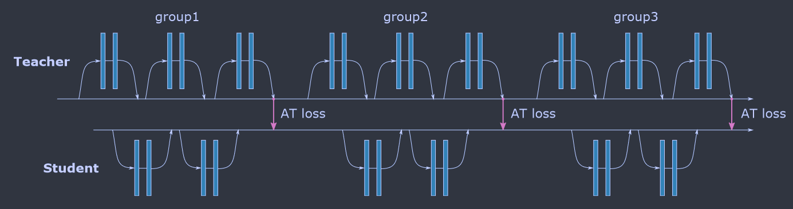
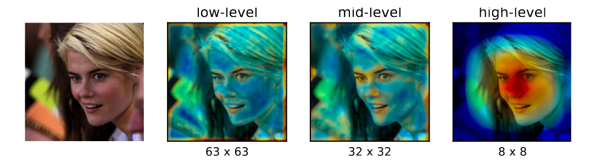
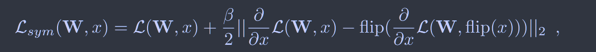

# Paying More Attention to Attention: Improving the Performance of Convolutional Neural Networks via Attention Transfer

**[ICLR 2017](https://arxiv.org/abs/1612.03928)	[code in github](https://github.com/szagoruyko/attention-transfer)	CIFAR  ImageNet**

与传统的基于网络的完全激活进行知识转移不同，这项工作给出了一种基于注意力图方式的知识转移，给出了两种不同的注意力图的定义方式并给出了对应的AT损失。

## Introduction

一种普遍的假设是存在非注意力和注意力感知过程，非注意力过程有助于观察一般场景并收集高级信息，我们认为不同的注意力策略能够从不同的方式看待同一场景。基于这个假设引出本文的问题：

这种注意力与人工视觉系统中的注意力有何不同？我们能否利用注意力信息来提高卷积神经网络的性能？

换种说法，我们要探究**能否通过向学生网络提供教师网络将注意力集中在哪里这种信息来提高学生网络的性能？**

我们给出了卷积神经网络中注意力图的定义：基于激活和基于梯度，探讨这两种注意力图如何在各种数据和架构上发生变化

我们实验表明基于激活的注意力转移要优于传统的完全激活转移，并且可以于蒸馏相结合。

## Method

### 基于激活的注意力转移

对于CNN的一个激活层$A\in R^{C \times H \times W}$，经过一个基于激活的映射层$\mathcal{F}$将其映射为2D特征注意力图：
$$
\mathcal{F}:R^{C \times H \times W} \rightarrow R^{H \times W}
$$
我们假设隐藏神经元激活的绝对值能够作为该神经元在特定输入下的重要性指示，对于A的绝对值，我们给出以下几种方式计算注意力图：

> 绝对值的和：$F_{sum}(A) = \sum^C_{i=1}|A_i|$
>
> 绝对值的p次幂的和：$F_{sum}^p(A) = \sum^C_{i=1}|A_i|^p$
>
> 绝对值的p次幂的最大值：$F_{max}^p(A) = max_{i=1,C}|A_i|^p$

上图为根据绝对值和计算出来不同等级特征图对应的注意力图的关注区域，在较低的层，对于低级梯度的点关注度较高，在中间层更关注一些比较有辨别性的区域，而在顶层关注完整的物体。

我们给出attention transfer loss:
$$
\mathcal{L}_{AT}=\mathcal{L}(W_S, x)+\frac{\beta}{2}\sum_{j\in\mathcal{I}}||\frac{Q_S^j}{||Q_S^j||_2} - \frac{Q_T^j}{||Q_T^j||_2}||_p
$$
$\mathcal{L}(W, x)$表示标准的交叉熵损失，$\mathcal{I}$表示我们想要转移注意力图的所有师生激活层对的索引，$Q_S^j=vec(F(A_S^j))$，$Q_T^j=vec(F(A_T^j))$分别表示第j组师生注意力图的向量表示。

注意力转移可以与蒸馏结合，只需添加一项蒸馏损失。

### 基于梯度的注意力转移

在这种情况我们将注意力定义为梯度，即输入空间位置的注意力编码反映了输出预测在该输入位置的变化，我们将梯度定义为师生模型在损失上的梯度：
$$
J_S=\frac{\partial}{\partial x}\mathcal{L}(W_S, x);J_T=\frac{\partial}{\partial x}\mathcal{L}(W_T, x)
$$
然后我们有AT loss:
$$
\mathcal{L}_{AT}(W_S, W_T, x)=\mathcal{L}(W_S, x)+\frac{\beta}{2}||J_S-J_T||_2
$$
因此可以给出对于Ws的更新梯度：
$$
\frac{\partial}{\partial W_S}\mathcal{L}_{AT} = \frac{\partial}{\partial W_S}\mathcal{L}(W_S, x) + \beta(J_S-J_T) \frac{\partial^2}{\partial W_S \partial x}\mathcal{L}(W_S, x)
$$
我们还想损失中添加了翻转不变性

