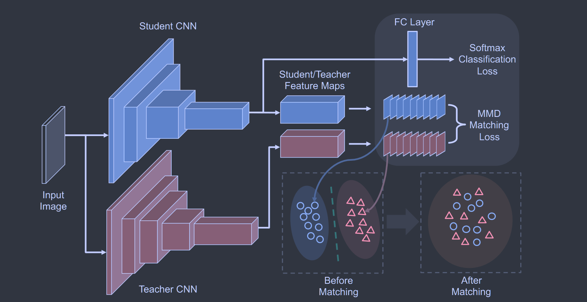
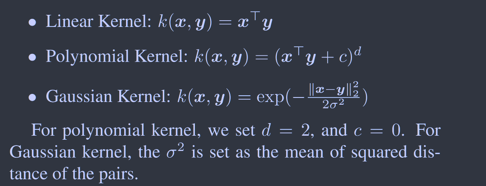

# Like What You Like: Knowledge Distill via Neuron Selectivity Transfer

**[arXiv2017](https://arxiv.org/abs/1707.01219)	no code	CIFAR  ImageNet  Voc2007**

这项工作提出了一种新的知识转移方法，通过最小化师生模型特征图分布之间的最大均值差异（MMD）来匹配教师网络和学生网络中选择性模式的分布，通过不同的核函数来获得不同的损失计算，NST是对现有方法的补充，与KD相结合达到了更好的性能效果，进一步证明知识转移能够学习到更好的特征表示。

## Introduction

这项工作提出了一种新的知识转移方法，通过最小化师生模型特征图分布之间的最大均值差异（MMD）来匹配教师网络和学生网络中选择性模式的分布，设计了一种新的KT损失，我们的方法称之为神经选择性迁移（NST）

一个神经元在某些区域或样本中被激活，说明这些位置具有一些可能与任务相关的共同属性。

## Background

对于CNN某一层输出的特征图$F\in\mathbb{R}^{C \times HW0}$，C为通道数，空间分辨率为$H \times W$，规定$f^{k·}\in \mathbb{R}^{HW}$为特征图的每个通道，$f^{·k}\in\mathbb{R}^C$为同一位置的值，注意$f^{k·}$是一个向量不是矩阵

### Maximum Mean Discrepancy

$\mathcal{X}=\{x^i\}_{i=1}^N$和 $\mathcal{Y}=\{y^i\}_{i=1}^N$分别从分布p、q采样得到，则p q之间的平方MMD距离表示为:
$$
\mathcal{L}_{MMD^2}(\mathcal{X}, \mathcal{Y}) = ||\frac{1}{N}\sum_{i=1}^N\phi(x^i) - \frac{1}{M}\sum_{j=1}^M\phi(y^j)||^2_2
$$
其中$\phi(·)$是一个显示映射函数，通过核函数技术，上式改写为：
$$
\mathcal{L}_{MMD^2}(\mathcal{X}, \mathcal{Y}) = \frac{1}{N^2}\sum_{i=1}^N\sum_{i'=1}^Nk(x^i, x^{i'}) + \frac{1}{M^2}\sum_{j=1}^M\sum_{j'=1}^Mk(y^i, y^{i'})-\frac{2}{MN}\sum_{i=1}^N\sum_{j=1}^Mk(x^i, y^i)
$$

## Method

我们认为来自神经元的高激活区域可能共享一些与任务相关的相似性，尽管其对于人类并不直观

我们将NST损失定义为:
$$
\mathcal{L}_{NST}(W_S) = \mathcal{H}(y_{true}, p_S) + \frac{\lambda}{2}\mathcal{L}_{MMD^2}(F_T, F_S)
$$
H表示标准交叉熵损失，MMD损失如下：
$$
\mathcal{L}_{MMD^2}(F_T, F_S) = \frac{1}{C_T^2}\sum_{i=1}^{C_T}\sum_{i'=1}^{C_T}k(\frac{f_T^{i·}}{||f_T^{i·}||_2}, \frac{f_T^{i'·}}{||f_T^{i'·}||_2}) + \frac{1}{C_S^2}\sum_{j=1}^{C_S}\sum_{j'=1}^{C_S}k(\frac{f_S^{j·}}{||f_S^{j·}||_2}, \frac{f_S^{j'·}}{||f_S^{j'·}||_2})-\frac{2}{C_SC_T}\sum_{i=1}^{C_T}\sum_{j=1}^{C_S}k(\frac{f_T^{i·}}{||f_T^{i·}||_2},\frac{f_S^{i·}}{||f_S^{j·}||_2})
$$
这里对特征图做L2标准化处理，为了使每个样本都保持相同的尺度，我们讨论三种kernel函数：

#### 线性核

$$
\mathcal{L}_{MMD^2}(F_T, F_S) = ||\frac{1}{C_T}\sum_{i=1}^{C_T}\frac{f_T^{i·}}{||f_T^{i·}||_2} - \frac{1}{C_S}\sum_{j=1}^{C_S}\frac{f_S^{j·}}{||f_S^{j·}||_2}||^2_2
$$

这其实与***2017NST***方法中的AT损失中使用绝对值的和生成的注意力图的损失是相同的。

#### 多项式核

c=0 p=2时，多项式核其实相当于两者的格拉姆矩阵进行匹配：
$$
\mathcal{L}_{MMD^2}(F_T, F_S) = ||G_S-G_T||^2_F
$$
$G\in\mathbb{R}^{HW\times HW}$为格拉姆矩阵，每一项为$g_{ij}=(f^{·i})^Tf^{·j}$，大概描述的是区域i和j的相似性