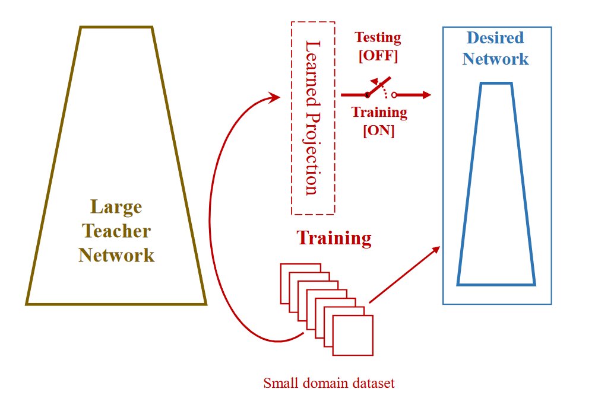
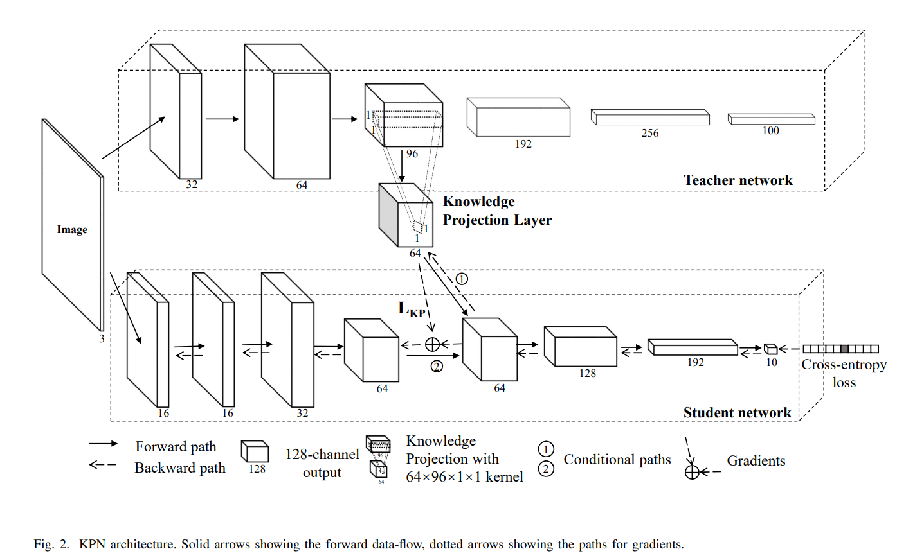
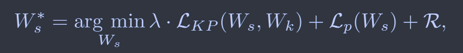
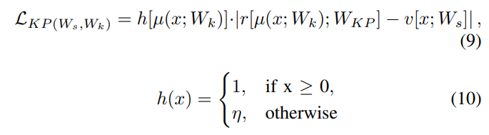
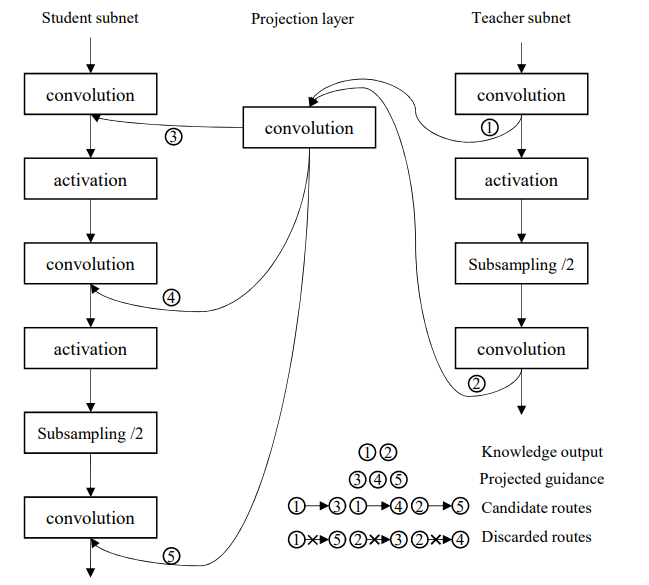
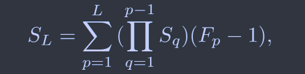
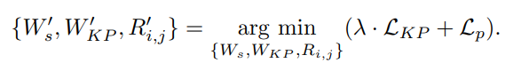

# Knowledge Projection for Effective Design of Thinner and Faster Deep Neural Networks

[arXiv1710](https://arxiv.org/abs/1710.09505)

**“如何联合解决网络压缩、加速和域自适应问题成为一个非常重要的研究问题”**

本文提出一种知识投影网络(KPN)，在预训练的大型教师网络的指导下，采用两阶段联合优化的方法来训练小型网络

## Method

### 投射层

在KPN中，学生网络由该联合损失进行优化

其中$L_{KP}$、$L_p$分别为知识投射层和任务相关损失，R为正则化项。

知识层被定义为教师的隐藏卷积层的输出，来指导学生网络中的注入层。

上式中$\mu$、v分别代表教师网络中的知识层和学生网络中的注入层中的网络参数；r[·]是应用在知识层上的投影函数，由上式可知，通过投射层将师生的知识层和注入层粒度进行对齐，然后让注入层来模仿知识层的输出进行学习。

$h[\mu(x;W_k)]$作为松弛项，可以通过调整h(x)的$\eta$值来降低知识层对异常样本的负响应，提高了网络的鲁棒性。

### 学习路径

**Stage 1 initialization stage:**

初始化阶段，大模型图的路径②被断开，投影层域学生网络的下半部分被一起训练，通过最小化目标任务损失$L_P$来进行优化。学生网络的上半部分通过最小化$L_{KP}$进行训练，上半部分网络利用投射层的特征输出进行优化而不直接访问任务目标。

这种策略避免了学生网络前期训练阶段拟合过快，后期难以修正的问题。

**Stage 2 joint training stage:**

联合训练阶段断开大模型图中的路径①重新连接路径②，使用stage 1的结果作为初始化，利用上述损失函数对模型进行联合优化，旨在在学生网络内部建立从输入到最终输出的平稳过渡。

### 投影路径的迭代剪枝

在教师网络和学生网络之间进行知识投射的另一个重要问题是确定知识层应选择教师网络中的哪些层，注入层应选择学生网络中的哪些层，提出一种迭代剪枝优化方案来选择最佳路径。

上图给出了候选的投影路径，通过文献44给出的方法计算每层的感受野大小，由此可以确定投射层权重$W_{KP}$矩阵的的尺寸大小

每一个KPN存储一个学生网络$W_s$，知识投影矩阵$W_{KP}$和路径路由$R_{i,j}$，教师网络的权重$W_t$为共享参数，我们的优化目标是找出联合损失最小的KPN设置：

根据计算的每条路径的感受野，我们可以给出一个候选的KPN列表，依次对其进行优化从而找到最优结果。

