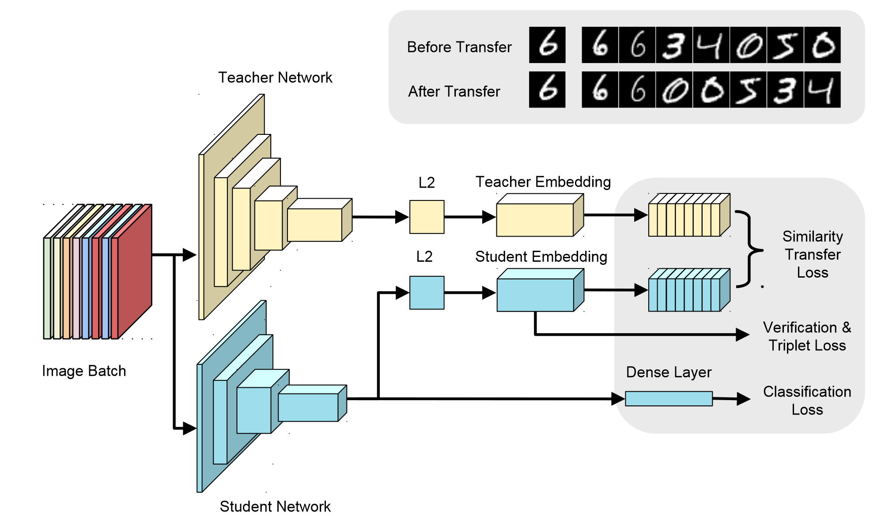
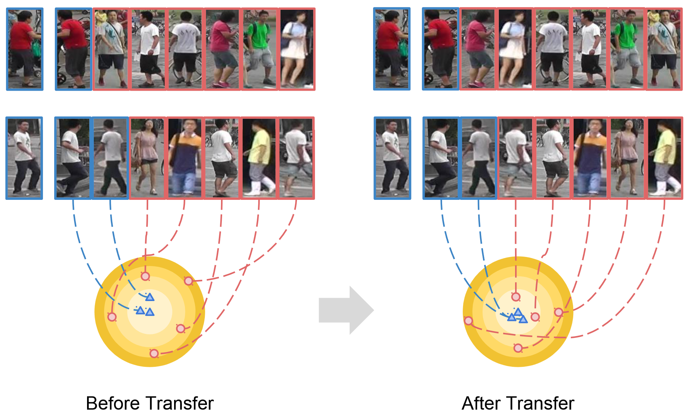

# DarkRank: Accelerating Deep Metric Learning via Cross Sample Similarities Transfer

**AAAI 2018**	

先前方法都仅考虑单样本的知识，都没有考虑不同样本之间的关系，这项工作引入知识转移的交叉样本相似性，提出了一套对样本进行相似度打分的分数损失，利用样本间的知识对学生模型进行训练。

## Introduction

现有的方法尽管利用了不同形式的知识，但是这些知识都局限于单个样本，他们都没有考虑不同样本之间的关系，因此我们引入了一种新型知识，知识转移的交叉样本相似性。

本文的总体架构与***2017NST***一致，区别在于NST提出的是注意力转移图，本文研究样本间的关系

## Method

图中的Triplet Loss怎么做的文中没提？！我推测是学生模型样本特征向量之间进行

利用候选x与查询q之间的相关性或相似性分数，将概率与每个排名排列相关联。X为候选样本，特定排列$\pi$的概率定义如下：
$$
P(\pi|X) = \prod_{i=1}^n \frac{exp[S(x_{\pi_{(i)}})]}{\sum^n_{k=i}exp[S(x_{\pi_{(k)}})]}
$$
S(x)为打分函数，对于mini-batch中的一组样本，取一个样本作为查询项q，其他作为候选，与q计算相似性，相似性分数S(x)：
$$
S(x) = -\alpha||q-x||_2^{\beta}
$$
$\alpha$和$\beta$为超参数来控制不同向量的尺度和对比度，然后根据打分函数给出我们的两种损失函数：
$$
L_{soft}(X^s, X^t) = D_{KL}[P(\pi\in\mathcal{P}|X^t) || P(\pi\in\mathcal{P}|X^s)] = \sum_{\pi \in \mathcal{P}}P(\pi|X^t)log\frac{P(\pi|X^t)}{P(\pi|X^s)}
$$

$$
L_{hard}(X^s, X^t) = -logP(\pi_y | X^s, X^t)
$$

软转移损失会考虑所有可能的排名，当有多个概率相似的排名时这很有帮助，但是所有的排名一共有n!中，只有当n不太大的时候可行，硬转移损失只考虑教师标签中最有可能的排名，硬转移是软转移的一个很好的近似，在长列表时要快得多。

