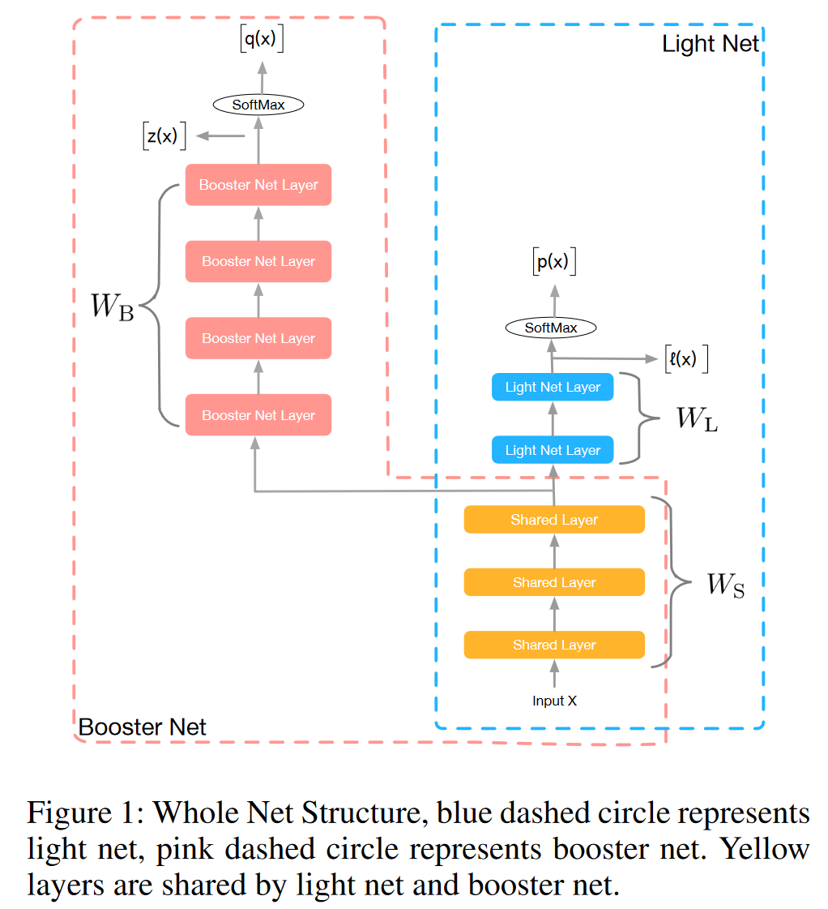
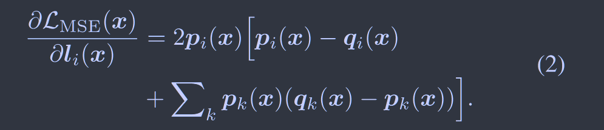
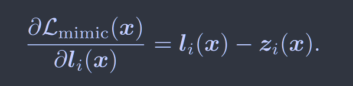
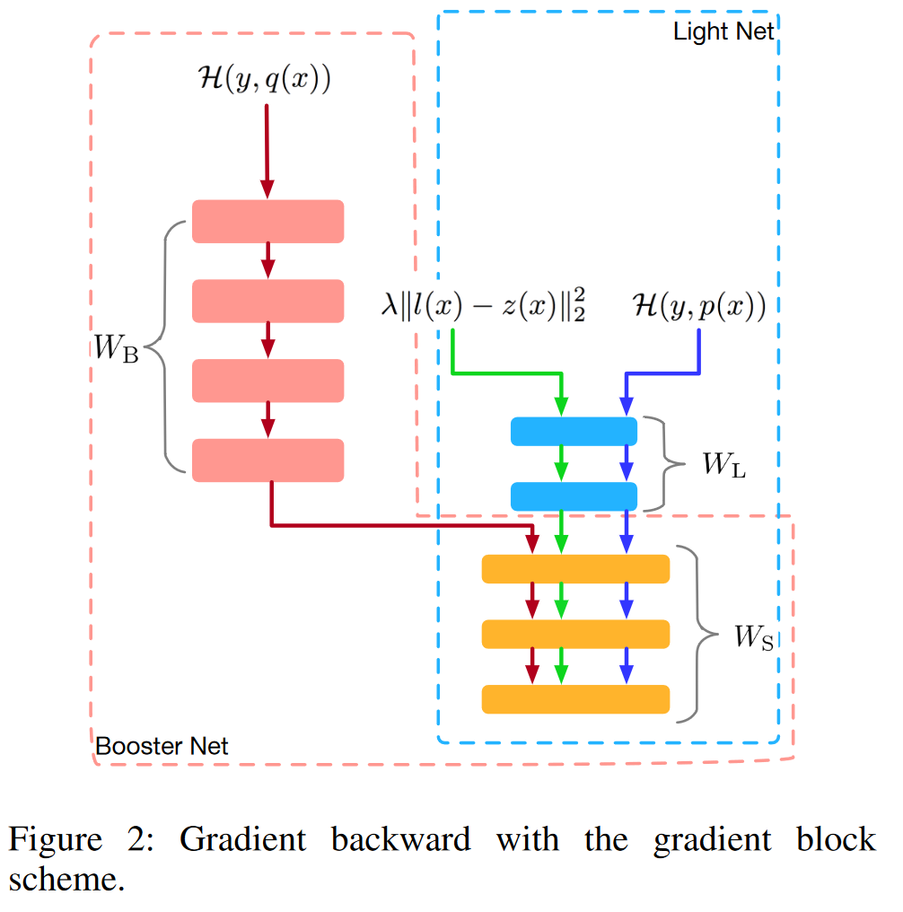

# Rocket Launching: A Universal and Efficient Framework for Training Well-performing Light Net

[2018AAAI](https://ojs.aaai.org/index.php/AAAI/article/view/11601) 	[**code in github**](https://github.com/zhougr1993/Rocket-Launching)	**CIFAR10 CIFAR100**

 **为了在有限时间下获得性能更好的神经网络，提出一个通用框架，利用一个加速网络来帮助轻量级网络的训练和预测**

提出了一种称为火箭的训练框架，包括加速网络（教师网络）和轻量级网络（学生模型），两者共享低级别层的参数，且各自都有特定曾用于任务的学习和预测，并提出梯度阻断方案来完善两个网络的优化过程

## Introduction 

在这项工作中，我们提出了一种成为火箭发射的框架，轻量级网络是推理的目标网络，助推器则是架构中更深、更复杂的网络作为教师模型。

在推理阶段，只有轻量级网络被使用。

> 我们提出一种新的训练框架，利用助推器网络在整个训练过程中监督轻量网络的学习，实验表明轻量级网络的性能能够被训练的接近更深更复杂的网络
>
> 我们分析了不同的损失函数，将信息从助推器网络蒸馏到轻量级网络
>
> 为了促进轻量级网络接近助推器网络，采用梯度块的技术抵消提示损失在反向传播过程中对助推器网络的影响，使助推器网络能够利用gt更新参数获得更好的性能

## Method

### Overview

该架构由两部分组成，轻量级网络和助推器网络，两者共享低级别的层(黄色)，并各自都有其特定的层用于任务的学习和预测。

**对于轻量级网络：**

参数由两部分组成，共享层的参数$W_s$和用于预测的特定层参数$W_L$
$$
p(x) = softmax(l(x))
$$
其中$l(x)$是softmax函数激活前的加权和

**对于助推器网络：**

参数由两部分组成，共享层的参数$W_s$和用于预测的特定层参数$W_B$
$$
q(x) = softmax(z(x))
$$
其中$z(x)$是softmax函数激活前的加权和

我们希望助推器网络根据真实标签学习以获得更强的表示能力，因此定义损失函数如下：
$$
\mathcal{L}(x;W_s,W_L;W_B) = \mathcal{H}(y, p(x)) + \mathcal{H}(y, q(x)) + \lambda||l(x)-z(x)||_2^2
$$
其中对于提示损失使用MSE损失，$\mathcal{H}(p, q)$表示交叉熵损失

### Characters of method

**Parameter sharing**

教师与学生网络在低层次共享参数，这有助于减少参数并提升泛化能力

**Hint loss functions**

*MSE of final softmax*: $\mathcal{L}_{MSE}(x)=||p(x)-q(x)||^2_2$

*MSE of logits before softmax activation:* $\mathcal{L}_{mimic}(x)=||l(x)-z(x)||^2_2$

*knowledge distillation:* $\mathcal{L}_{KD} = \mathcal{H}(\frac{p(x)}{T}, \frac{q(x)}{T})$，T为温度系数

对于MSE of final softmax，计算梯度时有：

这是如果l(x)为非常小的负数，经过softmax之后p(x)接近与0，此时会造成梯度消失，尽管轻量网络与助推器网络有差距，也不能进行学习

而MSE of logits before softmax activation解决了这一问题：

对于蒸馏损失，我们发现优化logits的差异效果要好于优化蒸馏损失

### Gradient block

轻量级网络与助推器网络一起训练，按照常规方式这种同步训练不可避免的会对助推器网络产生负面影响，因为按照常规方式在优化$W_B$时也要进行提示的反向传播，而轻量级网络不应该用于优化助推器网络，因此提出梯度块方案。

如图所示，更改了反向传播的过程，在提示损失反向传播时固定了$W_B$的参数，因此助推器网络可以直接从真实标签中学习以达到最佳性能。

