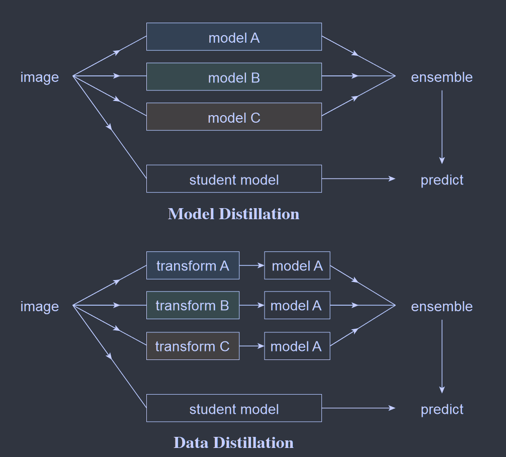

# Data Distillation: Towards Omni-Supervised Learning

**[CVPR 2018](https://openaccess.thecvf.com/content_cvpr_2018/html/Radosavovic_Data_Distillation_Towards_CVPR_2018_paper.html)	Keypoint Detection  Object Detection**

提出了一种新的学习方法，称之为数据蒸馏，利用已标记的数据训练一个模型，对未标记的数据做数据变换，计算出一个标签后进行聚合，然后与原本的标记数据合并再继续训练该模型，延长训练计划，通过这种方式能够超过大规模的监督学习。

## Introduction

大多数半监督学习通过拆分一个完全注释的数据集来模拟标记/未标记数据，其能力上限是使用全部标记好的数据进行训练的监督学习模型，而本文提出的全方位监督学习，属于半监督学习的一种，在完全标注上训练的监督学习模型是其能力的下限，我们利用在大量标记数据上训练的模型在未标记是数据上生成标签，然后使用额外生成的标签重新训练模型。

与从多个模型的预测中提炼知识相比，我们提炼了在未标记数据的多个转换副本上运行的单个模型的知识。

## Method

我们提出数据蒸馏，这是一种全方位监督学习，可以从未标记的数据中提炼知识而无需训练大量模型。

### Stage 1

在手动标记数据上训练模型，像正常训练监督学习模型一样

### Stage 2	Multi-transform inference

将训练好的模型应用于经过不同变换的未标记数据。

提高视觉识别模型准确性的常见策略是将同一模型应用于输入的多个变换，然后聚合结果，如裁剪、不同的尺度变换等。我们将利用单个模型推理数据的多个变换的过程称之为多变换推理。

实验使用两种流行的转换：缩放和水平翻转

### Stage 3	Generating labels on unlabeled data

通过合并多个预测，将未标记数据的预测转换为标签.

通过聚合多变换推理的结果，可以获得优于单变换下任何模型预测的单个预测，我们实验发现聚合会产生新的知识，模型可以使用这些信息来学习

### Stage 4

在手动标记数据和自动标记数据的并集上重新训练模型

## Notice 

训练非常简单，不需要更改损失函数，但是我们要确保每个训练批次都有手动标记的数据和自动标记的数据；我们有很多可用的数据，我们需要延长训练计划