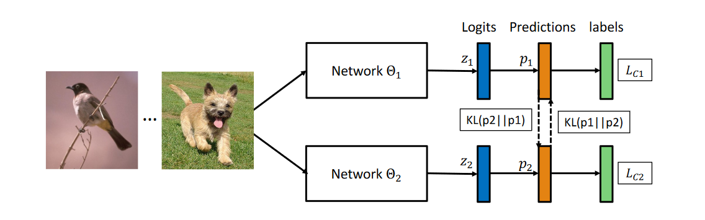
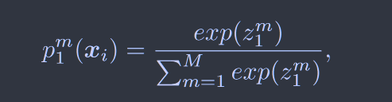
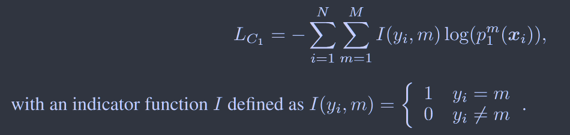
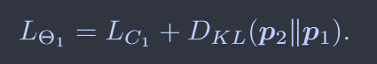
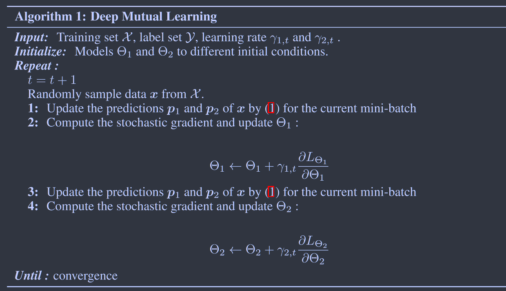
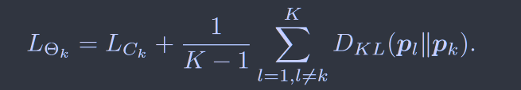
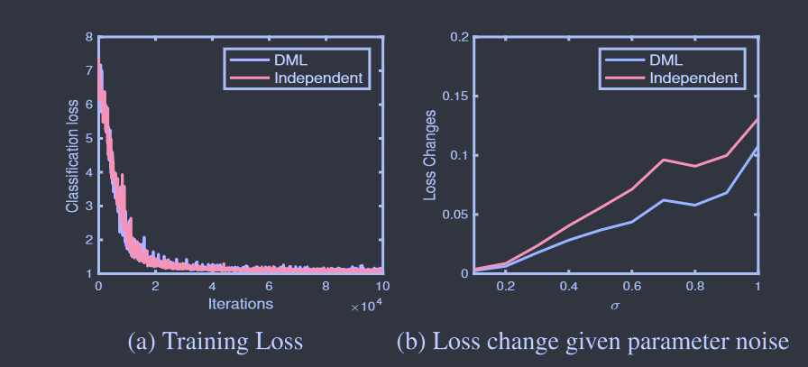
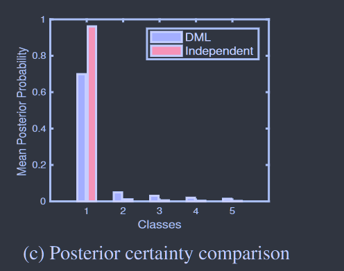

# Deep Mutual Learning 

[CVPR2018](https://openaccess.thecvf.com/content_cvpr_2018/html/Zhang_Deep_Mutual_Learning_CVPR_2018_paper.html) 	no code

提出了互学习的概念，两个或多个学生模型之间互相学习。 并且通过多模型的互学习优化时的不同集成策略证明了**具有高熵的后验能够训练出更鲁棒的模型结构。**

### 损失函数的设计

样本$x_i$的m类概率计算， $z^m$为神经网络$\theta_1$的softmax输出

定义由标签指导的交叉熵损失，$y_i$为真实标签，N为样本数量，M为类别数量

定义两个网络互相监督的KL散度损失：

对于神经网络$\theta_1$损失函数为：

对于神经网络$\theta_2$损失函数为：

通过这种设计，每个网络既能正确预测训练样本的真实标签，又能匹配其他学生网络的概率估计。

双模型更新过程如下所示：

### 扩展到多模型

假设有k个网络组成学生网络集合，损失函数应定义为：

添加1/(k+1)系数为了确保训练过程中起主导作用的是真实的标签

还有一种可行的方案是转换为之前两模型的更新方式，将K-1个模型集合成一个模型后进行更新，损失函数如下：

但是实验表明这种方式会使得集成的教师模型的真实类别后验概率更大，从而降低了所有类别的信息熵，不利于产生鲁棒性的解。

### Discussion

DML的学习过程并不是帮助找到一个训练损失的最小值而是找到一个更广泛、更稳健的最小值

DML的所有网络都倾向于集合对于次级概率的预测，通过对“合理”备选方案进行相互概率匹配而不是盲目的追求高熵偏好

结果发现对多网络模型，聚合后在进行学习效果更差，集成后的目标在真实标签上的峰值要比不集成的方式尖锐的多，因此不集成的信息熵要高于集成后的值，因此集成后实际上提供了一个不利的教学条件，**具有高熵的后验能够训练出更鲁棒的模型结构**。