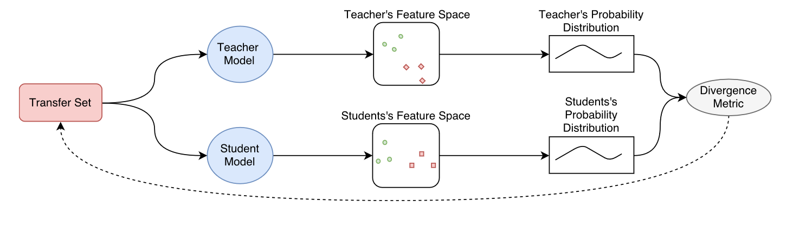

# Learning Deep Representations with Probabilistic Knowledge Transfer

**[ECCV 2018](https://arxiv.org/abs/1803.10837)	[code in github](https://github.com/passalis/probabilistic_kt)	CIFAR10  YouTubeFaces  VOC07/12**

本文提出一种利用概率的方法来让学生模型模仿教师模型的特征空间，对数据样本之间成对交互进行建模可以描述相应特征空间的几何形状，因此使用模型特征空间中样本间的联合概率密度来描述特征空间的形状，联合概率密度通过核密度估计来计算，最后还从信息论的角度分析了本文方法的有效性。

## Introduction

现有的KT技术仍然存在很大的局限性，他们通常无法直接在不同架构之间进行知识迁移，且大多是为分类任务量身定做的不太适用于其他应用；并且现有的KT技术大多忽略了教师特征空间的几何形状，例如流形、样本之间的相似性等，因为他们仅对教师网络的输出进行回归。

> 是否可以使用现有的KT技术来执行表示学习任务而不仅仅是分类任务？如果可以表现效果如何？
>
> 有没有什么方法可以学习教师特征空间的形状而不是学习其输出？
>
> 是否有可能将来自手工制作的特征（SIFT HoG etc.）的知识转移到神经网络中？
>
> 被训练来解决其他任务的网络知识是否也能有效的转移到较小的网络中？

为了克服这些困难，本文提出一种基于概率的知识迁移方法，首先将特征空间中数据样本之间交互建模为表达数据样本之间关系的概率分布，这样做尽管网络维度不匹配也可以直接进行知识迁移；另外直接模仿教师模型的输出可能不是最好的策略，通过允许稍微扭曲特征空间，可能会促进更好的知识转移。

我们提出的方法Probabilistic KT 能够进行跨模态的知识迁移；能够将手工特征提取器中的知识提取到神经网络中；无论任务是什么都能够进行知识转移；并且将领域知识纳入到转移过程中，提供了KT的新见解。

## Method

有研究表明，对数据样本之间成对交互进行建模可以描述相应特征空间的几何形状，因此可以使用特征空间中任意两个数据点的联合概率密度，对两个点靠近的概率进行建模，可以最小化教师模型P和学生模型S之间的联合概率密度差异来让学生模仿教师的特征空间，概率密度可以使用核密度估计（KDE）:
$$
p_{ij} = p_{i|j}p_j = \frac{1}{N}K(x_i, x_j;2\sigma_t^2) \\
q_{ij} = q_{i|j}q_j = \frac{1}{N}K(x_i, x_j;2\sigma_s^2) 
$$
其中$K(a,b;\sigma^2_t)$是宽度为$\sigma_t$d的对称核，a和b是两个向量。最小化这两个分布之间的差异不需要标签来指导。并且能够确保每个转移样本在学生和教师空间中具有相同的邻居。

然而学习一个小得多的模型来准确的重建复杂教师模型特征空间的整个几何形状通常是不可能的，为了解决这个问题，我们用样本的条件概率分布代替联合概率密度函数，条件概率分布能够更准确的描述样本之间的局部区域。

教师模型和学生模型的条件概率分布定义为：
$$
p_{i|j}=\frac{K(x_i,x_j;2\sigma^2_t)}{\sum^N_{k=1,k \neq j }K(x_k,x_j;2\sigma^2_t)} \in [0, 1] \\
q_{i|j}=\frac{K(y_i,y_j;2\sigma^2_t)}{\sum^N_{k=1,k \neq j }K(y_k,y_j;2\sigma^2_t)} \in [0, 1] \\
\sum^N_{i=0,i\neq j}p_{i|j}=1 \ and \ \sum^N_{i=0,i\neq j}q_{i|j}=1
$$
高斯核函数是比较常用的选择，$\sigma$是内核的缩放因子，为了获得好的效果需要仔细调整缩放因子的值，而这并不是一项容易的任务，因此本文使用一种基于余弦相似的核函数，这种几乎不需要调整超参数。并且有工作证明余弦度量会比欧几里得距离度量有着更好的性能，特别是在高维空间中。
$$
K_{Gaussian}(a, b;\sigma) = exp(-\frac{||a-b||^2_2}{\sigma}) \\
K_{cosine}(a, b) = \frac{1}{2}(\frac{a^Tb}{||a||_2 ||b||_2} + 1) \in [0, 1]
$$
用于训练学生模型的散度度量也有多种选择，本文使用KL散度：
$$
\mathcal{KL}(\mathcal{P||Q}) = \int_t \mathcal{P}(t)log\frac{\mathcal{P}(t)}{\mathcal{Q}(t)}dt
$$
$\mathcal{P}\ \mathcal{Q}$分别是教师模型和学生模型的概率分布，训练时使用有限点进行近似，因此训练时离散化的损失函数如下：
$$
\mathcal{L} = \sum^N_{i=1}\sum^N_{j=1,i\neq j}p_{j|i}log(\frac{p_{j|i}}{q_{j|i}})
$$
KL散度并不是对称距离度量，因此他会对邻近点赋予比远点更高的权重，这意味着在优化过程中维护局部邻域的几何形状比重新创建教师整个特征空间的全局几何特征更重要，若是维护整个空间的几何特征更为重要，可以使用对称散度度量来代替，例如二次散度度量。

为了学习学生模型g(t, W)的参数，使用梯度下降法，本文没有使用SGD而是使用最近被提出的Adam优化器。计算参数的核函数矩阵通常计算量庞大，这个过程可以被Nystrom-like的相似性矩阵来加速，并且不会产生负面效果。

## PKT and Mutual Information

我们给出了提出的方法与互信息之间的联系，互信息MI是随机变量之间依赖性的度量，令C为随机变量用于描述样本的属性，对于从X中提取的每个特征向量x都有一个对应的标签c，互信息衡量经过特征向量x后类别标签c的不确定性减少了多少，P(c)表示类别标签为c的概率，p(x, c)表示相应联合分布的概率密度函数，则教师的互信息定义为：
$$
I(X, C)=\sum_c\int_xp(x, c)log\frac{p(x, c)}{p(x)P(c)}dx
$$
互信息也可以被解释为联合概率分布p(x,c)与边缘概率p(x)P(c)乘积之间的kl散度。

二次互信息QMI通过将KL散度替换为二次散度度量来得到：
$$
I_T(X, C) = \sum_c \int_x( p(x, c) - p(x)P(c) )^2dx \\
= \sum_c \int_xp(x, c)^2dx + \sum_c \int_x(p(x)P(c))^2dx -2\sum_c \int_xp(x,c)p(x)P(c)dx
$$
我们定义以下几个信息势：

$V^{(t)}_{IN}$表示类内的相互作用；$V^{(t)}_{ALL}$表示所有样本之间的相互作用；$V^{(t)}_{BTW}$表示每个类与其他所有样本之间的相互作用
$$
V^{(t)}_{IN} = \sum_c \int_xp(x, c)^2dx \\
V^{(t)}_{ALL} = \sum_c \int_x(p(x)P(c))^2dx  \\
V^{(t)}_{BTW} = \sum_c \int_xp(x,c)p(x)P(c)dx
$$
因此QMI：
$$
I_T(X, C) = V^{(t)}_{IN} + V^{(t)}_{ALL} -2V^{(t)}_{BTW}
$$
推广到我们提出的PKT上：

假设存在Nc个不同类别，每个类别由Jp个样本组成，则cp类别的先验概率为$P(c_p)=\frac{J_p}{N}$N为样本总数。 引入核密度估计KDE：
$$
p(x, c_p) = \frac{1}{N}\sum^{J_p}_{j=1}K(x, x_{pj};\sigma^2_t) \\
p(x) = \sum^{J_p}_{p=1}p(x, c_p) = \frac{1}{N}\sum^N_{j=1}K(x, x_{j};\sigma^2_t)
$$
其中$x_{pj}$表示第p类的第j个样本，代入到上式中化简有对于教师模型的势：
$$
V^{(t)}_{IN} = \frac{1}{N^2}\sum_{p=1}^{N_c}\sum_{k=1}^{J_p}\sum_{l=1}^{J_p}K(x_{pk}, x_{pl};2\sigma^2_t) \\
V^{(t)}_{ALL} = \frac{1}{N^2}(\sum_{p=1}^{N_c}(\frac{J_p}{N})^2)\sum_{k=1}^{N}\sum_{l=1}^{N}K(x_{k}, x_{l};2\sigma^2_t)  \\
V^{(t)}_{BTW} = \frac{1}{N^2}(\sum_{p=1}^{N_c}\frac{J_p}{N})\sum_{j=1}^{J_p}\sum_{k=1}^{N}K(x_{pj}, x_{k};2\sigma^2_t)
$$
同理可以构造学生模型的信息势，若QMI要在模型之间转移，则意味着两个模型之间各自的信息势必须相等，这要求核函数为没对数据样本提供的值要相等，而这正式我们提出方法的优化目标。