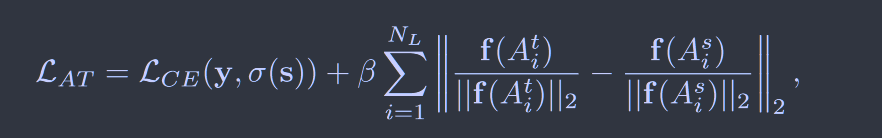
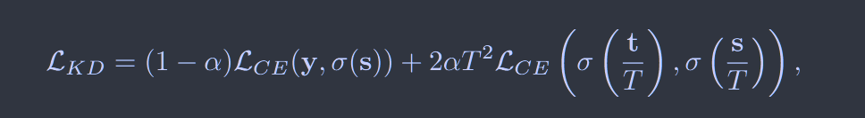
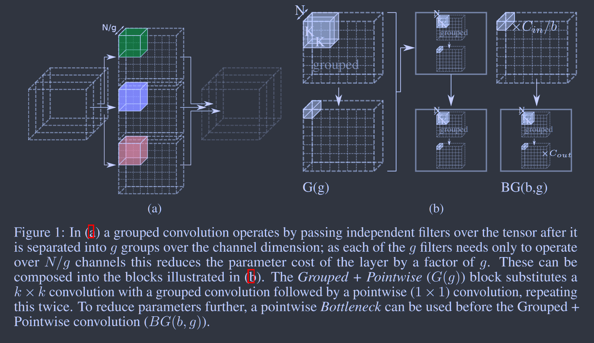
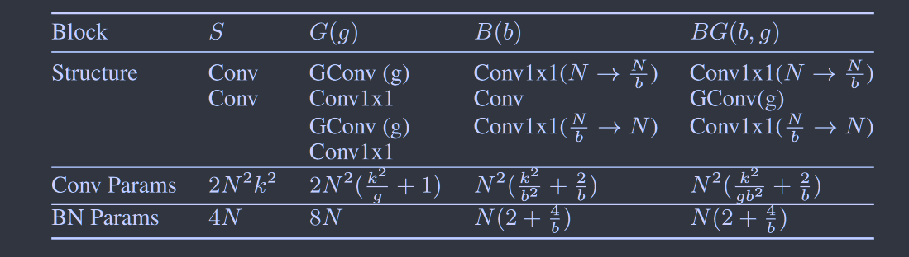
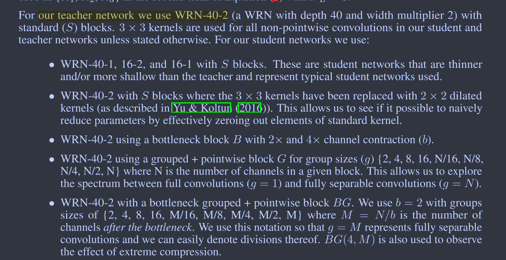
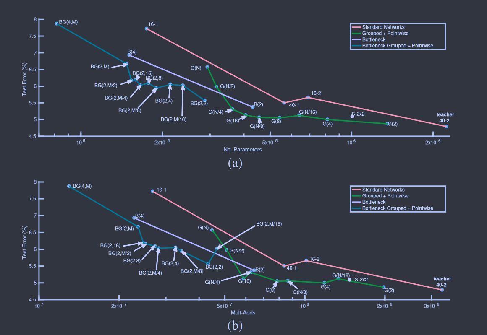
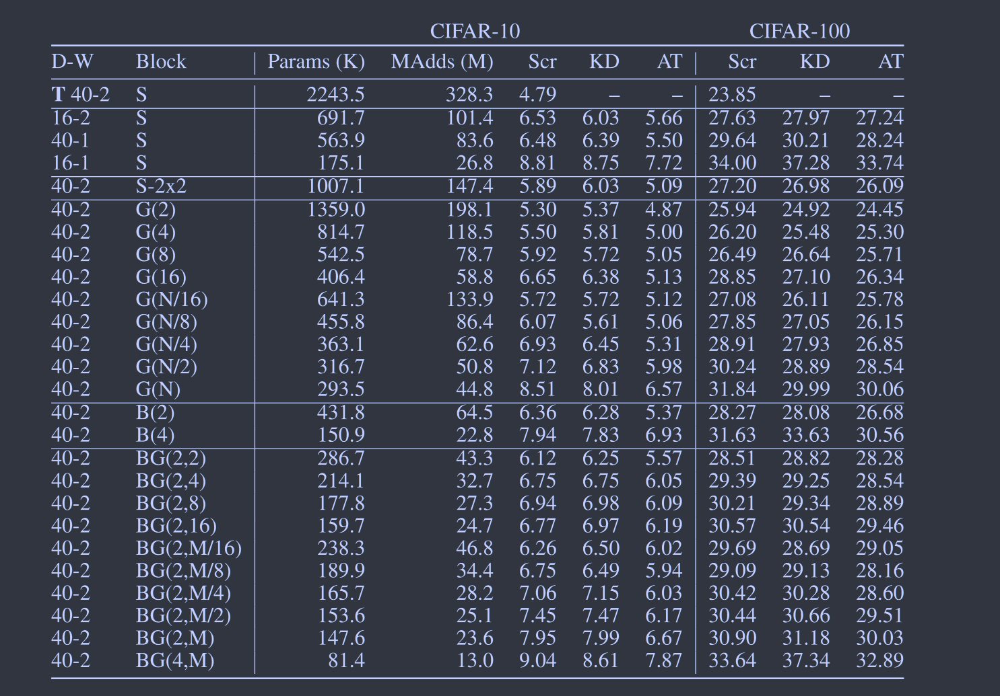

# Moonshine: Distilling with Cheap Convolutions

[NeurIPS2018](https://proceedings.neurips.cc/paper_files/paper/2018/hash/49b8b4f95f02e055801da3b4f58e28b7-Abstract.html)  **[code in github](https://github.com/BayesWatch/pytorch-moonshine/tree/master)**

**本文没有使网络变得更薄更浅，采用此类网络所使用的标准卷积块，并将其为替换为更便宜的卷积快，保持原始架构不变。**

## Introduction

**Can we have networks with substantially fewer parameters, without the commensurate loss of performance?**

**本文没有使网络变得更薄更浅，采用此类网络所使用的标准卷积块，并将其为替换为更便宜的卷积快，保持原始架构不变。**

## Method

### loss function

***提出了一种注意力转移的损失：***

$N_L$表示神经网络的层数，$a_{i,j}^t$表示教师模型第i层通道j的特征图的值，$A_i^t$表示教师模型该层的所有通道，对于学生模型同理

其中：
$$
f(A_i) = \frac{1}{N_{A_i}}\sum_{j=1}^{N_{A_i}}a_{i,j}^2
$$
${N_{A_i}}$为第i层的通道数。

与传统的蒸馏损失进行对比：

这里采用师生模型logits的交叉熵来替代kl散度损失的计算。

### ***cheap convolution***

**将卷积分成g组，若$N_{in}=N_{out}=N$，则卷积消耗从$N^2k^2$降低到$(\frac{N}{g})^2k^2$，降低了g倍，成为G(g)**

**引入瓶颈块，记为B(b)，首先将输入通道数降低b倍进行卷积，在最后一个过程恢复到所需要的$N_{out}$**

**两种方法组合记为BG(b,g)**

## Experiment & Result

师生模型设定：

