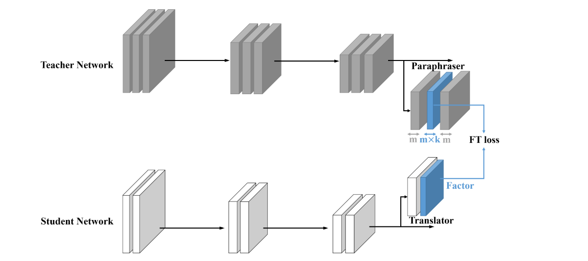
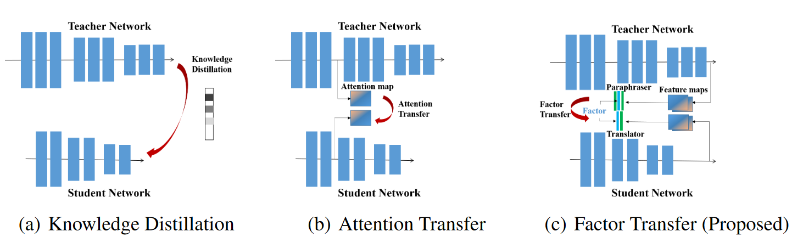

w# Paraphrasing Complex Network: Network Compression via Factor Transfer

**[NeurIPS 2018](https://proceedings.neurips.cc/paper_files/paper/2018/hash/6d9cb7de5e8ac30bd5e8734bc96a35c1-Abstract.html)	[code in github](https://github.com/Jangho-Kim/Factor-Transfer-pytorch)	CIFAR10/100  ImageNet  ObjectDetection**

这项工作认为先前方法都忽略了师生模型之间的内在差异，简单的提供教师知识而没有任何解释，不利于学生模型的理解，因此提出了因子转移的方法，在教师网络上添加一个释义器，来解释教师模型的特征图；学生网络上添加一个翻译器，来帮助学生模型理解教师模型释义器的内容。学生模型通过与标签的交叉熵和释义器-翻译器的知识转移共同训练。

## Introduction 

现有的工作在进行知识转移时直接将教师网络的软化分布或注意力图直接转移到学生网络，来诱导学生网络模仿教师网络。尽管这些方法取得了不错的效果，但我们认为直接传输忽略了教师网络和学生网络之间的内在差异，例如网络结构、通道数量和初始条件。简单的直接提供教师的知识而没有任何解释，对于教授学生来说可能有些不足，应当将教师网络的知识翻译成更简单的属于，让学生网络更加容易理解。

我们提出一种新的知识转移的方法，引导学生和教师网络产生可变换的特征，我们称之为因素。从教师网络中提取因子的神经网络称之为释义器；从学生网络中提取因子的神经网络称之为翻译器。以无监督的方式训练释义器，期望它提取与监督损失所不同的知识，学生网络与翻译器一同训练，吸收从释义器中获得的知识。

## Method

释义者通过重建损失进行训练，从教师网络中提取教师因子；这些教师因子转移到学生因子上，以便学生网络从中学习

### Teacher Factor Extraction with Paraphraser

我们将网络架构堆叠成组，先前工作验证了低层特征比较普遍而高层特征有着更大的特异性，因此我们从最后一组特侦图中提取因子，最后一次包含足够信息来完成任务，释义器的输入为x，输出为P(x)，我们以无监督的方式训练它，使用多个卷积来生成教师因子FT，并且调整空间通道数，因子通道数调整为$m \times k$，k称为释义率，给出释义器的重建损失：
$$
\mathcal{L}_{rec} = ||x - P(x)||^2
$$

### Factor Transfer with Translator

教师网络提取了教师的知识因素，学生网络应当能够以自己的方式消化吸收他们，我们称这一过程为因子转移（Factor Transfer），在学生网络最后一组卷积之后插入转换器，翻译器与学生网络共同训练，翻译器起到缓冲的作用，通过改写学生网络的特征图，将学生网络从直接学习教师网络输出的负担中解脱出来，给出学生模型的损失：
$$
\mathcal{L}_{student} = \mathcal{L}_{cls} + \beta\mathcal{L}_{FT} \\
L_{cls} = \mathcal{C}(S(I_x), y) \\
\mathcal{L}_{FT} = ||\frac{F_T}{||F_T||_2} - \frac{F_S}{||F_S||_2}||_p
$$
其中$\beta$为权重参数，$\mathcal{C}$为标准交叉熵损失

### Training Code

训练时先训练教师骨干网络，然后训练释义器，最后利用训练好的教师网络和释义器训练学生网络和翻译器