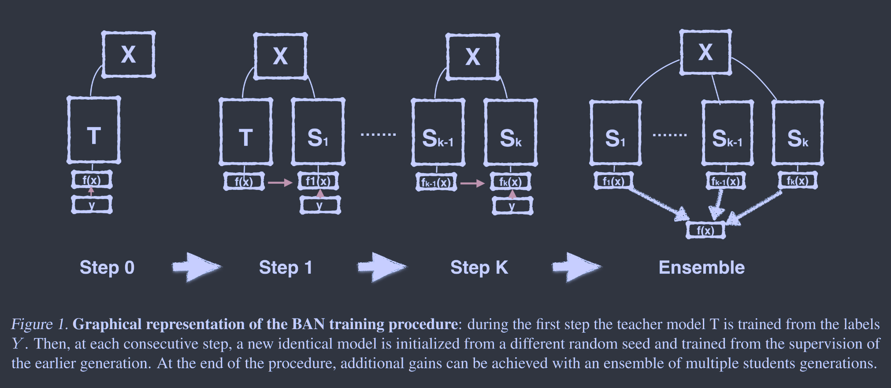

# Born Again Neural Networks

**[PMLR 2018](https://proceedings.mlr.press/v80/furlanello18a.html)	no code**	

*Tommaso Furlanello, Zachary Lipton, Michael Tschannen, Laurent Itti, Anima Anandkumar*

本文提出一个序列化的建模过程，令前一个模型为后一个模型的老师，依次来进行序列化的学习，最后将所有的学生模型集成成一个模型作为最终的输出。

## Introduction 

先前工作表明，不同的随机算法程序可以导致具有相似验证性能的不同模型，且将这些模型组合成一个集合可以获得由于每个组成模型的性能。基于这一思想我们开发了一个再训练的过程，教师模型收敛后，我们初始化一个新的学生模型，以预测正确的标签和匹配教师的输出分布的双重目标进行训练。我们称这些学生为Born-Again 网络 BANS。

## Method

考虑经典图像分类设置，我们有由图像和标签组成的元组$(x.y) \in \mathcal{X} \times \mathcal{Y}$，我们期望拟合一个函数$f(x): \mathcal{X} \mapsto \mathcal{Y}$，可以推广到看不到的数据。通常映射f(x)由一个神经网络$f(x, \theta_1)$参数化，$\theta_1\in \Theta_1， \Theta_1$为某个参数空间，我们通过经验风险最小化ERM来学习参数，从而产生一个最小化某些损失函数的模型$\theta^*_1$：
$$
\theta^*_1 = \underset{\theta_1}{arg\ min}\ \mathcal{L}(y, f(x, \theta_1))
$$
通常使用SGD进行优化。BAN是利用了蒸馏中的思想，教师模型输出分布$f(x, \theta_1)$可以提供丰富的训练信号，从而得到第二个解$f(x, \theta_2)$参数化，$\theta_1\in \Theta_2$，具有更好的泛化能力：
$$
\mathcal{L}(f(x,\underset{\theta_1}{arg\ min}\ \mathcal{L}(y, f(x, \theta_1))), f(x, \theta_2))
$$

### Sequence of Teaching Selves Born-Again Networks Ensemble

我们将BANs应用到多代知识迁移，在每一种情况下，训练k个模型，知识从第k-1个学生转移：
$$
\mathcal{L}(f(x,\underset{\theta_{k-1}}{arg\ min}\ \mathcal{L}(y, f(x, \theta_{k-1}))), f(x, \theta_k))
$$
最后将多个模型进行集成：
$$
f^k(x) = \frac{1}{k}\sum^k_{i=1}f(x, \theta_i)
$$
我们发现序列的改进是趋于饱和的，但是我们能通过集成产生显著的增益。

