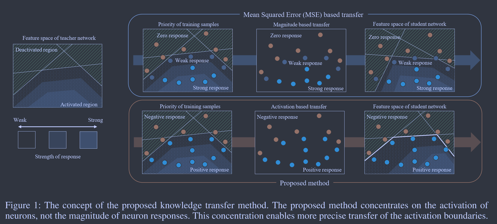

# Knowledge Transfer via Distillation of Activation Boundaries Formed by Hidden Neurons

**[AAAI 2019](https://ojs.aaai.org/index.php/AAAI/article/view/4264)	[code in github](https://github.com/bhheo/AB_distillation)	CIFAR10**

基于先前工作的启发，作者认为激活信息是非常重要的，先前工作集中于对于激活值的传递，而我们认为对于激活边界的传递是更为重要的，因此修改损失函数来传递教师模型的激活边界信息，而这个修改导致了损失函数的离散化，无法进行梯度下降优化，为了解决这个问题引入了一个近似函数，将教师模型的神经元激活值视为二分类中的标签，转化为连续的二分类问题，在性能上取得了提升。

## Introduction

先前的工作揭示了将教师的激活边界信息传递给学生可以极大的促进分类问题中知识转移性能的提高，因为分类问题高度依赖类别之间决策边界的形成。基于这一启示，本文提出一种专注于激活边界转移的知识转移方法，这种方法旨在关注神经元是否被激活。

提出一种激活转移损失，该损失使教师和学生之间的神经元激活差异最小化，激活转移损失不考虑神经元反应的大小，而是考虑神经元是否被激活；但这无法微分，不能通过梯度下降来优化，我们提出类似于SVM铰链损失的替代损失，使之能够进行梯度下降。

## Method

有两种方案：第一种在学生神经网络学习对输入图像进行学习时转移神经元反应，这种情况交叉熵损失和转移损失结合在一起，形成一个用于整个训练过程的综合损失；第二种是在分类训练之前转移神经元响应以初始化网络，根据传输损失初始化后使用交叉熵进行分类训练。

本文基于网络初始化的方法进行讨论。

### Linear Layer

$\mathcal{T}(I)\in\mathbb{R}^M$，$\mathcal{S}(I)\in\mathbb{R}^M$分别表示教师模型和学生模型在激活函数之前的值，M为隐藏层神经元的数量，我们首先假设师生网络隐藏层神经元数量相同。激活函数$ReLU\ \sigma(x) = max(0, x)$，先前方法对于神经元反应的转移定义如下：
$$
\mathcal{L}(I) = ||\sigma(\mathcal{T}(I)) - \sigma(\mathcal{S}(I))||^2_2
$$
然而这种方式只是让学生模型近似教师模型神经元的反应，激活边界可能大不相同，这种方式只能很好的传递具有强响应的样本，对于弱响应和零响应的样本很难区分，如下图上半部分所示。

因此准确转移激活边界至关重要，我们提出放大激活边界附近区域的可忽略不计的转移损失，我们定义了一个逐元素的激活指示器函数来表示神经元是否被激活：
$$
\rho(x) = 
\begin{cases}
1,\ if\ x>0 \\
0,\  otherwise
\end{cases}
$$
给出对应的激活转移损失：
$$
\mathcal{L}(I) = ||\rho(\mathcal{T}(I)) - \rho(\mathcal{S}(I))||_1
$$
教师和学生激活不同时，会给出恒定的惩罚，无论神经元反应大小如何，都具有相同的权重，图一下半部分是我们提出方法的结果。尽管神经元的反应没有很好的转移，但是保持了与教师模型相同的激活边界。

由于$\rho(·)$是离散函数，损失函数无法通过梯度下降优化，我们提出一个替代函数。最小化激活转移损失类似于学习二元分类器，教师神经元的激活对应于类别标签，基于以上启发，我们设计了类似于SVM中使用的铰链损失，$\mu$为边际，确保训练的稳定性：
$$
\mathcal{L}(I) = ||\rho(\mathcal{T}(I)) \odot \sigma(\mu1 - S(I)) + (1-\rho(\mathcal{T}(I))) \odot \sigma(\mu1 + S(I))||^2_2
$$
对神经元响应的第i个元素计算梯度：
$$
-\frac{\partial\mathcal{L}(I)}{\partial s_i} = 
\begin{cases}
2(s_i-\mu), {\kern 20pt}if\ \rho(t_i)=1 \ and \ s_i<\mu \\
-2(s_i+\mu),{\kern 12pt}if\ \rho(t_i)=0 \ and \ s_i > -\mu \\
0, {\kern 53pt} otherwise
\end{cases}
$$
当师生网络隐藏层神经元数量不同时，我们引入一个连接器r来对齐两者的尺度：
$$
\mathcal{L}(I) = ||\rho(\mathcal{T}(I)) \odot \sigma(\mu1 - r(S(I)) + (1-\rho(\mathcal{T}(I))) \odot \sigma(\mu1 + r(S(I))||^2_2
$$

### Convolutional Layer

我们将我们的方法推广到卷积层，对于教师网络$\mathcal{T}(I)\in\mathbb{R}^{H \times W \times M}\ \ \mathcal{T}(I)_{ij}\in\mathbb{R}^{M}$，同理对学生网络$\mathcal{S}(I)\in\mathbb{R}^{H \times W \times M}\ \ \mathcal{S}(I)_{ij}\in\mathbb{R}^{M}$
$$
\mathcal{L}(I) = \sum_i^H\sum_j^W||\rho(\mathcal{T}(I)_{ij}) \odot \sigma(\mu1 - r(S(I)_{ij}) + (1-\rho(\mathcal{T}(I)_{ij})) \odot \sigma(\mu1 + r(S(I)_{ij})||^2_2
$$
