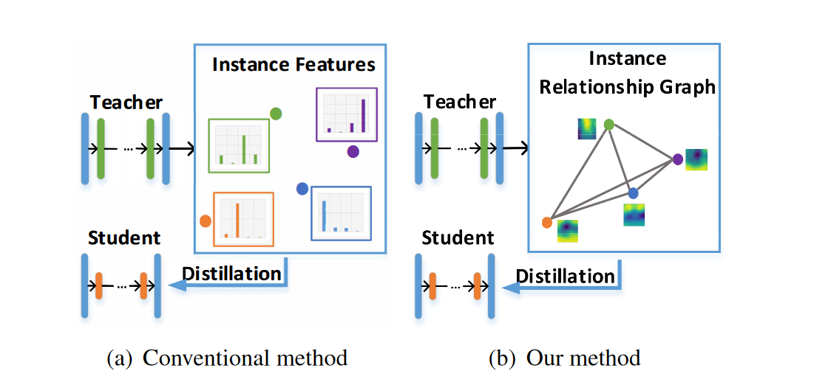
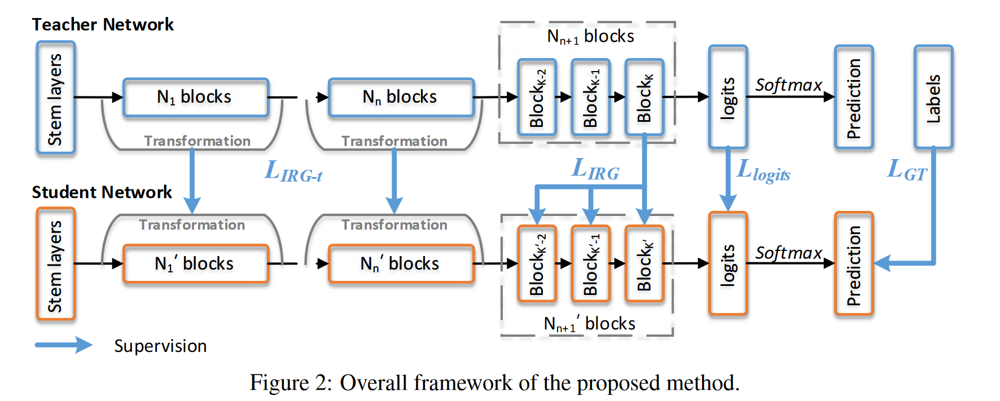
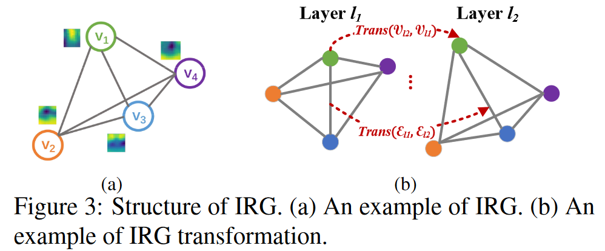
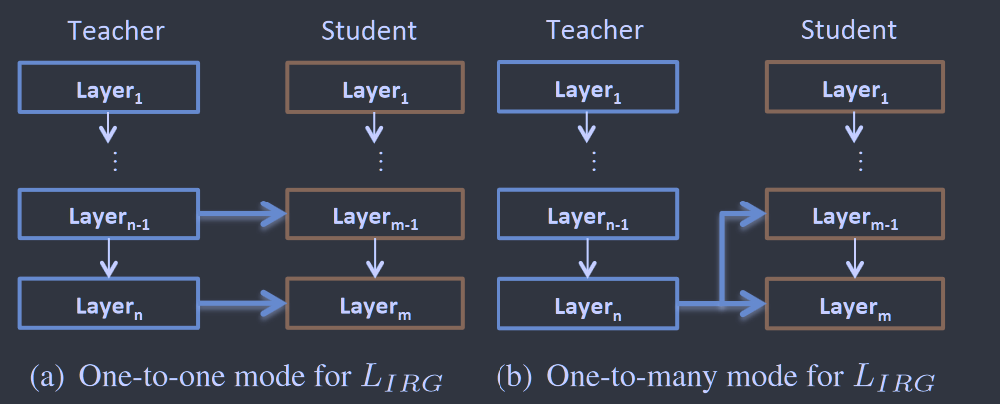

# Knowledge Distillation via Instance Relationship Graph

**[CVPR 2019](https://openaccess.thecvf.com/content_CVPR_2019/html/Liu_Knowledge_Distillation_via_Instance_Relationship_Graph_CVPR_2019_paper.html)	no code	CIFAR10/100  ImageNet**

*Yufan Liu, Jiajiong Cao, Bing Li, Chunfeng Yuan, Weiming Hu, Yangxi Li, Yunqiang Duan*

先前工作忽略了实例之间的关系，本文提出一种实例关系图用于知识蒸馏，建模了三种知识：实例特征、实例关系和特征空间变换。将实例特征和实例关系分别作为顶点和边，引入三种损失分别对其进行优化。

## Introduction 

传统的知识蒸馏方法存在两个缺陷，现有方法独立地从教师网络中提取实例特征，实例关系从未被考虑过，但他有助于减少特征空间中的类内差异并扩大类间差异；且当师生网络具有不同网络结构时，基于实例特征的方法通常会有显著的性能下降。	

因此我们提出一种新的基于图的知识蒸馏框架，除了广泛使用的实例特征，还定义了两种新的知识，包括实例关系和特征空间变换。提出实例关系图（IRG）来对知识进行建模。

## Method

### Instance Relationship Graph

给定I个训练实例$x=\{ x_i \}^I_{i=1}$，令$f_l(x_i)$为第l层的xi的实例特征，实例关系被描述为实例特征的邻接矩阵，记为$A_l$，$IRG_l$表示第l层的特征空间

$$
IRG_l=(\mathcal{V}_l,\mathcal{E}_l) = (\{f_l(x_i)\}^I_{i=1}, A_l) \\
A_l(i, j) = ||f_l(x_i)-f_l(x_j)||^2_2, \ i,j=1,...,I
$$

其中$\mathcal{V_i}$是表示第l层实例特征的IRG的顶点集，$\mathcal{E}_l$是表示实例关系IRG的边集，特征关系矩阵的每个元素$A_l$表示一条边，每条边定义为两个实力特征之间的欧氏距离。基于IRG的表述定义变换，令$IRG-t_{l_1l_2}$为第l1层到第l2层的IRG变换，将其分解为顶点变换$Trans(\mathcal{V_{l_1}},\mathcal{V_{l_2}})$和边变换$Trans(\mathcal{E_{l_1}},\mathcal{E_{l_2}})$:
$$
IRG-t_{l_1l_2}=Trans(IRG_{l_1},IRG_{l_2})=(Trans(\mathcal{V_{l_1}},\mathcal{V_{l_2}}), Trans(\mathcal{E_{l_1}},\mathcal{E_{l_2}})) = (\Lambda_{l_1, l_2},\Theta_{l_1, l_2}) \\
\Lambda_{l_1, l_2}(i, i) = ||f_{l_1}(x_i)-f_{l_2}(x_i)||^2_2, \ i=1,...,I \\
\Theta_{l_1, l_2}=||A_{l_1}-A_{l_2}||^2_2
$$
其中Trans(·)为变换函数，$\Lambda_{l_1, l_2}, \Theta_{l_1, l_2}$分别为顶点变换矩阵和边变换矩阵。

***$A_l$表征的是同一层中样本间的关系***

***$\Lambda_{l_1,L_2}$表征的是不同层间样本关系；$\Theta_{l_1,l_2}$表征的是同层样本间关系在不同层之间的差异；两者信息其实有冗余***

### Loss for IRG

IRG损失定义为师生IRG之差，$IRG^T_L,IRG^S_{L_M}$分别表示第L层教师网络的IRG和第LM层学生网络的IRG，然后将两个IRG的差值分为顶点插值和边差值：
$$
L_{IRG}(x)=Dist(IRG^T_L,IRG^S_{l_M})=\lambda_1·Dist(\mathcal{V}^T_L,\mathcal{V}^S_{l_M}) + \lambda_2·Dist(\mathcal{E}^T_L,\mathcal{E}^T_{l_M}) \\
=\lambda_1·\sum^I_{i=1}||f_{L}^T(x_i)-f_{l_M}^S(x_i)||^2_2 + \lambda_2·||A_{L}^T-A_{l_M}^S||^2_2
$$
当$\lambda_2=0$是，退化为只考虑实例特征的情况。$L_{IRG}$有两种可能的部署模式，一对一模式下，学生所选择的层由相应层的教师网络进行监督，当教师模型和学生模型共享网络结构时，一对一模式最佳；一对多模式利用教师的最后一层L来指导学生的选定层LM，由于最后一层通常学习数据集的一般分布，所以最后一层的IRG与网络设计的相关性较小。

顶点差异只有当$f_{L}^T(x_i),f_{l_M}^S(x_i)$具有相同的特征分辨率和通道数时才能够根据上式计算，然而在大多数情况下是无法满足的，因此顶点差仅用于logits层:
$$
L_{IRG}(x)=\lambda_1·L_{logits}(x)+\lambda_2·\sum_{l_M\in L_M}||A^T_L-A^S_{l_M}||_2^2
$$

### Loss for IRG Transformation

IRG变换是实例特征空间变换的表示，由顶点变换和边变换组成：
$$
L_{IRG-t}(x)= Dist(IRG-t_{l_1, l_2}^T,(IRG-t_{l_3, l_4}^S) \\
=Dist(Trans(\mathcal{V}_{l_1}^T, \mathcal{V}_{l_2}^T), Trans(\mathcal{V}_{l_3}^S, \mathcal{V}_{l_4}^S)) + Dist(Trans(\mathcal{E}_{l_1}^T, \mathcal{E}_{l_2}^T), Trans(\mathcal{E}_{l_3}^S, \mathcal{E}_{l_4}^S)) \\
= ||\Lambda^T_{l_1, l_2} - \Lambda^S_{l_3, l_4}||^2_2 + ||\Theta^T_{l_1, l_2} - \Theta^S_{l_3, l_4}||^2_2
$$
其中$\Lambda^T_{l_1, l_2} , \Theta^T_{l_1, l_2}$表示教师模型顶点和边从l1层到l2层的转换，$\Lambda^S_{l_3, l_4}， \Theta^S_{l_3, l_4}$,用其L2范数来评估教师和学生顶点变换和边变换的差异。

与顶点部分相比，边变换消耗了更多的计算资源，对于具有I个顶点的IRG，顶点部分时间复杂度为$O(I)$而边部分时间复杂度为$O(I^2)$，且提取顶点变换和边变换的知识是冗余的，因此忽略掉边变换的损失：
$$
L_{IRG-t}(x) = ||\Lambda^T_{l_1, l_2} - \Lambda^S_{l_3, l_4}||^2_2
$$

### Multi-Type Knowledge Loss

我们定义了一个MTK损失来训练学生网络，由GT损失，IRG损失和IRG变换损失来组成：
$$
L_{MTK}(x)=L_{GT}(x) + L_{IRG}(x) + \lambda_3 · L_{IRG-t}(x) \\
=L_{GT}(x)+\lambda_1·L_{logits}(x)+\lambda_2·\sum_{l_M\in L_M}||A^T_L-A^S_{l_M}||_2^2 + \lambda_3·\sum_{l_1, l_2, l_3, l_4\in L_{Tran}}||\Lambda^T_{l_1, l_2} - \Lambda^S_{l_3, l_4}||^2_2
$$
