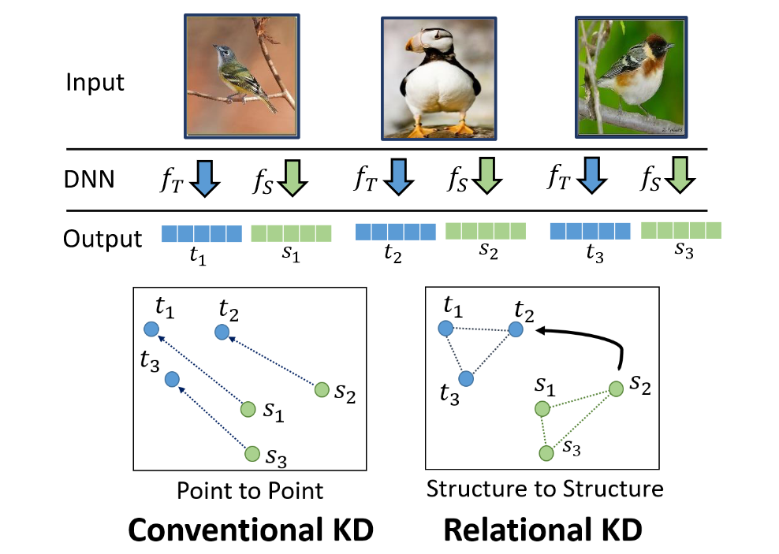
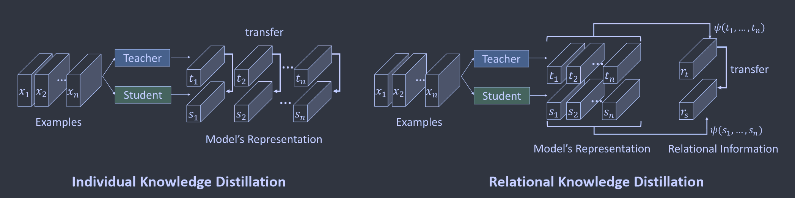

# Relational Knowledge Distillation

**[CVPR 2019](https://openaccess.thecvf.com/content_CVPR_2019/html/Park_Relational_Knowledge_Distillation_CVPR_2019_paper.html)	[code in github](https://github.com/lenscloth/RKD)	CIFAR10/100  TinyImageNet  Few-shot Learning**

*Wonpyo Park, Dongju Kim, Yan Lu, Minsu Cho*

先前方法令学生模仿教师对于单一示例输出而忽略了样本之间的关系，我们提出称为关系知识蒸馏RKD的方法，转移了数据示例之间的相互关系，提出了距离和角度的蒸馏损失，来惩罚师生模型之间的结构差异。

## Introduction 

对于知识转移这一目标，存在两个主要问题，学习模型中的知识构成什么？如何将知识转移到另一个模型中？在这项工作中，我们从语言结构主义的角度重新审视KD，其侧重于结构关系，符号的含义取决于他与系统内其他符号的关系，一个符号没有独立于上下文的绝对意义。

我们的核心观点是，构成知识的东西最好由所学表征的关系来呈现而不是表征的个体来呈现，单个数据示例在表示系统中获得相对于其他数据示例相关或与之形成对比的含义，因此主要的信息位于数据特征空间中的结构中。

基于此观点，引入关系知识蒸馏RKD ，它转移输出的结构关系而不是单个输出本身，提出两种RKD损失：距离（二阶）和角度（三阶）蒸馏损失

## Method

教师模型和学生模型分别表示为S,T，设$f_T, f_S$为教师和学生函数，我们用$\mathcal{X}^N$表示一组数据示例的N元组，例如$\mathcal{X}^2=\{ (x_i, x_j|i\neq j)\}, \mathcal{X}^3=\{ (x_i, x_j, x_k)|i\neq j\neq k\}$

RKD旨在利用教师输出中数据示例的相关关系来转移结构性知识，他为每个n元组的数据示例计算关系势，并通过点位将信息从教师传递到学生。我们定义$t_i=f_T(x_i), s_i=f_S(x_i)$：
$$
\mathcal{L}_{RKD}=\sum_{(x_1, ..., x_n)\in \mathcal{X}^N}l(\psi(t_1, ..., t_n), \psi(s_i, ..., s_n))
$$
当关系为一元即N=1时，RKD退化为IKD

### Distance-Wise Distillation Loss

给定一对训练样本，距离势函数在输出表示空间测量两个样本之间的欧几里得距离
$$
\psi_D(t_i, t_j) = \frac{1}{\mu}||t_i-t_j||_2
$$
$\mu$为距离的归一化因子，我们将$\mu$设为minibatch中$\mathcal{X}^2$的平均距离：
$$
\mu=\frac{1}{|\mathcal{X}^2|}\sum_{(x_i, x_j)\in \mathcal{X}^2}||t_i-t_j||_2
$$
由于蒸馏视图匹配教师和学生之间的距离电位，因此这种小批量距离归一化非常有用，特别是当教师距离和学生距离之间存在差异时。

因此距离损失定义为：
$$
\mathcal{L}_{RKD-D}=\sum_{(x_i, x_j)\in \mathcal{X}^2}l_\delta(\psi_D(t_i, t_j), \psi_D(s_i, s_j))
$$
其中$l_\delta$为Huber损失，定义为：
$$
l_\delta(x, y)=
\begin{cases}
\frac{1}{2}(x-y)^2 {\kern 20pt}  for\ |x-y| \leq 1\\
|x-1|-\frac{1}{2}  {\kern 15pt} otherwise.
\end{cases}
$$
距离蒸馏损失通过惩罚其输出表示空间之间的距离差异来转移示例之间的关系，与传统的KD不同，他不会强迫学生直接匹配教师的输出，而是鼓励学生专注于输出的距离结构。

### Angle-Wise Distillation Loss

给定一个三元组示例，角度关系势函数测量输出表示空间中三个示例形成的角度;
$$
\psi_A(t_i, t_j, t_k) = cos\angle t_it_jt_k = <e^{ij}, e^{kj}> \\
where\ e^{ij}=\frac{t_i-t_j}{||t_i-t_j||_2}, e^{kj}=\frac{t_k-t_j}{||t_k-t_j||_2}
$$
角度损失定义为：
$$
\mathcal{L}_{RKD-A}=\sum_{(x_i, x_j, x_k)\in \mathcal{X}^3}l_\delta(\psi_A(t_i, t_j, t_k), \psi_A(s_i, s_j, s_k))
$$
其中$l_\delta$为Huber损失，角度蒸馏损失通过惩罚角度差异来转移训练示例特征空间的关系，角度是比距离更高阶的属性，因此他可能能够更有效的传输关系，我们的实验表明，角度损失蒸馏能够更快的收敛并达到更好的性能。
