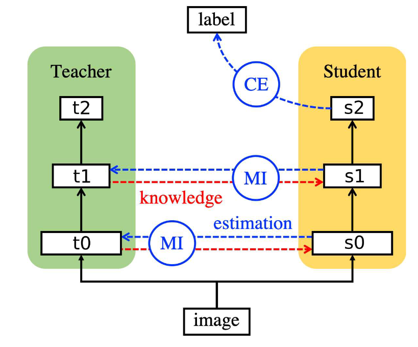

# Variational Information Distillation for Knowledge Transfer

**[CVPR 2019](https://openaccess.thecvf.com/content_CVPR_2019/html/Ahn_Variational_Information_Distillation_for_Knowledge_Transfer_CVPR_2019_paper.html)	no code	CIFAR10  CUB200  MIT-67	20240412**

*Sungsoo Ahn, Shell Xu Hu, Andreas Damianou, Neil D. Lawrence, Zhenwen Dai*

这项工作从信息论的角度试着解释知识转移的过程，提出了变分信息蒸馏，将知识转移表述为教师网络和学生网络之间的互信息的最大化，提出一个可操作的知识转移目标，允许我们量化从教师网络到学生网络的知识量，并且通过最大化变分下界来近似分布来帮助互信息的计算。

## Introduction 

现有的方法背后没有公认的理论支持，这导致难以理解经验结果和以更有原则的方式开发新方法，本文提出了变分信息蒸馏，从信息论的角度试着解释知识转移的过程，将知识转移表述为教师网络和学生网络之间的互信息的最大化，提出一个可操作的知识转移目标，允许我们量化从教师网络到学生网络的知识量，并且通过最大化变分下界来近似分布来帮助互信息的计算。

> 我们提出变分信息蒸馏，一种基于变分信息最大化的技术，通过最大化两个网络之间的互信息来建立知识转移框架
>
> 我们证明了VID能够概况现有的知识转移方法。

## Method

### Variational information distillation (VID)

我们将Variational Information Distillation (VID) 描述为知识转移的一般框架，考虑在目标任务上训练的学生网络，给定另一个在类似任务上预训练的教师网络，我们假设教师网络中的层已经经过训练，可以表示源任务和目标任务中存在的给定输入的某些属性，学生网络必须学习如何将这些属性的知识融入到自己的学习中。

从信息论的角度，知识转移可以表述为在教师和学生网络的层之间保持高度的互信息，对于从目标数据分布p(x)抽取的随机变量x，从师生网络层$(\mathcal{T}^{(k)}, \mathcal{S}^{(k)})$中抽取的K个层对$\mathcal{R} = \{ (\mathcal{T}^{(k)}, \mathcal{S}^{(k)})\}^K_{k=1}$，对于x在网络中的前向过程在K个层对上的输出：$\{ (\mathcal{t}^{(k)}, \mathcal{s}^{(k)})\}^K_{k=1}$，则(t, s)之间的互信息定义为：
$$
I(t;s) = H(t) - H(t|s) = -\mathbb{E}_t[log\ p(t)] + \mathbb{E}_{t,s}[log \ p(t|s)]	\tag{1}
$$
其中信息熵H(t) 和条件熵 H(t|s) 由联合分布p(t, s)，联合分布p(t, s)是从输入分布p(x)采样的输入x在层上聚集的结果。根据此，我们定义损失函数，旨在让学生学习目标任务同时鼓励与教师网络的最大化互信息：
$$
\mathcal{L} = \mathcal{L_S} - \sum^K_{k=1}\lambda_k I(t^{(k)}, s^{(k)})	\tag{2}
$$
$\mathcal{L_S}$为目标任务损失，然而由于互信息难以计算，优化问题是不可行的，我们为每个信息项I(t;s)提出一个变分下界，定义一个q(t|s)来近似p(t|s):
$$
\begin{aligned}
I(t;s) &= H(t) - H(t|s) \\
&= H(t) + \mathbb{E}_{t, s}[log\ p(t|s)] \\
&= H(t) + \mathbb{E}_{t, s}[log\ q(t|s)] + \mathbb{E}_s[D_{KL}(p(t|s)||q(t|s))]\ \ (Evidence\ Lower\ Bound,\ ELBO) \\
&\leq H(t) + \mathbb{E}_{t, s}[log\ q(t|s)]
\end{aligned}	\tag{3}
$$
对Eq2中每个互信息项应用变分信息最大化来获得VID：
$$
\widetilde{\mathcal{L}} = \mathcal{L_S} - \sum^K_{k=1}\lambda_k\mathbb{E}_{t^{(k)}, s^{(k)}}[log\ q(t^{(k)}|s^{(k)})] \tag{4}
$$
其中H(t)相对于要优化的参数为常数可以忽略。

### Algorithm formulation

我们通常采用具有异方差均值$\mu(·)$和同方差$\sigma$作为变分分布q(t|s)， 即$\mu(·)$为s的函数，标准差$\sigma$不是。当t对应教师网络的中间层时$t\in \R^{C\times H \times W}$:
$$
-log\ q(t|s) = -\sum^C_{c=1}\sum^H_{h=1}\sum^W_{w=1}log\ q(t_{c, w, h}|s) = \sum^C_{c=1}\sum^H_{h=1}\sum^W_{w=1}log\ \sigma_c + \frac{(t_{c, h, w} - \mu_{c, h, w}(s))^2}{2\sigma^2_c} + constant \tag{5}
$$
$t_{c, h, w} , \mu_{c, h, w}$分别表示由(c,h,w)索引的t的标量分量和由卷积层组成的神经网络$\mu(·)$单个单元的输出，使用softplus函数保证方差为正$\sigma^2=log(1+exp(\alpha_c)) + \epsilon, \alpha_c\in\R$为要优化的参数。可以从与t具有相似结构的学生网络中选择s，当两层的空间维度相同时，使用1*1的卷积对$\mu$进行有效参数化，否则使用适当的卷积对其进行维度匹配。

我们还考虑了$t = \mathcal{T}^{logit}(x) \in \R^N$对应于教师网络logit层的情况，变分分布表示如下：
$$
-log\ q(t|s) = -\sum^N_{n=1}log\ q(t_{n}|s) = \sum^N_{n=1}log\ \sigma_n + \frac{(t_{n} - \mu_{n}(s))^2}{2\sigma^2_n} + constant \tag{6}
$$
其中tn表示向量t中第n个条目，$\mu_n$表示单个神经网络单元的输出，$\sigma_n$通过softplus函数保证其为正，这种情况下我们匹配学生网络对应的层s是倒数第二层而不是logit层，不会对学生网络输出由太大的限制，此外我们发现使用简单的线性变换来参数化$\mu(·)$就足够，即$\mu(s) = W_s$

我们还探索了异方差$\sigma(·)$，但他给出了不稳定的训练和有限的改进。