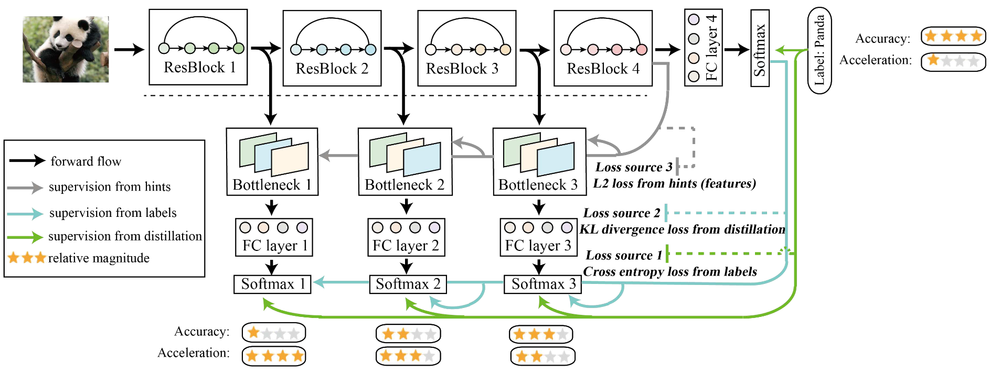
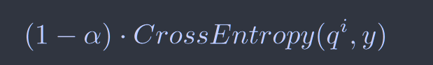
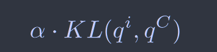
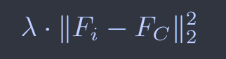
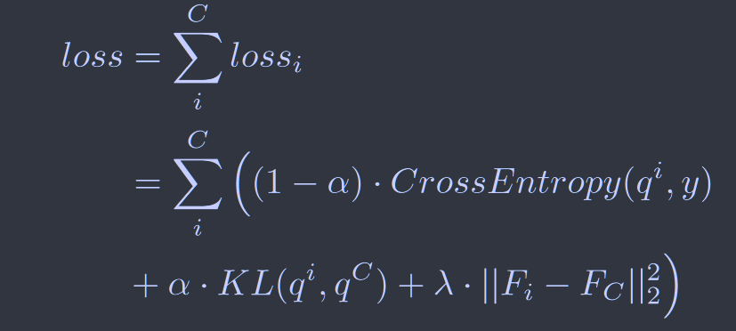

# Be Your Own Teacher: Improve the Performance of Convolutional Neural Networks via Self Distillation

[ICCV2019](https://openaccess.thecvf.com/content_ICCV_2019/html/Zhang_Be_Your_Own_Teacher_Improve_the_Performance_of_Convolutional_Neural_ICCV_2019_paper.html)	[Code in github](https://github.com/ArchipLab-LinfengZhang/pytorch-self-distillation-final)

为了提高学生模型的性能，在训练过程中引入三种损失：

### 交叉熵损失

其中qi为学生模型的输出标签，y为gt标签，$\alpha$ 为超参数，隐藏在数据集中的知识直接从标签引入到所有分类器中

### KL散度损失

让每个学生模型模仿最深网络的输出，qi为学生网络的softmax输出，qC为最深的网络的softmax输出

**最小化KL散度其实就是在最小化分布之间的交叉熵**
$$
KL(S(X), T(X)) = S(x)logS(x) - S(x)logT(x)
$$
$S(x)logS(x)$对于优化分布之间的差异相当于常数项，所以这里仅仅对分布的交叉熵进行优化即可

### Hint的L2损失

通过计算最深分类器和每个浅分类器的特征图之间的L2 loss来获得，特征图有着不同的尺寸，通过引入bottleneck结构来对齐他们，Fi和FC分别为浅分类器和最深分类器的特征图

### 最终的损失函数

## Discussion & Future Work

> 自蒸馏可以帮助模型收敛到平坦最小值，这本身就是模型具有泛化性的特征
>
> 自蒸馏能够防止模型出现梯度消失的问题
>
> 在自蒸馏中用更深的分类器提取更有判别力的特征

> 对于引入的超参数需要手动调整，耗费大量计算资源，下一步工作考虑通过学习率衰减或基于矩启发的方法自动调整引入的超参数
>
> 自蒸馏找到的是最优的平坦最小值么？ 实验中发现通过自蒸馏训练收敛之后在继续使用传统的方法训练能够进一步提升分类器的性能，也就是说在训练的最后阶段自蒸馏也会组织最深层分类器的收敛，使用多种训练方法交替切换训练可能有助于进一步收敛