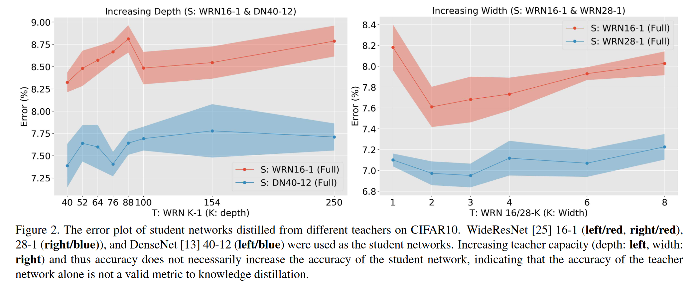
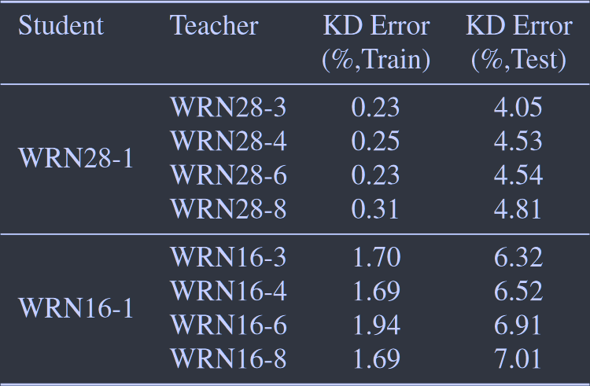
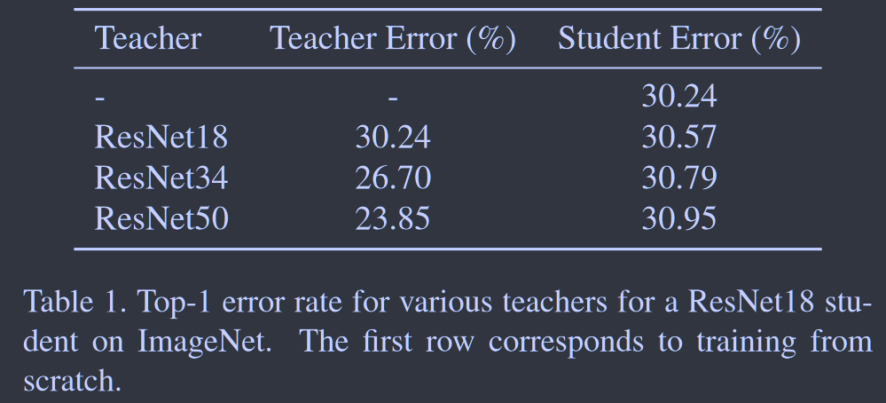
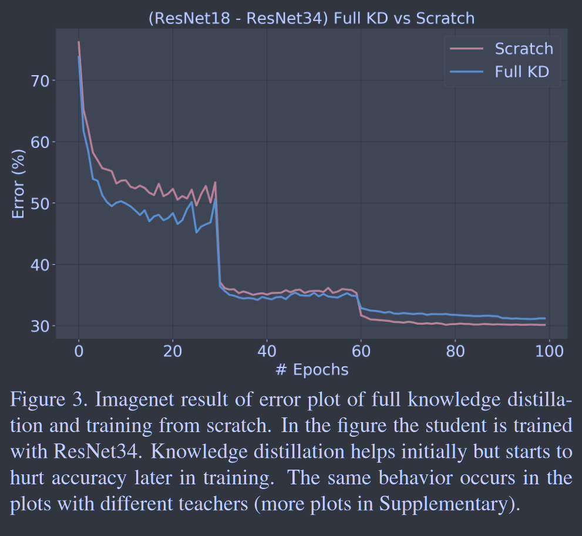
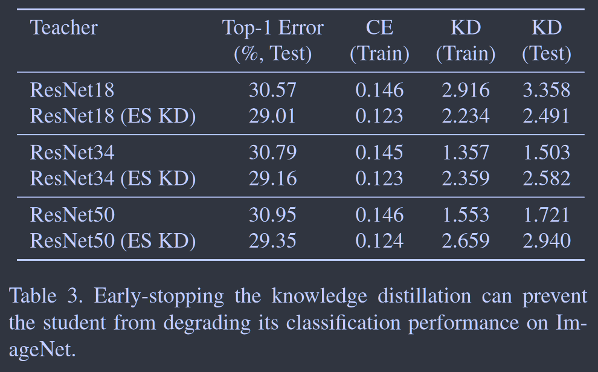
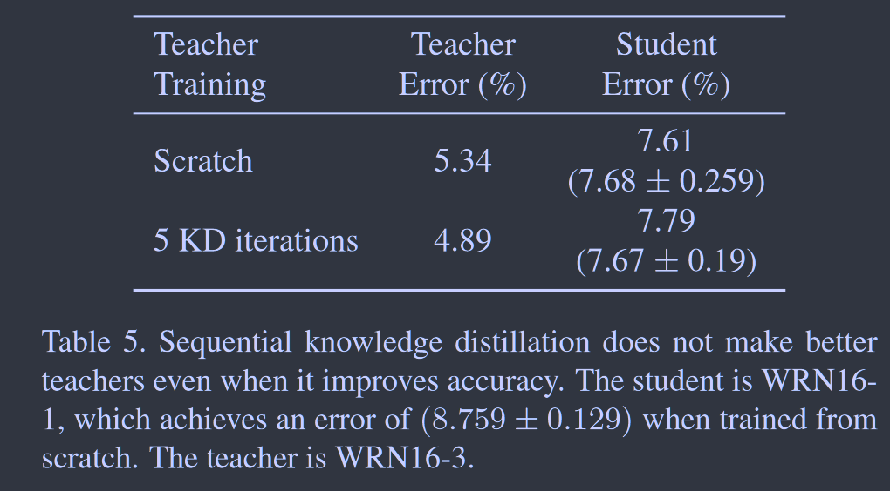
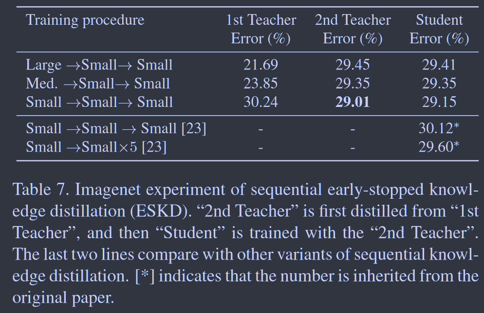
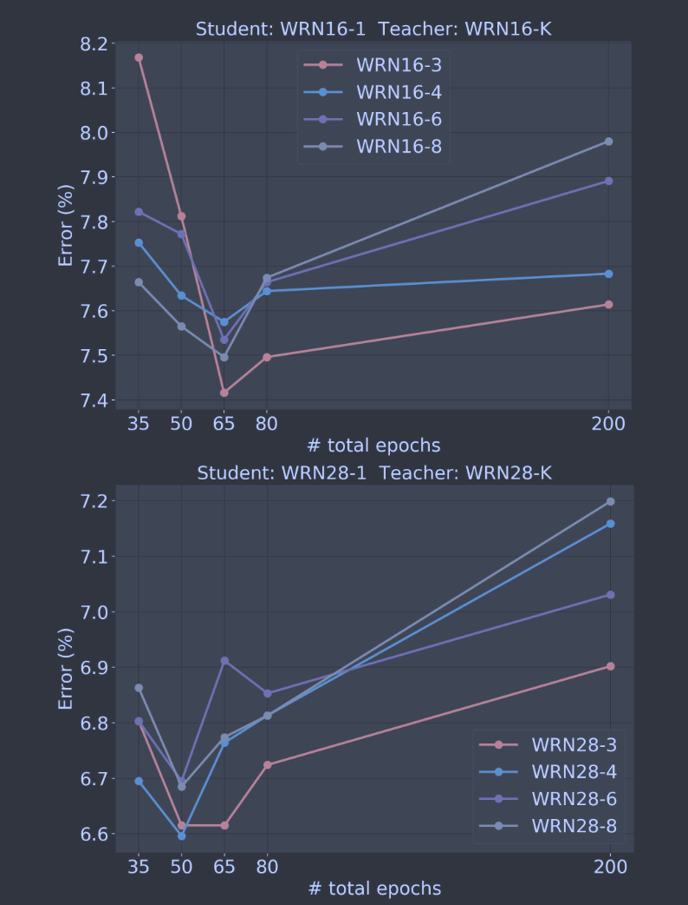
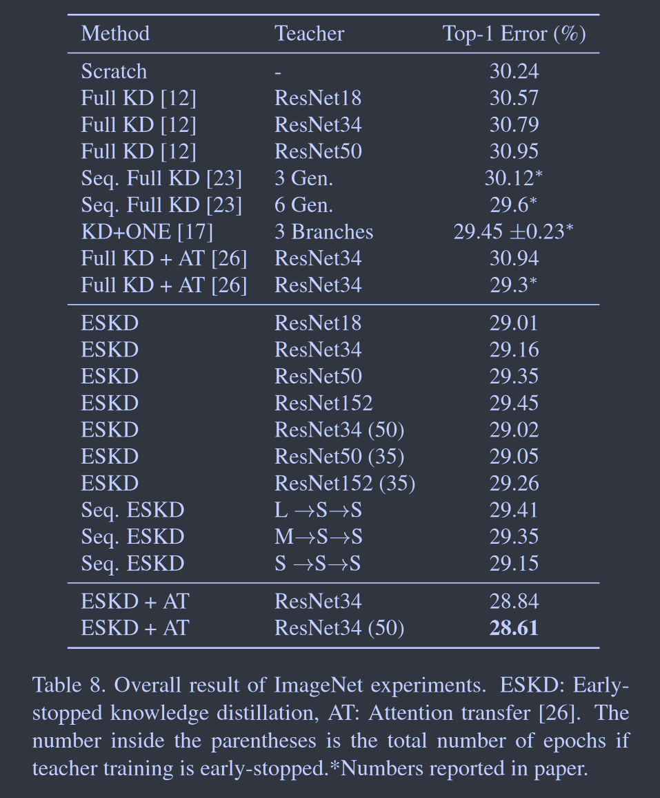

# On the Efficacy of Knowledge Distillation

**[ICCV 2019](https://openaccess.thecvf.com/content_ICCV_2019/html/Cho_On_the_Efficacy_of_Knowledge_Distillation_ICCV_2019_paper.html)	no code	CIFAR10  ImageNet**

*Jang Hyun Cho, Bharath Hariharan*

这项工作进行了大量的实验说明，发现先前的蒸馏方法教师并不是最优的教师，学生的学习也不是最优的情况。我们发现在施加蒸馏损失的学习中，在后期不如直接训练，任务损失与蒸馏损失产生冲突，我们提前停止蒸馏来缓解这一问题，后期仅用任务损失进行优化；针对高精度的大的教师模型，我们认为教师模型给出的解根本不在较小的学生模型的解空间中，我们需要找到一个在其解空间中的解，结合先前工作经过少量训练的大的教师模型的搜索空间仍然比小的模型大，我们对教师模型也施加提前停止。本文的很多思想在***2023CVPR DOT***中很明显的体现，后者认为是对损失没有做好最佳的优化而导致的性能不足并从优化的角度解决了这一问题，同样带来了性能的提升。

## Introduction

先前的工作通常着眼于少数精心挑选的架构，隐含的假设是结论将在学生或教师架构中推广。一些工作中的失败案例告诉我们这个假设可能是错误的，有项工作观察到无法通过ImageNet上的知识蒸馏取得积极的结果(*ICLR 2017 AT*)。这引发了我们的思考，这与其他知识蒸馏不能提高性能的试验有什么特点？有没有表现更好的师生模型组合？我们能做些什么来提高其他组合的性能？

教师的准确性并不是学生性能的最佳指标，较大的教师尽管自身准确但不一定是更好的教师，我们探讨了其中的原因，并证明随着教师能力和准确性的提高，学生经常很难模仿教师的性能。

我们通过提前停止对教师的训练来对教师进行正则化，并在知识蒸馏接近收敛时停止，以便让学生模型更好地适应训练损失。

## Experiment

### Bigger Models are Not Better Teachers

我们改变了教师的深度和宽度，教师的准确率持续上升，但学生的准确性上升后开始下降。一种可能的猜想是随着教师变得越来越准确，输出的概率开始变得越来越像真实标签，学生可用的信息减少，但是我们实验表明在高温标签下并没有改变这一结果，这一猜想并不成立，我们提出一个替代假设。

### Analyzing Student and Teacher Capacity

更大更准确的教师不会带来更好的学生准确性可能有两个原因：

> 学生能够模仿老师，但这并不能提高准确率，这表明KD损失与我们关心的准确率并不匹配
>
> 学生无法模仿老师，这表明师生的能力不匹配

### Distillation Adversely Affects Training

知识蒸馏在ImageNet上表现特别差，所有教师都导致学生的准确率第一从头开始训练的学生，虽然上一节表明学生可能没有足够的能力来匹配一个非常大的老师，但是为什么没有老师提高ImageNet的准确性仍然是个谜。

我们进行了更深入的研究，下图展示了从头开始训练的ResNet18与使用ResNet34进行知识蒸馏之间的验证准确性图，虽然最初提高了验证准确性，但在训练结束时他开始损害准确性，我们假设，由于ImageNet是一个更具挑战性的任务，低容量的学生可能处于拟合不足的状态，学生可能没有足够的能力来最小化训任务损失和蒸馏损失，最终在训练快结束时以牺牲任务损失为代价来最小化蒸馏损失。

因此基于该假设，我们希望在训练过程中提前停止蒸馏，在剩余的训练中只对交叉熵进行梯度下降，我们称之为早期停止的知识蒸馏ESKD，与之对应的是标准蒸馏Full KD。

我们发现提前停止的版本对三种教师模型都获得了更好的结果，并且早期停止的版本的训练交叉熵和KD损失都达到了更好的结果，这表明这其中确实存在着一种损失权衡另一种损失的情况，并且提前停止的学生都比之前实验中从头开始训练的模型要更好。

但是提前停止并没有解释我们最初的问题，更大更准确的教师不会产生更准确的学生。即使应用早期停止策略，KD损失仍会随着教师规模的增大而增发。

### The Efficacy of Repeated Knowledge Distillation

先前的工作表明，若师生能力差距大，先从大教师提炼知识到中级教师，然后再提炼到学生上，这样每一步再师生模型能力之间都有更好的匹配。有项工作训练一个序列模型，使用第i-1个模型训练第i个模型，他们发现这会产生更好的结果，并且继承后能达到更佳的性能。然而我们发现，对于某些模型，序列最后一个学生的表现实际低于从头开始训练的学生模型，这表明网络架构再很大程度上决定了序列蒸馏的成功与否，并且虽然来自整个序列的学生模型继承优于从头开始训练的单个模型，但其并不优于从头开始训练的相同数量模型的集成。

我们与从0开始训练的教师进行比较，虽然经过序列蒸馏的模型更准确，但他并不是一个更好的老师。我们在ImageNet上重复了这些实验，并且基于上一节我们在蒸馏时使用了提前结束，结果表明顺序蒸馏仍然是无效的，最好的结果仍然是从小模型到另一个小模型的单一蒸馏。这些结果都表明，序列蒸馏并不是万能的，尤其是它并不能帮助我们使用一个大教师训练一个能力显著不同的小学生。

### Early-Stopped Teachers Make Better Teachers

我们认为造成之前问题的根本在于：大教师找到的解根本不在小学生的解空间中，唯一的解决办法是找到一个老师，这个老师发现的解是学生模型能够得到的。

我们可以通过网格搜索寻找最优的教师网络，但代价太大，我们建议在训练是对教师进行规则化，提早停止对大的教师模型的训练，有工作已经证明，仅用几个epoch训练的大网络表现为一个较小的网络，但仍然包含比小网络更大的搜索空间。我们的结果表明，所有提前结束训练的教师都比经过完整训练的教师产生更好的学生。

因此基于以上的探究，我们同时对教师和学生模型训练应用提前停止，在ImageNet上进行测试：

