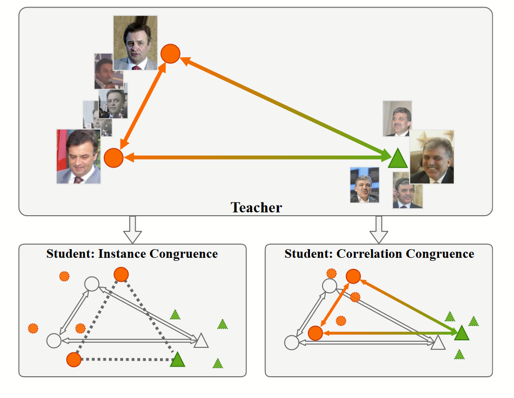
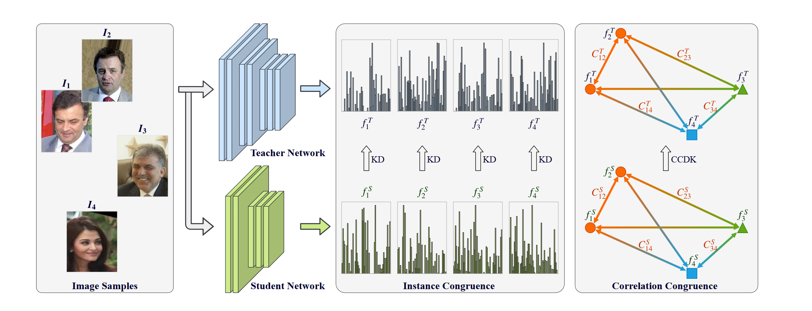

# Corrlation Congruence for Knowledge Distillation 

**[ICCV 2019](https://openaccess.thecvf.com/content_ICCV_2019/html/Peng_Correlation_Congruence_for_Knowledge_Distillation_ICCV_2019_paper.html)	no code	CIFAR100  ImageNet-1K  MSMT17**

*Baoyun Peng, Xiao Jin, Jiaheng Liu, Dongsheng Li , Yichao Wu, Yu Liu, Shunfeng Zhou, Zhaoning Zhang*

先前工作仅考虑样本实例之间的一致性关系而忽视了相关性的关系，直接模仿教师模型的输出使得学生模型并不能很好的呈现类内聚集而类间分离的特征，这项工作提出一个新的蒸馏框架CCKD，通过蒸馏来保持样本一致性，并引入相关性一致，通过核方法捕获样本之间的相关性，将其融入蒸馏学习的过程中，并且就计算相关性给出了两种类别采样方法。

## Introduction 

知识蒸馏已被证明是模仿高容量网络的行为来促进小型网络性能的有效方法，工作原理是为每个输入实例的**教师和学生的输出添加一个强一致性约束**，以鼓励学生模仿教师的行为。

由于师生网络之间的差距，学生很难学习与教师相同的映射函数，通过只关注实例一致性，学生将从教师那里学习很多不同的实例相关性。教师模型的特征空间具有类内实例凝聚在一起而类间实例彼此分离的特征，通过实例一致性训练的学生模型的对应特征空间则缺乏这种特征。

我们认为除了实例一致性之外，实例之间的相关性也是促进学生表现的重要知识。基于这一想法，我们提出一个新的蒸馏框架，称为相关一致性知识蒸馏CCKD。CCKD唯一的要求是教师和学生的维度应该相同。

> 我们提出一种新的知识蒸馏框架，称为相关一致性知识蒸馏CCKD，它不仅关注实例一致性，还关注相关一致性。
>
> 我们引入一种通用的基于内核的方法，以更好的捕获小批量中实例之间的相关性。评估分析了不同相关指标对不同任务的影响。
>
> 探索了用于小批量训练的不同采样器策略，来进一步改善相关性知识转移

## Method

参数为$W_t$的教师网络记为T，参数为$W_s$的学生网络记为S，输入数据集$\mathcal{X}=\{x_1, x_2, ..., x_n\}$，对应的标签$\mathcal{y}=\{ y_1, y_2,...,y_n\}$，n代表样本数量。深度神经网络可以看作多个非线性层堆叠的映射函数，记$\phi_t(x;W_t),\phi_s(x;W_s)$为教师和学生网络的映射函数，x表示输入数据。$f_s,f_t$表示教师和学生的特征表示，师生模型的logit输出表示为$z_t=\phi(x;W_t), z_s=\phi(x;W_s)$，师生模型的最终概率预测表示为$p_t=softmax(z_t),p_s=softmax(z_s)$.

### Correlation Congruence

与先前方法不同，CCKD不仅考虑了实例级的一致性，还考虑了实例之间的相关一致性，CCKD由实力一致性和相关一致性组成。

令$F_t, F_s$为师生模型的特征集：
$$
F_t=matrix(f^t_1, f^t_2,\dots, f^t_n), \\
F_s=matrix(f^s_1, f^s_2,\dots, f^s_n). \\
$$
特征f可看作是特征空间中的一个点，引入映射函数：
$$
\psi : F \rightarrow C \in \mathbb{R}^{n\times n}
$$
其中C为相关性矩阵，C中每个元素表示特征空间中xi与xj之间的相关性，定义为：
$$
C_{ij}=\varphi(f_i, f_j),\ \ C_{ij}\in \mathbb{R}
$$
函数$\varphi$可以为任何相关性指标，相关一致性可以表述为：
$$
L_{CC} = \frac{1}{n^2}||\psi(F_t) - \psi(F_s)||^2_2 = \frac{1}{n^2}\sum_{i, j}(\varphi(f_i^s, f_j^s) - \varphi(f_i^t, f_j^t))^2
$$
CCKD的优化目标：
$$
L_{CCKD} = \alpha L_{CE} + (1-\alpha)L_{KD}+\beta L_{CC}
$$
$L_{CE}$为交叉熵损失，$\alpha,\beta$为超参数。

### Generalized Kernel-Based Correlation

由于特征空间维度非常高，捕获实例之间的复杂相关性并不容易，我们引入核技巧来捕获特征空间中的实例之间的高阶相关性。

设$x,y\in \Omega$表示特征空间中两个实例，引入不同的映射函数$k:\Omega\times \Omega \mapsto R$作为相关性度量：

> 最大平均差异(naive MMD): $k(x, y)=|\frac{1}{n}\sum_ix_i - \frac{1}{n}\sum_iy_i|$，可以反应均值嵌入之间的距离
>
> 线性核(Bilinear Pool): $k(x, y)=x^Ty$，可以看作是一个朴素的二阶函数，两个实例之间的相关性由点积计算
>
> 高斯径向基核(Gaussian RBF): $k(x, y)=exp(-\frac{||x-y||^2_2}{2\delta^2})$，高斯核是一个常用的核函数，其值仅取决于与原空间的欧几里得距离

高斯核函数的p阶泰勒公式近似如下：**？？？How to get it**
$$
[k(F,F)]_{ij} = exp(-\gamma||F_i-F_j||^2) \approx \sum^P_{p=0}exp(-2\gamma)\frac{(2\gamma)^p}{p!}(F_{i·}·F_{j·}^T)^p
$$

### Strategy for Mini-batch Sampler

由于实例之间的相关性是在一个小批量中计算的，因此一个合适的采样器对于平衡类内和类间的相关性是非常重要的。

为了平衡类内和类间相关一致性，提出了两种小批量采样策略，类一致随机采样器（CUR-sampler）和超类一致随机采样其（SUR-sampler）。

CUR-sampler按类采样，对每个采样类随机选取固定的k个样例；SUR-sampler与CUR-sampler类似，不同之处在于通过超类对样本进行采样，超类是通过聚类生成的真实类的一种更柔和的形式，先使用教师模型提取特征，然后通过kmeans聚类。

SUR-sampler对不平衡标签灵活性的容忍度更高，因为超类对嵌入空间中实例的粗略结构进行了变形。