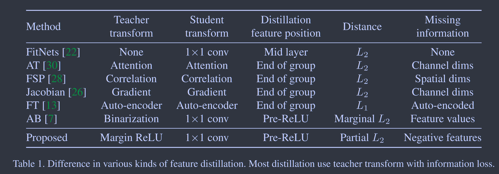
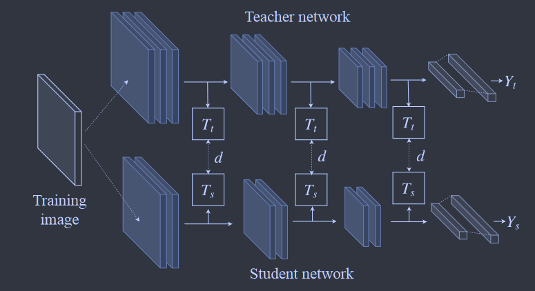
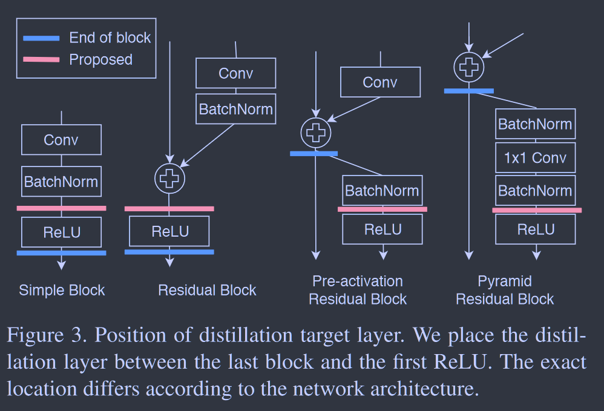
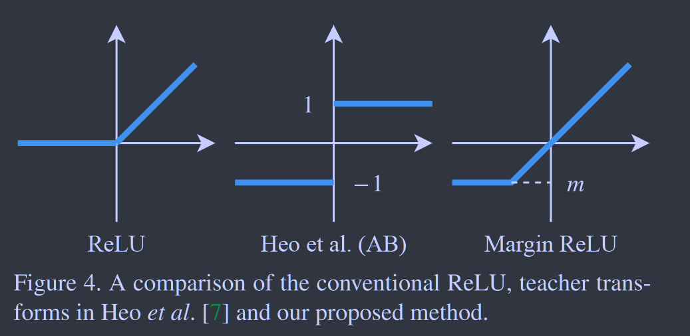

# A Comprehensive Overhaul of Feature Distillaion

**[ICCV 2019](https://openaccess.thecvf.com/content_ICCV_2019/html/Heo_A_Comprehensive_Overhaul_of_Feature_Distillation_ICCV_2019_paper.html)	[code in github](https://github.com/clovaai/overhaul-distillation)	CIFAR100  ImageNet  VOC07/12**

*Byeongho Heo  Jeesoo Kim  Sangdoo Yun  Hyojin Park  Nojun Kwak  Jin Young Choi*

这项工作详细对比了近期六项较为具有代表性的kt方法，分析其优缺点并给出本文的方法。从教师特征变换、学生特征变换、特征蒸馏位置、距离函数四个方面论述了各种方法的优缺点。本文提出在进行ReLU激活前进行特征的转移，设计了一种新的教师特征变换的模式，并在这基础上提出了一种新的距离度量。

## Introduction 

最近的工作提出增加蒸馏过程中的信息量来提升性能，但现有的方法都会使教师的特征值发生变形，这给性能提升留下进一步的提升。

本文通过对教师变换、学生变换、蒸馏特征位置和距离函数进行研究，提出一种新的特征蒸馏损失，进一步提高了特征蒸馏的性能。我们主要关注ReLUctant后特征响应的大小，它携带了大部分的特征信息；第二个是每个神经元的激活状态。因此提出余量ReLU，将蒸馏特征的位置改为ReLU前面，并使用部分L2距离来跳过不必要的信息蒸馏。

## Motivation

> FitNets: $\mathcal{L}_{HT}(W_{Guided}, W_r) = \frac{1}{2}||u_h(x;W_{Hint}) - r(v_g(x;W_{Guided});W_r)||^2$
>
> AT:  $\mathcal{L}_{AT}=\mathcal{L}(W_S, x)+\frac{\beta}{2}\sum_{j\in\mathcal{I}}||\frac{Q_S^j}{||Q_S^j||_2} - \frac{Q_T^j}{||Q_T^j||_2}||_p$
>
> FSP:  $L_{FSP}(W_T,W_S)=\frac{1}{N}\sum_x\sum^n_{i=1}\lambda_i\times ||G_i^T(x;W_t) - G_i^S(x;W_s)||^2_2$
>
> Jacobian: $Match Jacobians=||\frac{\nabla_xf(x)}{||\nabla_xf(x)||_2} - \frac{\nabla_xg(x)}{||\nabla_xg(x)||_2}||^2_2$
>
> FT: $\mathcal{L}_{FT} = ||\frac{F_T}{||F_T||_2} - \frac{F_S}{||F_S||_2}||_p$
>
> AB: $\mathcal{L}(I) = ||\rho(\mathcal{T}(I)) \odot \sigma(\mu1 - r(S(I)) + (1-\rho(\mathcal{T}(I))) \odot \sigma(\mu1 + r(S(I))||^2_2$

### Teacher Transform

将教师的隐性特征转化为易于迁移的形式，这是特征蒸馏的重要组成部分，也是造成信息缺失的主要原因。

AT，FSP，Jacobian通过教师变换减少特征向量维数，这回导致信息缺失；FT使用由用户确定的压缩比，AB以二进制值的形式利用原始特征。除FitNets外，大多数现有方法的教师转换都会导致蒸馏损失中教师特征缺少信息。

### Student Transfer

AT，FSP，Jacobian，FT学生变换与教师变换使用相同的函数，这两者丢失的信息量相同。FitNets和AB不降低教师特征的维度，使用1*1的卷积是作为学生的变换，以将特征维度与教师相匹配，学生特征大小不会减小，因此不会丢失任何信息。

### Distillation Feature Position

FitNets使用任意中间层末端作为蒸馏点，这已被证明性能不佳；在AT，FSP，Jacobian中，蒸馏点位于每个层组的末端；在FT中蒸馏点仅位于最后一个层组的末端。这导致了比Fitnets更好的结果，但仍缺乏对于ReLU的考虑

### Distance Function

大多数蒸馏方法直接采用L2或L1距离，我们的方法根据教师变换和pre-ReLU位置的蒸馏点设计一个合适的距离函数

## Method

### Distillation Position

精心设计的ReLU蒸馏策略可以只传递必要的信息，我们的方法，蒸馏位置再位于第一个ReLU和层块的末端之间，如上图所示。这使得学生再经过ReLU之间就可以获得教师保存的信息。

### Loss Function 

因为我们再ReLU之前提取教师的知识，因此若教师某值是正的，学生要产生一个相同的价值，而教师某值是负数时学生也要产生一个负值，来保持师生模型的神经元激活状态相同。因此我们提出一种**教师变换**，再保留正值的同时给出负值的余量，我们称之为**margin ReLU**：
$$
\sigma_m(x)=max(x, m); \ m<0
$$

对于一个通道数为C的第i个元素的教师特征，m的值可以为所有图像的期望值：
$$
\mathcal{m_C}=E[F_t^i|F_t^i<0,i\in \mathcal{C}]
$$
这个值可以直接再训练过程中计算得到，也可以利用前一个批量归一化层参数计算得到，教师变换**margin ReLU$\sigma_{\mathcal{m_C}}(·)$被用作教师特征变换函数**来为学生网络提供知识。

再考虑ReLU的情况下，需要重新考虑距离函数，教师特征中，如果教师的响应是正值，则应通过他们的准确值来传递，而如果是负值，若学生响应高于目标值，则应当降低学生的响应值（*这里我认为是高于有可能会高过0而无法被relu屏蔽*），若学生响应低于目标值，则不需要增加增加，因为负响应会被ReLU阻断。

因此对于师生模型的特征表示$T,S\in\mathbb{R}^{W\times H\times C}$，张量的第i个分量表示为$T_i,S_i\in\mathbb{R}$，则距离定义为：
$$
d_p(T,S)=\sum^{WHC}_i
\begin{cases}
0 {\kern 60pt}if\ S_i\leq T_i\leq 0 \\
(T_i-S_i)^2 {\kern 22pt} otherwise.
\end{cases}
$$
综上所述，我们这项工作的损失函数定义如下，其中$\sigma_{\mathcal{m_C}}(x)$为教师变换，$r(·)$为1*1卷积组成的回归器用于学生变换：
$$
\mathcal{L}_{distill} = d_p(\sigma_{\mathcal{m_C}}(F_t),r(F_s)) \\
\mathcal{L} = \mathcal{L}_{task} + \alpha\mathcal{L}_{distill}
$$

### Batch Normalization 

对学生的特征进行批量归一化处理，来自教师的特征必须以同样的方式进行规范化，学生网络特征是逐批归一化的（训练模式，不是推理模式的单样本），教师的归一化曾应该是提取信息时的训练模式，**为此我们在1*1卷积之后附加一个归一化层**，将其用作学生变换，并将教师的知识代入其训练模式。
