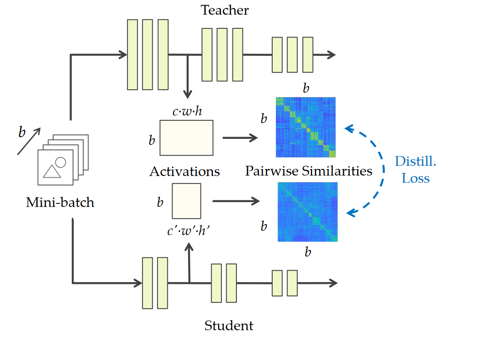

# Similarity-Preserving Knowledge Distillation 

**[ICCV 2019](https://openaccess.thecvf.com/content_ICCV_2019/html/Tung_Similarity-Preserving_Knowledge_Distillation_ICCV_2019_paper.html)	no code	CIFAR10 CINIC10**

*Frederick Tung, Greg Mori*

这项工作提出了一种新的知识迁移方法，其灵感来自于语义相似的输入倾向于在经过训练的神经网络中引发相似的激活模式，利用小批量样本之间的相似性来将教师网络中的输出激活图迁移到学生模型上。先前的蒸馏方法鼓励学生模仿教师表征空间的不同方面，这项旨在保持输入样本的成对激活相似性，不需要能够表达教师的表征空间而只需要保留成对的激活相似性即可。

## Introduction 

我们提出一种新的知识蒸馏方法，灵感来自于语义相似的输入倾向于在经过训练的神经网络中引发相似的激活模式，我们从输出的激活图中计算成对的相似性矩阵，根据相似性矩阵定义师生模型之间的蒸馏损失。我们试验表明，来自同一类别的图像倾向于在经过训练的网络中产生相似的激活模式。

> 引入保持相似性的知识蒸馏，使用每个小批量中成对的激活相似性来监督学生网络与教师网络之间的知识迁移
> 试验表明保持相似性的知识阵列柜不仅可以改善学生网络的性能，还可以补充传统知识蒸馏方法

## Method

训练有素的教师网络提供超出数据监督额外的语义知识，挑战在于确定如何编码和转移教师的知识，以最大限度地提高学生的表现。我们认为语义上相似的输入往往会在经过训练的神经网络中引发相似的激活模式，激活模式在同一个类别中基本一致且在不同的类别中具有不同的差异，因此我们引导学生网络去产生与教师网络相似的激活模式。

我们定义$A_T^{(l)} \in \R^{b\times c\times h\times w},A_S^{(l')} \in \R^{b\times c'\times h'\times w'}$，表示教师模型T第l层和学生模型S第l'层的激活图，其中b表示batch size，c c' 表示通道数，h h' w w' 表示空间维度，c不一定等于c'，因此有：
$$
\widetilde{G}^{(l)}_T = Q^{(l)}_T · Q^{(l)T}_T \\
G^{(l)}_{T[i,:]} = \frac{\widetilde{G}^{(l)}_{T[i,:]}}{||\widetilde{G}^{(l)}_{T[i,:]}||_2}
$$
其中$Q^{(l)}_T \in \R^{b\times chw}$为$A_T^{(l)}$的变形，因此$\widetilde{G}^{(l)}_T\in\R^{b\times b}$。具体来说，$\widetilde{G}^{(l)}_T$中第（i，j）个元素表示该批量样本中第i个和第j个图像网络激活特征的相似性。我们对$\widetilde{G}^{(l)}_{T[i,:]}$进行逐行归一化得到$G^{(l)}_{T[i,:]}$，[i, :]表示矩阵中的第i行，对于学生模型，有类似的定义：
$$
\widetilde{G}^{(l)}_S = Q^{(l)}_S · Q^{(l)T}_S \\
G^{(l)}_{S[i,:]} = \frac{\widetilde{G}^{(l)}_{S[i,:]}}{||\widetilde{G}^{(l)}_{S[i,:]}||_2}
$$
因此我们定义相似性保持(Similarity-Preserving)蒸馏损失：
$$
\mathcal{L}(G_T, G_S) = \frac{1}{b^2}\sum_{(l,l')\in \mathcal{I}}||G^{(l)}_T - G^{(l')}_S||^2_F
$$
其中$\mathcal{I}$表示$(l,l')$的层对（如每一组末尾的最后一层），$||·||_F$是矩阵的F范数（取值上与$||·||_{m_2}$范数相同），最终定义学生网络的总损失：
$$
\mathcal{L}=\mathcal{L}_{CE}(y, \sigma(\mathbf{z}_S))+\gamma\mathcal{L}_{SP}(G_T, G_S)
$$
我们的方法与先前方法的一个关键区别在于，先前的蒸馏方法鼓励学生模仿教师表征空间的不同方面，我们旨在保持输入样本的成对激活相似性，他的行为不会因为教师表征空间的旋转而改变，不需要能够表达教师的表征空间而只需要保留成对的激活相似性即可。