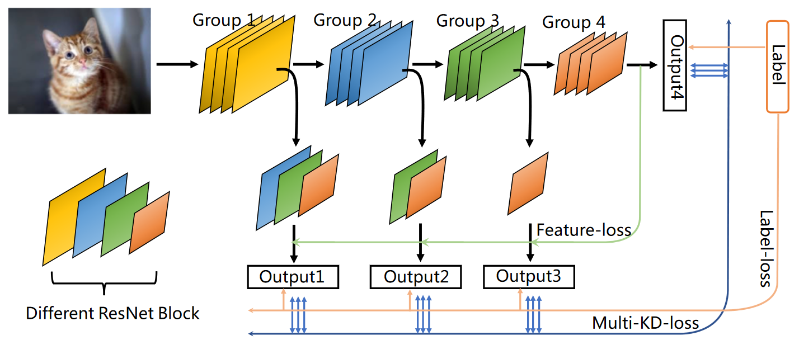
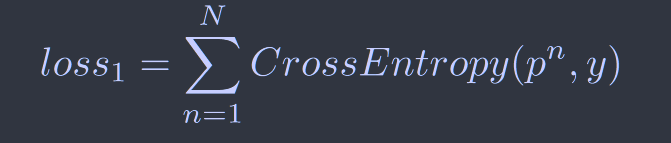
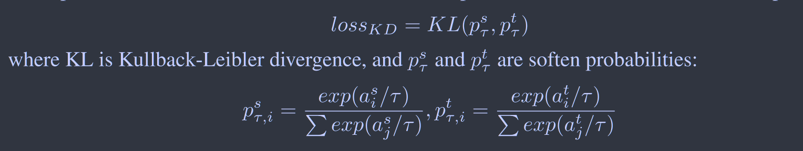
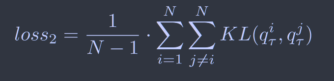
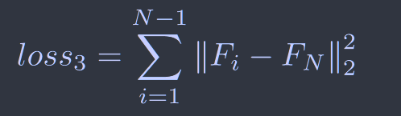
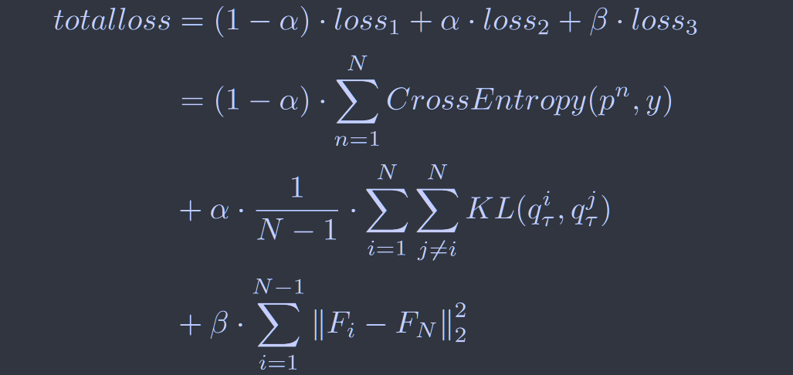
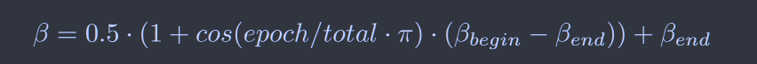

# MSD: Multi-Self-Distillation Learning via Multi-Classifiers within Deep Neural Networks

[arxiv2019](https://arxiv.org/abs/1911.09418)

与***ICCV2019 Be Your Own Teacher: Improve the Performance of Convolutional Neural Networks via Self Distillation***非常相似

唯一的区别在于本文认为对于特征层的模仿学习在后期大的权重参数会影响网络的性能，因此引入余弦退火来削弱后期特征损失的权重值

## Introduction

本文重点关注典型的分组网络，例如Inception、ResNet系列，每个组具有相似的结构，但具有不同的权重和卷积层数量，在靠前的卷积中学习精细尺度特征，靠后的卷积学习粗尺度特征。

> 提出了一个MSD学习框架，提供了一种简单但有效的方法来提高具有多个分类器的网络性能
>
> 提供了一种分类器分支的增强方法，允许通过所提出的MSD学习来优化现代CNN
>
> 在图像分类任务上对不同类型的CNN和训练方法进行了实验，证明这种学习方法的泛化性

## Method

### 基于采样的分支扩充

如图所示，在ResNet网络中，每层网络包含多个ResNet块，为了使早期分类器的特征图维度变化模式与主干网络相似，分别对第一个、第二个、第三个分类器配备了3、2、1个ResNet块来对齐粒度，实验结果表明这些块带来了准确性的巨大提升。

### 多重自蒸馏学习

损失函数由三项组成：

**标签损失：**$p^n$表示第n个分类器的softmax输出，y表示真实标签

**KD损失：**

对于每个分类器，将其他n-1个分类器视为教师网络来计算其kd损失:

**特征损失：**

计算最终全连接层与之前特征图之间的L2损失，一方面这位早期分类器提供了知识有助于模型收敛，另外有点工作证明当学生模型没有足够能力或机制来模仿教师的行为时，知识蒸馏可能不会有效，特征损失缩小了教师和学生之间的差距

**总体损失： **$\alpha$ $\beta$ 为超参数

特征损失在一开始帮助早期子分类器收敛，大的$\beta$值会损害训练后期网络的性能，引入余弦退火来削减$\beta$的值，实验表明这种方式要比恒定的值效果更好

