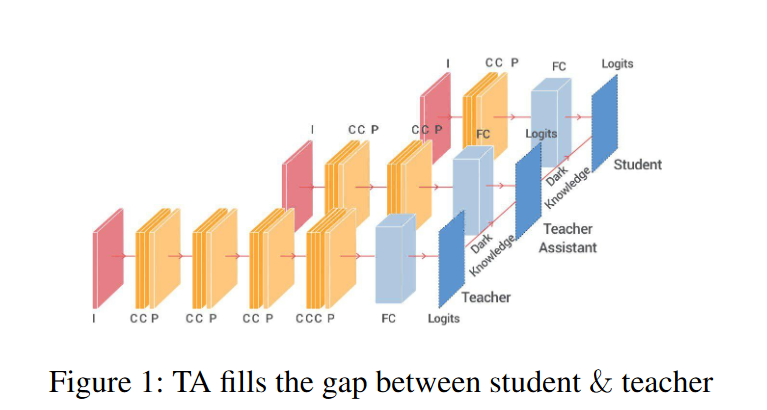
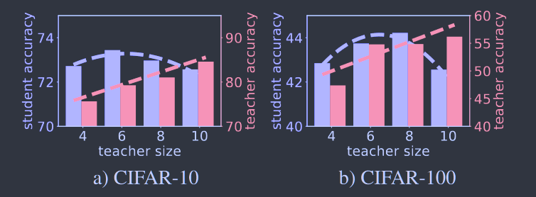
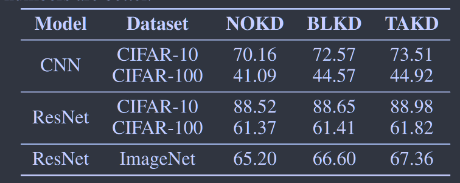
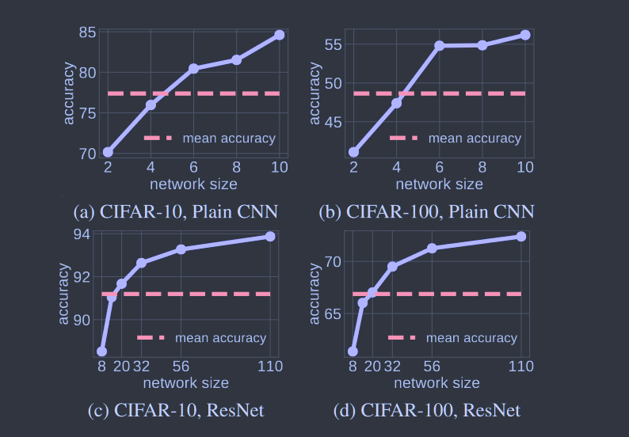
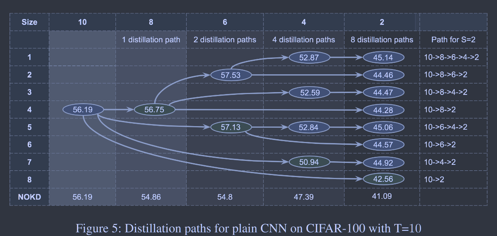

# Improved Knowledge Distillation via Teacher Assistant

[AAAI2020](https://ojs.aaai.org/index.php/AAAI/article/view/5963)	[**code in github**](https://github.com/imirzadeh/Teacher-Assistant-Knowledge-Distillation)

**"a teacher can effectively transfer its knowledge to students up to a certain size, not smaller."**

**“教师可以有效的将其知识传授给一定规模的学生，而不是更小的学生”**

这项工作当师生模型之间差距过大时，蒸馏的性能并不好。探究了出现这种问题的原因，并提出了在保持师生模型不变的情况下引入一个助教来弥合这种差距，先用复杂的教师模型训练助教，然后再通过助教训练较小的学生模型，实验证明最佳的助教尺寸是道道师生模型平均性能的尺寸。

## Introduction

研究发现蒸馏并不总是有效的，当教师和学生之间规模差距较大时，从一个参数较多的教师中提取的学生模型的表现比从一个容量较小的教师中提取的学生模型的表现要差。

基于该发现我们提出一个新的蒸馏框架TAKD，称为教师辅助知识蒸馏，在学生和老师之间引入中间模型作为助教来填补师生模型之间的差距。

## Method & Discussion

实验表明，随着教师规模的增加，其自身的正确率增加，但训练后的学生精度则会先增大后减小，为了解释这一现象，我们给出了如下三条见解：

> 教师的表现提高，因此它通过成为更好的预测者为学生提供更好的监督
>
> 教师模型变得复杂以至于学生尽管收到了指导但没有足够的能力或机制来模仿她的行为
>
> 教师对数据的确定性增加，从而使其软标签不那么软，削弱了通过匹配软目标来完成的知识转移

第一条因素有利于提高蒸馏性能，而第二三条不利于提高蒸馏性能，最初随着教师模型规模的增大，因素1占据主导地位，后来因素23占据主导地位。

### Teacher Assistant Knowledge Distillation TAKD

我们提出使用中等大小的网络来弥补师生模型之间的差距，助教（TA）规模能力介于教师模型和学生模型之间，先从教师模型那里提取出TA网络，然后TA扮演教师的角色对学生模型进行训练。

### Will TA Improve Knowledge Distillation?

NOKD 表示没有蒸馏，直接进行训练

BLKD 表示传统的师生模型进行训练

TAKD 表示本文提出的方法

### What is the Best TA Size?

我们实验发现最佳的TA尺寸并不是师生模型的平均尺寸，而是达到师生模型平均性能的尺寸。

### Why Limiting to 1-step TA?

直接由较大的模型教授较小的学生模型效果是比较差的，而通过助教来过度性能会有显著提升，但是一个助教与多名主教的性能差异并不大