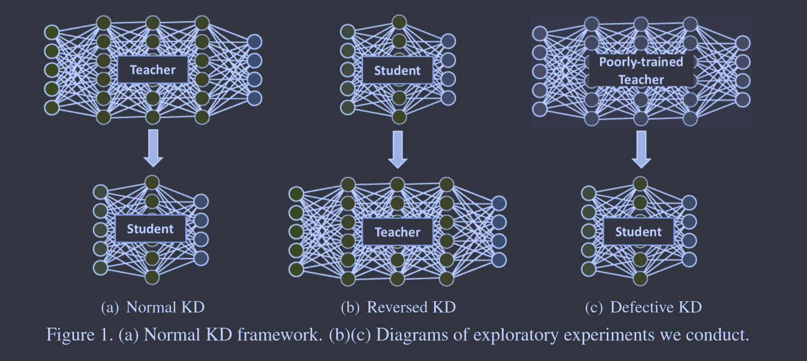
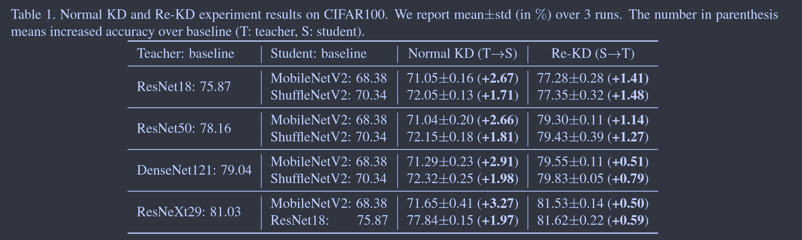
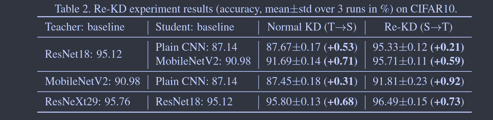
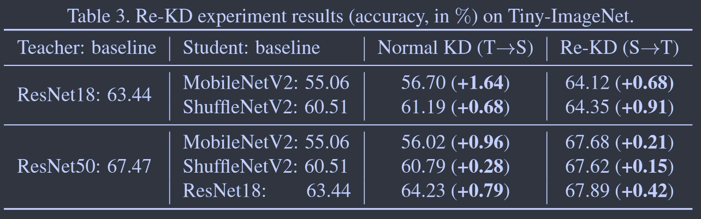
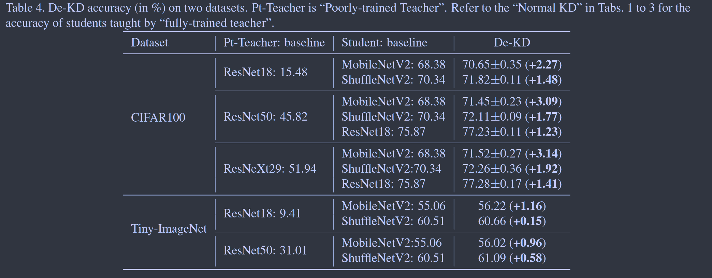
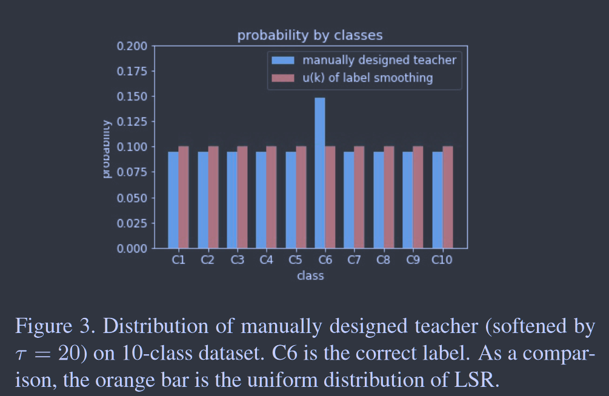

# Revisiting Knowledge Distillation via Label Smoothing Regularization

**[CVPR 2020](https://openaccess.thecvf.com/content_CVPR_2020/html/Yuan_Revisiting_Knowledge_Distillation_via_Label_Smoothing_Regularization_CVPR_2020_paper.html)	[code in github](https://github.com/yuanli2333/Teacher-free-Knowledge-Distillation)	CIFAR10/100  TinyImageNet**

*Li Yuan, Francis EH Tay, Guilin Li, Tao Wang, Jiashi Feng*

这项工作通过实验证明了用一个较弱的学生去教授老师，和使用一个训练不佳的老师去教授一个比他性能更好的学生，都会带来其性能的提升，这与先前的认知不相符。通过这个这项工作认为暗知识不仅包括类被之间的相似性，还包括对学生培训的正则化，然后通过标签平滑正则化LSR的角度重新审视的KD，提出了一个自训练框架Tf-KD

## Introduction 

这项工作我们通过实验探索了：让学生模型通过传递学生的软目标来教授教师模型；让性能较差的学生教授学生。基于先前的理解，教师模型不会通过学生的训练而变得更强；性能不良的教师也不会增强学生。因为他们都不能提供类别之间可靠的相似性信息。然而经过大量实验之后，我们得到相反的结果，若学生可以提高教师，训练不佳的教师也能提高学生。

这种结果促使我们将KD解释为正则化项，我们从标签平滑正则化LSR的角度重新审视知识蒸馏。

对于LSR，通过将平滑后的标签拆分为两部分并考虑相应的损失，第一部分是真实分布和模型输出的普通交叉熵，第二部分对应一个虚拟教师模型，该模型提供了一个均匀分布来教授模型

对于KD，通过结合教师软目标和gt标签，我们发现KD是学习一个LSR，KD的平滑分布来自教师模型，LSR的平滑分布是手动设计的。

来自弱学生和训练不加的教师模型的软标签可以有效地规范模型训练，即使他们缺乏类别之间的强相似性信息。因此我们认为类别之间的相似性信息并不能完全解释KD中的暗知识，而教师模型中的软目标确实为学生模型提供了有效的正则化。基于分析，我们推测在教师模型的类别之间不可靠甚至0相似性信息的情况下，KD仍然可以很好的改进学生模型，因此提出一种具有两种实现方式的新颖的无教师蒸馏Tf-KD框架。第一种是子训练学生模型，用模型本身的预测替代暗知识；第二种是手动设计目标分布具有100%准确率的虚拟教师模型，灵感来自于KD与LSR之间的关系。

通过实验我们证明了：**暗知识不仅包括类别之间的相似性，还包括对学生培训的正则化。**

## Exploratory Experiments and Counterintuitive Observations

> 反转常规的KD，我们用一个较弱的学生去教授老师知识 (Re-KD)
>
> 用一个训练不佳的教师去教授一个更强的学生 (De-KD)

***两种反常规的训练，都能带来性能的提升。***

### Reversed Knowledge Distillation

### Defective Knowledge Distillation 

## Knowledge Distillation and Label Smoothing Regularization

我们从数学上分析知识蒸馏KD和标签平滑正则化LSR之间的关系，来解释上述发现的现象。

对每个训练实例x，神经网络S输出为每个标签的概率$k\in \{ 1...K\} : p(k|x) = softmax(z_k) = \frac{exp(z_k)}{\sum_{i=1}^kexp(z_i)}, z_i$为神经网络S的logits.标签的gt分布为q(k|x)，为简单起见，我们将q(k|x)记为q(k)，p(k|x)记为p(k). 模型S通过交叉熵损失来训练：$H(q, p) = -\sum^K_{k=1}q(k)log(p(k))$

**在LSR中**，最小化了修改后的标签分布q'(k)和模型输出p(k)，其中q'(k)表示为：
$$
q'(k) = (1-\alpha)q(k) + \alpha u(k) \tag{1}
$$
为q(k)与一个固定分布u(k)的混合。通常u(k)为均匀分布$u(k) = \frac{1}{K}$，在平滑标签分布上的交叉熵损失为：
$$
H(q',p) = -\sum^K_{k=1}q'(k)log\ p(k) = (1-\alpha)H(q, p) + \alpha H(u, p) = (1-\alpha)H(q, p) + \alpha(D_{KL}(u,p) + H(u)) \\
p.s.\ [KL(p||q) = p\ log\frac{p}{q} = p\ log\ p - p\ log\ q = -H(p)+H(p,q)] \tag{2}
$$
其中H(u)表示u的信息熵，是由均匀分布固定的一个常数，因此模型S的标签平滑损失函数可以写为：
$$
\mathcal{L}_{LS} = (1-\alpha)H(q, p)+\alpha D_{KL}(u, p) \tag{3}
$$
**对于知识蒸馏**，假设学生S的预测输出为p(k)，教师的预测输出为$p^t_\tau(k)=softmax(z^t_k) = \frac{exp(z^t_k/\tau)}{\sum^K_{i=1}exp(z^t_i/\tau)}, z^t$为教师网络的logits，r为温度系数：
$$
\mathcal{L}_{KD} = (1-\alpha)H(q, p) + \alpha D_{KL}(p^t_\tau, p_\tau)	\tag{4}
$$
(3)(4)的区别仅在于蒸馏损失，一个是教师模型的分布，一个是预定义的均匀分布。因此从这个角度来看可以将KD视为LSR的一个特例，其平滑分布是学习的而不是预先定义的；若我们将$D_{KL}(u, p)$视为KD的虚拟教师模型，该教师模型会像所有的类提供相同的均匀概率。

若我们将教师分布的熵$H(p^t_\tau)$视为一个恒定的常数，则对Eq4进行变形：
$$
\mathcal{L}_{KD} = (1-\alpha)H(q, p) + \alpha (D_{KL}(p^t_\tau, p_\tau) + H(p^t_\tau)) = (1-\alpha)H(q, p) + \alpha H(p^t_\tau, p_\tau)	\tag{5}
$$
当$\tau=1$时，有$p_\tau=p, p^t_\tau=p^t, L_{KD}=H(\tilde{q}^t,p)$:
$$
\tilde{q}^t(k) = (1-\alpha)q(k) + \alpha p^t(k) \tag{6}
$$
 Eq6. 与 Eq1.进行对比可以更清楚的看出来KD是LSR的特例，并且温度系数越高，$p^t$与均匀分布越相似。

**我们总结如下：**

> 知识蒸馏是一种学习的标签平滑正则化，他与后者由相似度功能，即正则化模型的分类器层
>
> 标签平滑是一种临时的知识蒸馏，可以视为具有随机精度和温度系数=1的教师模型
>
> 随着温度的升高，教师在知识蒸馏的软标签分布于标签平滑的均匀分布更相似

因此Re-KD, De-KD的结果可以解释为模型在高温下的软标签更接近于标签平滑的均匀分布，学习到的软标签可以为教师模型提供正则化，这是这两组实验为什么能够提高性能的原因。

## Teacher-free Knowledge Distillation

基于上述分析，教师中的暗知识与其说是类别之间的相似性信息，不如说是一个正则化项。基于此我们提出一个具有两种实现的无教师知识蒸馏框架Tf-KD。

第一种是自训练知识蒸馏，记为$Tf-KD_{self}$,我们以正常方式训练一个学生模型S，得到一个预训练模型$S^p$，使用该模型提供的软标签来训练自己（Eq4），$S, S^p$输出的概率分别为$p_\tau, p^t_\tau$:
$$
\mathcal{L}_{self} = (1-\alpha)H(q, p) + \alpha D_{KL}(p^t_\tau, p_\tau)	\tag{7}
$$
第二种是实现100%正确率的手动设计的教师，称之为Teacher-free KD,记为$Tf-KD_{reg}$先前的分析证明LSR是一个具有随机精度的虚拟教师模型，因此我们设计一个精度更高的虚拟教师模型：
$$
p^d(k) = \begin{cases}
\begin{aligned}
&a &if \ k=c \\
&(1-a)/(K-1) &if\ k \leq c
\end{aligned}
\end{cases} \tag{8}
$$
其中K为类别数量，c为正确的标签，a是正确类的正确概率，该模型对任何数据集都有100%的正确率。
$$
\mathcal{L}_{reg} = (1-\alpha)H(q, p) + \alpha D_{KL}(p^d_\tau, p_\tau)	\tag{9}
$$
我们将温度系数设为20使得该虚拟教师具有LSR的平滑特性，Eq9 与Eq3并不等价，因为Eq3的前提是温度系数为1，而这里温度系数远大于1

