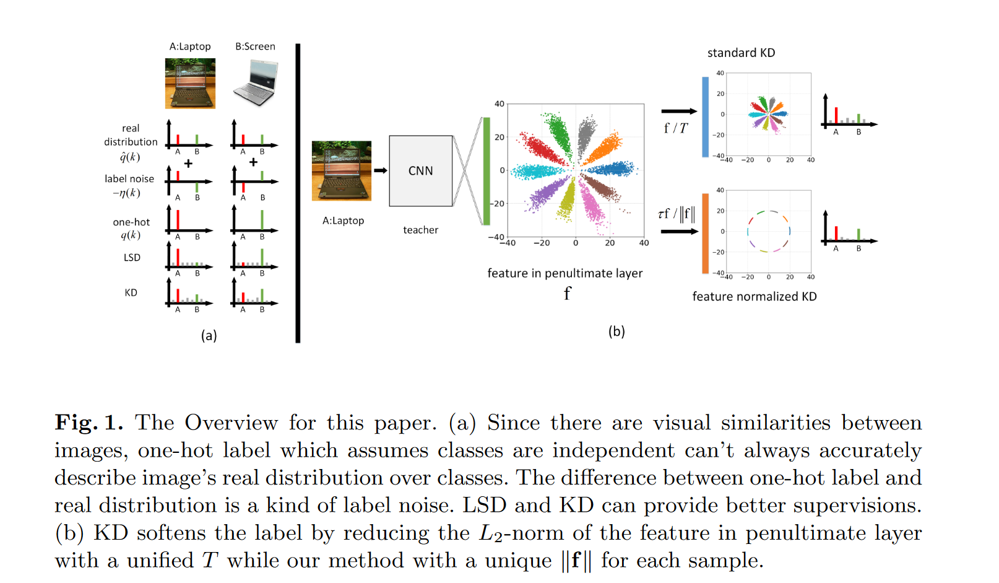
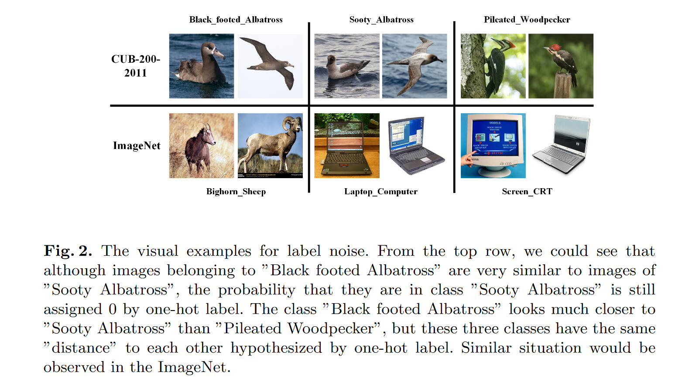

# Feature Normalized Knowledge Distillation for Image Classification

**[ECCV 2020](https://link.springer.com/chapter/10.1007/978-3-030-58595-2_40)	[code in github](https://github.com/aztc/FNKD)	CIFAR  FGVC  CUB200	20240510**  

*Kunran Xu, Lai Rui, Yishi Li, Lin Gu* 

这项工作从one-hot标签角度研究了标签分布和真实分布之间的差距，作者认为one-hot将所有类别看作是相互独立并不正确，提出将真实分布表示为one-hot分布加一个噪声的形式，并通过均匀的LSD和带偏移的LSD验证了这一想法。这项工作还研究了倒数第二层对于logit蒸馏的影响，认为倒数第二层特征的L2范数表达的是标签中的噪声强度，提出一个归一化KD，使用倒数第二层特征L2范数来代替温度系数来进行蒸馏。

## Introduction

这项工作从标签噪声的角度系统的分析了温度在KD中的作用机制，并将倒数第二层特征的L2范数引入到软标签中做了进一步改进。由于图像之间存在视觉相似性，假设类别相互独立的one-hot标签并不能准确的描述图像在类别上的真实分布。

从LSD的角度描述并分析了提出的这一噪声理论。并通过使用倒数第二层的L2范数来修正温度系数。

> 从one-hot标签噪声的角度分析了温度在知识蒸馏中的作用机制，并验证了较高的温度实际是对代表标签噪声强度的倒数第二层的特征的L2范数的一个修正因子
>
> 提出一个归一化KD，用于完善温度机制
>
> 展示了KD，LSD和HE（超球体嵌入）之间的关系，并通过实验验证了所提处的归一化知识蒸馏从KD和HE中获益

## Method

### Noise in One-Hot Label

考虑一个K类别的分类任务，对于一个给定的输入x，我们的目的是学习一个映射$\sigma(\psi(x;\theta))$来产生一个类别分布$p(k|x)$去估计真实分布$\hat{q}(k|x)$，$\sigma(·), \psi(x;\theta)$分别表示softmax和CNN网络。

通常我们不知道$\hat{q}(k)$的具体分布，使用$q(k)=\begin{cases}1\ k=t\\ 0\ k\neq t \end{cases}$来近似它。为了便于分析，我们在条件分布中省略x，通过q(k)近似会引入标签噪声

黑脚信天翁与烟灰信天翁非常相似，但他在后者的概率仍被one-hot标签标记为0，并且黑足信天翁要比北美黑啄木鸟更接近烟灰信天翁，但在one-hot的模拟下两者具有相同的距离。

由此可以看出one-hot标签假设类别之间是相互独立的，并且每个x都与其他类别没有相关性，但是其视觉上往往有很多的相似之处，one-hot的强假设会带来$q(k)$与$\hat{q}(k)$之间的噪声，因此我们引入一个补偿分布$\eta(k)$：
$$
\hat{q}(k) = q(k) + \eta(k)
$$
$-\eta(k)$可用来表示one-hot引起的噪声，尽管其含有噪声但很难手动找到比q(k)更精确的估计，我们通过一个简单的实验衡量标签噪声对模型精度的影响，引入标签平滑LSD来做一个估计：
$$
q_{lsd}(k) = (1-\epsilon_1)q(k)+\epsilon_1u(k)
$$
u(k)表示均匀分布，用$\frac{\epsilon_1}{1-\epsilon_1}u(k)$来估计$\eta(k)$，LSD实际是通过使用各向同性滤波来产生一个分布近似$\hat{q}(k)$，考虑到样本在不同类别中表现出不同的视觉相似性，我们提出一种各向异性的LSD，引入一种非均匀分布$\rho(k)$来进行估计：
$$
q_{alsd}(k) = (1-\epsilon_1-\epsilon_2)q(k)+\epsilon_1u(k)+\epsilon_2\rho(k) \\
\rho(k)=\begin{aligned}
\begin{cases}
\frac{1}{|\mathcal{A}(x)|} &k\in\mathcal{A}(x)\\
0 &k\notin\mathcal{A}(x)

\end{cases}
\end{aligned}
$$
其中A(x)表示更接近x真实类的集合，由数据集提供的类名决定。实验表明one-hot标签确实会造成模型精度的下降，随着$\eta(k)$估计的更加准确，我们会得到一个更加干净的目标来缓解one-hot标签带来的问题。

### Standard Knowledge Distillation

标准的蒸馏损失通常表示为：
$$
\mathcal{L}_{kd} = (1-\alpha)\mathcal{H}(q,\sigma(\psi(x;\theta))) + \alpha\mathcal{H}(q_{kd}, \sigma(\frac{\psi(x;\theta)}{T})) \\
q_{kd}(k) = \frac{exp(v_k/T)}{\sum^K_{i=1}exp(v_i/T)}
$$
当T=1时：
$$
\mathcal{L}_{kd}^{T=1} = \mathcal{H}(q_t,\sigma(\psi(x;\theta)))  \\
q_{t}(k) = (1-\alpha)q(k) + \alpha q_{kd}(k)
$$
与LSD比较可以发现$q_t(k)$与$q_{lsd}(k), q_{alsd}(k)$具有相同的作用，我们认为这也是对$\eta(k)$的一个估计，唯一区别是$u(k), \rho(k)$是预先定义的，$q_{kd}(k)$是另一个CNN从数据中学习得到的，LSD和KD都旨在去除one-hot标签中的噪声来产生更接近真实分布$\hat{q}(k)$的分布

当T不为1时，随着温度的升高，qkd(k)逐渐趋向于均匀分布。

### Feature in Penultimate Layer

CNN的最后一层通常为k元的全连接层，输入特征$f\in\R^D$通过线性变换$v=Wf, W\in\R^{C\times D}$获得logits v:
$$
v_i = W_i·f = ||f||\ ||W_i||cos(\theta_i)
$$
f对于每个vi都有相同的影响，若我们只想知道样本的类别，$||W_i||cos(\theta_i)$足以，||f||的作用是什么呢？先前工作证明更大的f范数能更好的贴合one-hot的分布，然而考虑到上述所说的标签噪声，更短的f其实是更合适的。因此这也解释了为什么存在一个T>1的温度系数，这可以作为L2范数的一个修正因子，来减弱||f||来缓解噪声的影响。

由于||f||部分由标记噪声决定，我们可以用||f||表示噪声强度，我们实验证明具有较低l2范数的图像具有相似的角度光照背景等，相对而言较高l2范数的图像看起来更有特点更容易区分。不同样本受到不同强度标签噪声的影响，我们提出一种新的特征归一化KD，根据每个样本的L2范数来抑制噪声，而不是对所有样本都使用相同的温度T。

### Feature Normalized Knowledge Distillation

我们使用样本特征的l2范数来表示one-hot标签中的噪声强度，较低L2范数表示较强的噪声强度，提出用L2范数的逆来为每个样本进行加权：
$$
q_{f_n}(k) = \frac{exp(\frac{\tau{v_k}}{||f||})}{\sum^K_{i=1}exp(\frac{\tau v_i}{||f||})}
$$
$\tau$是一个控制分布光滑性的参数，最终归一化的KD学习目标是：
$$
\mathcal{L}_{fn} = \mathcal{H}(q, \sigma(\psi(x;\theta))) + \lambda^2\mathcal{H}(q_{fn}, \sigma(\frac{\tau\psi(x;\theta)}{||f||}))
$$
