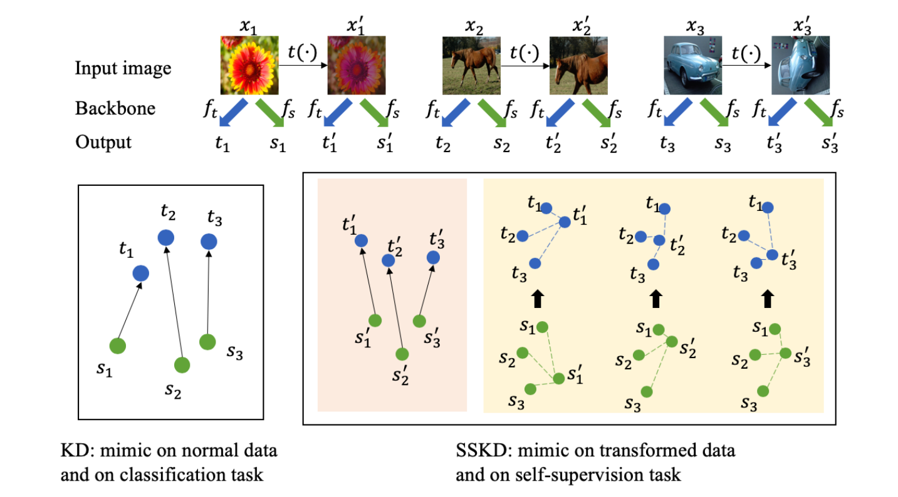
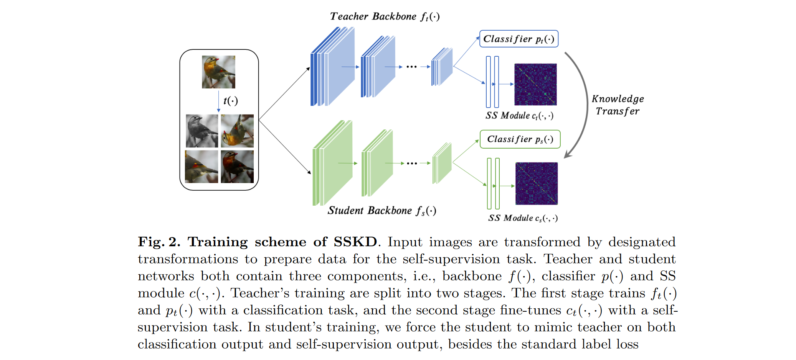

# Knowledge Distillation Meets Self-Supervision

**[ECCV 2020](https://link.springer.com/chapter/10.1007/978-3-030-58545-7_34)	[code in github](https://github.com/xuguodong03/SSKD)	CIFAR  ImageNet	20240517**

*Guodong Xu, Ziwei Liu, Xiaoxiao Li & Chen Change Loy* 

这项工作引入自我监督的辅助任务来帮助模型学习更全面的知识，通过对数据集进行变换来创建正负样本对，这个过程是为了获得更好的特征表示而不是为了扩充数据集，为了更好的利用变换样本带来的暗知识，提出了选择性转移策略，利用其分类排名作为评价指标，只转移正确知识和topK的知识来避免极端错误对学生模型带来的负面影响。SSKD的核心在于传递这种不准确但结构化的知识。

- 引入自监督对比损失来增强模型表示能力
- 引入选择性转移策略来保证这种不准确但结构化的知识不会给学生模型带来负面影响

## Introduction

先前的知识蒸馏方法具有高度的任务专用性，这些知识可能只反映了封装在一个繁琐网络中的完整知识的单方面。为了更丰富的暗知识，我们需要在原始分类任务之外增加一个辅助任务，提取出与分类知识互补的更丰富的信息。

这项工作中，我们引入了自我监督学习，令其作为辅助任务可以帮助从教师网络中获取更全面的知识。自监督学习最初目标是通过一个前导任务从数据中学习具有自然监督的表示（而不是人工的标签）

我们提出的SSKD，讲转换后的数据和自监督前导任务加入到蒸馏中，这种结构化的知识不仅提高了整体的蒸馏性能，还能使学生在少样本和噪声标签的情况下得到更好的表示。SSKD值传递最后一层的输出，具有模型无关性。

> 提出SSKD，利用自监督任务来促进教师网络到学生网络中提取更丰富的知识，这是第一个通过自监督任务定义知识的工作。
>
> SSKD极大提升了学生网络的泛化能力，在小样本和噪声环境下更具优势。

## Method

#### Contrastive Prediction as Self-Supervision Task

我们采用对比预测作为框架中的自监督任务，对比预测的总体目标是通过潜在空间中的对比损失来最大化数据点与其数据变换之间的一致性。

给定一个具有N个数据点的batch$\{x_i \}_{i=1:N}$，我们对每个样本应从从分布T中采样的独立变换t(·)得到数据$\{\tilde{x})_i\}_{i=1:N}$，将其输入到教师或学生网络中，提取表征$\phi_i=f(x_i), \tilde{\phi}_i = f(\tilde{x}_i)$，我们添加一个两层的多层感知器，在这个空间中应用对比损失，即$z_i = MLP(\phi_i), \tilde{z_i}=MLP(\tilde{\phi_i})$,$(\tilde{x}_i, x_i), (\tilde{x}_i, x_k)_{k\neq i}$分别表示正样本对和负样本对，我们要最大化正对的相似性并最小化负对的相似性，使用余弦相似度计算其相似性：
$$
\mathcal{A}_{i, j} = cosine(\tilde{z}_i, z_j) = \frac{dot(\tilde{z}_i, z_j)}{||\tilde{z}_i||_2||z_j||_2}
$$
对比损失表示为：
$$
L = -\sum_ilog(\frac{exp(cosine(\tilde{z}_i, z_i)/\tau)}{\sum_kexp(cosine(\tilde{z}_i, z_k)/\tau)}) = -\sum_ilog(\frac{exp(\mathcal{A}_{i, j}/\tau)}{\sum_kexp(\mathcal{A}_{i, k}/\tau)})
$$
SSKD中主要目标是学习对变换的不变表示，利用对比预测作为辅助任务，从教师模型中挖掘更丰富的知识。

### Learning SSKD 

SSKD主要由三部分组成，一个用于提取表示的主干f()，一个用于主要任务的分类器p()和一个用于特定自我监督任务的自监督模块SS

#### Training the Teacher Network

输入为原始数据x和变换数据x‘，我们选择了颜色丢失、旋转、裁剪和颜色失真四种变换，输入到主干网络得到其特征表示$\phi=f_t(x), \tilde{\phi}=f_t(\tilde{x})$

> "颜色丢失"指的是从图像中移除一部分颜色信息，使图像变得更加模糊或者降低色彩鲜艳度的操作。这可以通过多种方式实现，如将图像的某些色彩通道置零或减去固定值，或者应用一些滤镜效果等。
>
> "颜色扭曲"通常指对图像的色彩进行一系列变换，使图像的色彩分布发生改变。这些变换可以包括改变图像的亮度、对比度、饱和度等，或者对图像的色彩进行一些随机的增强或调整操作，以增加数据的多样性和模型的鲁棒性.

教师网络第一阶段使用分类损失对网络进行训练，只更新主干网络f(·)和分类器p(·)；由于变换T要比数据增强笨重的多，分类损失不在变换后的数据上计算，因为其目标是使x’在视觉上与x更不相似来增强模型而不是扩充数据集。

在第二阶段固定f(·) p(·)，仅使用对比损失更新ss模块。两个阶段具有不同的作用，第一阶段是简单的训练一个网络进行分类，第二阶段旨在适应ss模块使用现有的来自主干的特征进行对比预测。

#### Training the Student Network

在对教师模型ss模块进行训练之后，我们将softmax应用于教师相似度矩阵A，沿行向量生成一个概率矩阵$\mathcal{B}^t$，$\mathcal{B}^t_{i, j}$表示xi xj是正对的概率，对学生同理得到$\mathcal{B}^s$，计算师生模型ss模块之间的kl散度：
$$
L_{ss} = -\tau^2\sum_{i,j}\mathcal{B}^t_{i,j}log(\mathcal{B}^s_{i,j})
$$
变换后的数据点是对比预测的副产物，虽然我们不要求学生对其正确分类，但是我们可以鼓励学生分类器输出$p_s(f_s(\tilde{x}))$接近教师分类器的输出，损失函数为：
$$
L_T = -\tau^2\sum_{\tilde{x}\sim\mathcal{T}(\mathcal{D}_x)}\sum^C_{i=1}p_t^i(\tilde{x};\tau)log(p_s^i(\tilde{x};\tau))
$$
学生网络训练的总体损失表示为：
$$
L = \lambda_1L_{ce} + \lambda_2L_{kd} + \lambda_3L_{ss} + \lambda_4L_{T}
$$

### Imperfect Self-Supervised Predictions

对比损失教师很可能会产生一个不准确的预测，教师分配的错误答案很可能包含了丰富的教师知识，传递这种不准确但结构化的知识是我们SSKD的核心，但是一个极其错误的答案会误导学生学习，因此我们提出选择性迁移，利用其分类排名来表示误差水平。rank=1时表示预测正确，rank值越大误差越大，我们只传递正确的预测和错误排名前k的预测。这种策略显著抑制了教师预测中的潜在噪音，只传递有益的知识