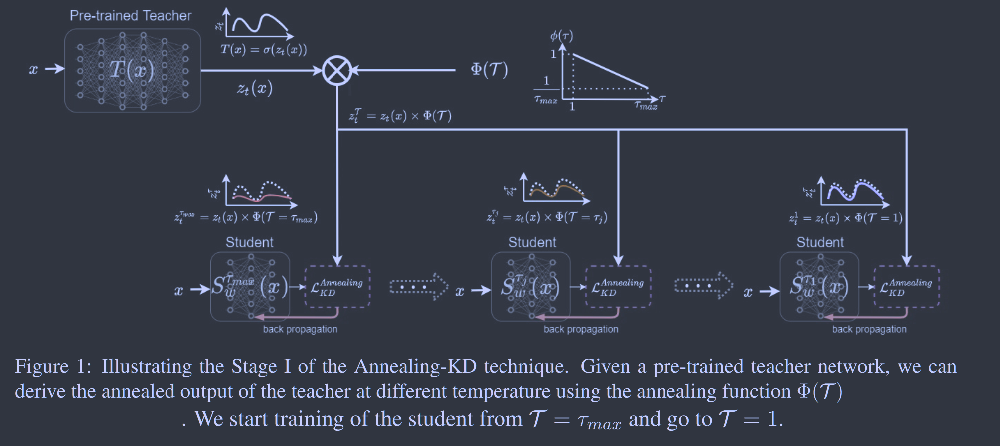
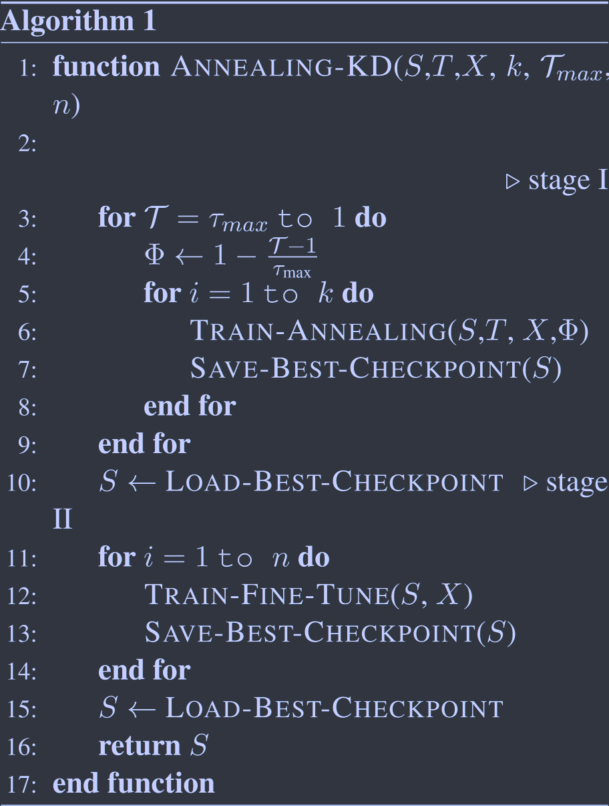

# Annealing Knowledge Distillation

**[ACL 2021](https://aclanthology.org/2021.eacl-main.212/)	no code	CIFAR10/100  GLUE	20240503**

Aref Jafari, Mehdi Rezagholizadeh, Pranav Sharma, Ali Ghodsi

针对师生网络能力差距较大时产生的性能下降问题，在温度系数上进行了优化来缓解这一问题，提出AKD，将蒸馏分为两阶段，第一阶段用MSE代替kl散度，在教师的引导下进行学习，初期给教师模型施加一个大的温度系数使之平滑让学生更容易进行学习，并随着轮次的进行逐步降低温度使之学习教师模型更尖锐的输出；第二阶段移除教师模型，使用数据集的标签对学生模型进行微调。

## Introduction

先前工作表明，师生网络之间的差距越大，利用知识蒸馏进行学习的难度就越大，先前工作提出通过助教来弥合这一差距，但是这需要单独训练TA网络增加了计算的复杂性，并且TA的误差也会累积到学生模型中。

这项工作提出了退火KD技术，引入一个带有动态温度项的KD损失来弥合师生模型之间的差距，AKD能够在不同温度下生成逐渐过渡的软标签，将教师的知识平滑的迁移到学生模型中

> 提出Annealing-KD(AKD)来解决师生差距问题，修改KD损失和引入动态温度函数来使学生训练渐进平滑
>
> 我们通过VC理论增加了算法的理论性
>
> 我们的方法简单可以应用到不同的KD框架上

## Method

我们提出的Annealing-KD分为两个阶段，第一阶段逐步训练学生使用我们的Annealing-KD损失来模仿教师，第二阶段使用交叉熵损失使用硬标签对学生模型进行微调：
$$
\mathcal{L} = \begin{aligned}
\begin{cases}
\mathcal{L}^{Annealing}_{KD}(i), &&Stage\ I:1\leq \mathcal{T}_i \leq \tau_{max} \\
\mathcal{L}_{CE}, &&Stage\ II:\mathcal{T}_n = 1
\end{cases}
\end{aligned}
$$
i表示当前训练轮数，第一阶段训练n个epoch，Ti表示每个轮次的温度值，Annealing-KD损失定义如下：
$$
\mathcal{L}^{Annealing}_{KD}(i) = ||z_s(x) -z_t(x)\times\Phi(\mathcal{T}_i)||_2^2 \\
\Phi(\mathcal{T}) = 1-\frac{\mathcal{T}-1}{\tau_{max}},1\leq\mathcal{T}\leq\tau_{max},\mathcal{T}\in\mathbb{N}
$$
我们初始设置$\mathcal{T}_1 = \tau_{max}$，随着训练轮次增加，温度逐渐降低。第一阶段训练一致持续到i=n，T=1，此时$\Phi(\mathcal{T}_n)=1$，zt没有任何软化。我们对比了在第一阶段使用KL散度和MSE，实验表明MSE效果更佳。我们通过引入退火函数来弥合学生模型和教师模型之间的差距，能够在不同温度下对教师生成的标签进行渐进转换麻将教师的知识平滑的传递给学生模型。

### Summary

- Annealing-KD不需要任何超参数来衡量软硬标签损失的贡献，因为它在不同的阶段分别对每个损失进行计算
- 我们的Annealing-KD使用MSE误差取代了KL散度
- 我们通过在Annealing-KD损失中定义退火函数来使用动态温度，而不是在KD中使用固定温度
- 我们实验表明在Annealing-KD中最好用logits代替softmax输出，且与KD不同的是我们没有在学生模型上加入温度系数

### Theoretical Justification

according to VC-throry:
$$
R(f_s) - R(f) \leq O(\frac{|\mathcal{F}_s|_c}{N^{\alpha_s}}) + \varepsilon_s
$$
R(·)表示误差项，$f_s\in\mathcal{F}_s$为属于函数类Fs的学习器，f为潜函数, |·|c为某个函数类的容量测度，$\varepsilon_s$为逼近误差，$0.5\leq\alpha \leq1$表示学习问题的难度，接近0.5表示问题难，学习的很慢；接近1表示学习容易能够很快学习

according to KD:
$$
R(f_s) - R(f_t) \leq O(\frac{|\mathcal{F}_s|_c}{N^{\alpha_{st}}}) + \varepsilon_{st}
$$
扩展到我们提出的AKD中：
$$
R(f_s^{\mathcal{T}}) - R(f_t^{\mathcal{T}}) \leq O(\frac{|\mathcal{F}_s|_c}{N^{\alpha_{st}^{\mathcal{T}}}}) + \varepsilon_{st}^{\mathcal{T}}
$$
当${\mathcal{T}}=1$时，有$f_t^1 = f_t,\ f_s^t=f_s,\ f^1=f,\ R_1(·)=R(·)$因此：
$$
R(f_s^1) - R(f_t^1) \leq O(\frac{|\mathcal{F}_s|_c}{N^{\alpha_{st}^{1}}}) + \varepsilon_{st}^{1}
$$
要想证明我们的方法要优于传统的KD，需要有以下不等式成立：
$$
O(\frac{|\mathcal{F}_s|_c}{N^{\alpha_{st}^{1}}}) + \varepsilon_{st}^{1} \leq O(\frac{|\mathcal{F}_s|_c}{N^{\alpha_{st}}}) + \varepsilon_{st}
$$

#### Proof.

在AKD中，每个温度下的学生网络都是在$f_s^{\mathcal{T}-1}$初始化的，与KD的随机初始化相比更接近于教师，因此使用退火教师要比传统KD学习的要快，也就是$\alpha_{st}^\tau \geq \alpha_{st}$, 因此有$\alpha_{st}^1 \geq \alpha_{st}$.

逼近误差取决于学习器的容量，在AKD中我们不改变学生模型的结构，因此我们有$\varepsilon_{st} = \varepsilon_{st}^\mathcal{T}$.

因此可以证明不等式$O(\frac{|\mathcal{F}_s|_c}{N^{\alpha_{st}^{1}}}) + \varepsilon_{st}^{1} \leq O(\frac{|\mathcal{F}_s|_c}{N^{\alpha_{st}}}) + \varepsilon_{st}$成立
