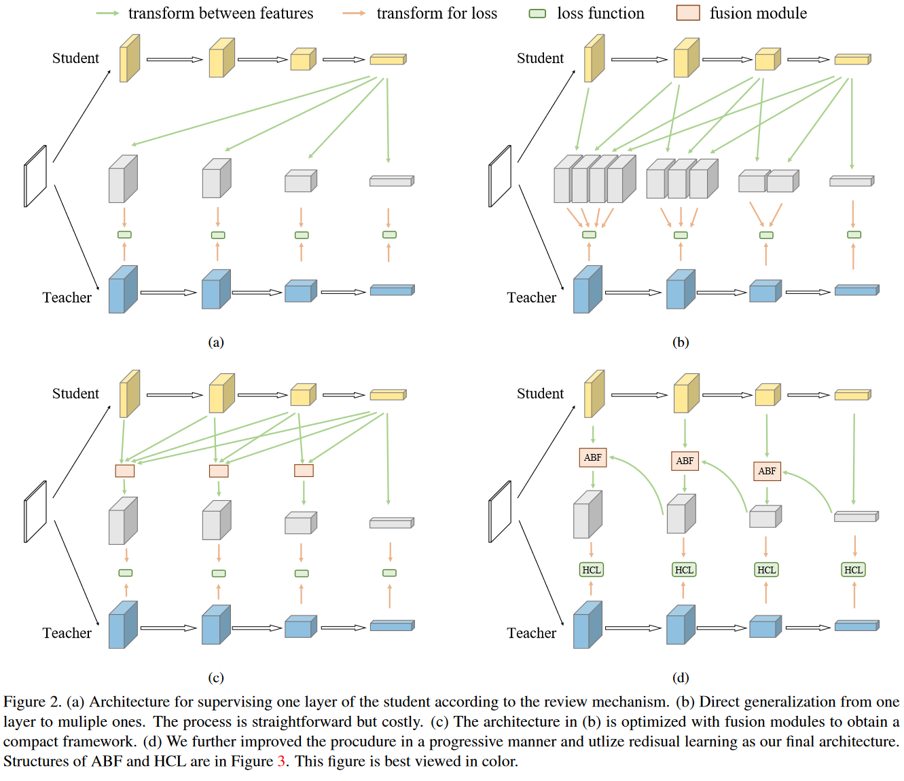
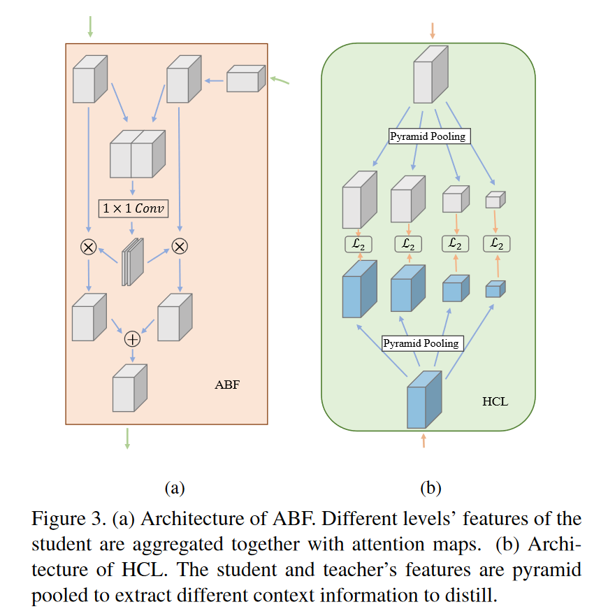

# Distilling Knowledge via Knowledge Review

**CVPR 2021	no code	CIFAR100  ImageNet  COCO2017**

先前工作都集中在使用相同级别的信息来指导学生进行学习，而忽略了跨层级的知识，本文提出一种新的学习框架，让学生的高层去学习教师模型的低层特征，并且引入了注意力融合ABF来完成对于教师模型从低层到高层特征的融合，并引入层级上下文损失HCL来完成到学生高层的知识传递

## Introduction 

现有方法大多都致力于提高蒸馏的效率，集中在变换和损失函数上，本文从教师和学生之间的连接路径上解决这一问题，先前方法都是只是用相同级别的信息来指导学生，我们考虑了以往知识蒸馏中被忽视的连接路径设计的重要性，并据此提出一个新的框架，我们发现学生的高阶段层能够学习教师网络的低层特征，关键是修改使用教师网络中的低级特征来监督学生的深层特征，从而提升整体的性能。

我们称之为知识回顾，这种机制利用先前较浅的特征指导当前特征，这意味着学生必须经常检查之前学过的内容，来更新对旧知识的理解。

> 我们提出了一种新的知识蒸馏中的回顾机制，利用教师的多级信息来指导学生网络的一级学习
>
> 我们提出一个残差学习框架来更好的实现回顾机制的学习过程
>
> 为了进一步提升回顾机制，提出一个基于注意力融合ABF模块和一个层次上下文损失HCL函数

## Method

### Review Mechanism

给定一个输入图像X和学生网络S，令Ys=S(X)表示学生网络输出的logit，S可以分为不同的部分$(S_1,S_2,...,S_n,S_c)$Sc为最后的分类器，S1...Sn为下采样层的不同阶段，Ys计算表述为：
$$
Y_s=S_c \circ S_n \circ ...\circ S_1(X)
$$
其中$\circ$表示函数的嵌套，$g \circ f(x) = g(f(x))$，Ys为学生的输出，中间体特征为$(F^1_s,...,F^n_s)$，第i层计算如下：
$$
F^i_s = S_i\circ S_{i-1}\circ...\circ S_1(X)
$$
对教师网络同理。单层的知识蒸馏可以表示为：
$$
\mathcal{L}_{SKD} = \mathcal{D}(\mathcal{M}^i_s(F^i_s), \mathcal{M}^i_t(F^i_t))
$$
其中M是将特征转换为注意力图或因子的目标表示的变换，D为距离函数，多层知识蒸馏表示为：
$$
\mathcal{L}_{MKD} = \sum_{i\in I}\mathcal{D}(\mathcal{M}^i_s(F^i_s), \mathcal{M}^i_t(F^i_t))
$$
I存储了特征层来传递知识。我们的回顾机制是利用先前的特征来指导当前的特征，单层的知识蒸馏表示为：
$$
\mathcal{L}_{SKD\_R} = \sum^i_{j=1} \mathcal{D}(\mathcal{M}^{i, j}_s(F^i_s), \mathcal{M}^{j,i}_t(F^j_t))
$$
将学生的特征固定为$F^i_s$然后利用教师的前i个层次的特征来指导，多层次蒸馏表示为：
$$
\mathcal{L}_{MKD\_R} = \sum_{i\in I}\bigg(\sum^i_{j=1} \mathcal{D}\Big(\mathcal{M}^{i, j}_s(F^i_s), \mathcal{M}^{j,i}_t(F^j_t)\Big)\bigg)
$$
我们通过$\lambda$来平衡任务损失和蒸馏损失：
$$
\mathcal{L} =\mathcal{L}_{CE} + \lambda\mathcal{L}_{MKD\_R}
$$

### Residual Learning Framework

我们首先设计了一个简单的框架，如a所示，变换层$M^{i,j}_s$简单的由卷积层和最近插值层组成，用于传递学生的第i个特征，以匹配教师的第j个特征的大小，我们不对教师特征做变换；b显示了将该思想直接应用于多层蒸馏，并提取了全级特征，然而由于阶段之间的巨大的信息差异，该策略并不是最优的，并且使用了所有的特征是一个复杂的过程，学习过程繁琐且耗费大量资源。

如c所示，当j固定时，教师特征$F^i_s$和学生特征$F^j_s-F^n_s$，U为融合模块，对学生特征进行融合近似:
$$
\sum^n_{i=j}D(F^i_s, F^j_t) \approx D(U(F^j_s,...,F^n_s), F^j_t)
$$
为了提高效率，融合计算可以进一步优化，如d所示，融合操作可以递归计算，应用于连续的特征图，$F_s^{j+1,n}$表示从$F^{j+1}_s$到$F^n_s$融合的特征图：
$$
\mathcal{L}_{MKD\_R} = \mathcal{D}(F^n_s, F^n_t) + \sum^1_{j=n-1}\mathcal{D}(\mathcal{U}(F^j_s, F^{j+1, n}_s), F^j_t)
$$
在这里ABF和HCL分别为针对该结构设计的融合模块和损失函数。

### ABF and HCL

ABF（Attention based fusion）首先将较高级别的特征调整为与较低级别特征相同的形状，然后将来自不同层次的两个特征串联在一起，生成两个H*W的注意力图，则和谐注意力图分别于两个特征相乘，最后将两个特征相加形成最后的输出。

ABF可以根据输入的特征生成不同的注意力图，因此可以对两个特征图进行动态聚合，这种聚合方式优于直接相加，因为特征图来自网络的不同阶段，信息是多样的，低层特征和高层特征可能集中在不同的区域上，注意力图可以更合理的对齐进行聚合。

通常L2可以有效的传递同一层次的信息，但在我们的框架中，不同曾是的信息被聚合在一起以便向教师学习，此时L2距离不足以传递复合的特征信息。我们提出HCL(hierarchal context loss)，利用空间金字塔池化，将知识的传递分离成不同层次的上下文信息，使之能够在不同的层次上更好的提取信息。

首先使用空间金字塔池化从特征中提取不同层次的知识，然后使用L2距离分别蒸馏他们的知识。

