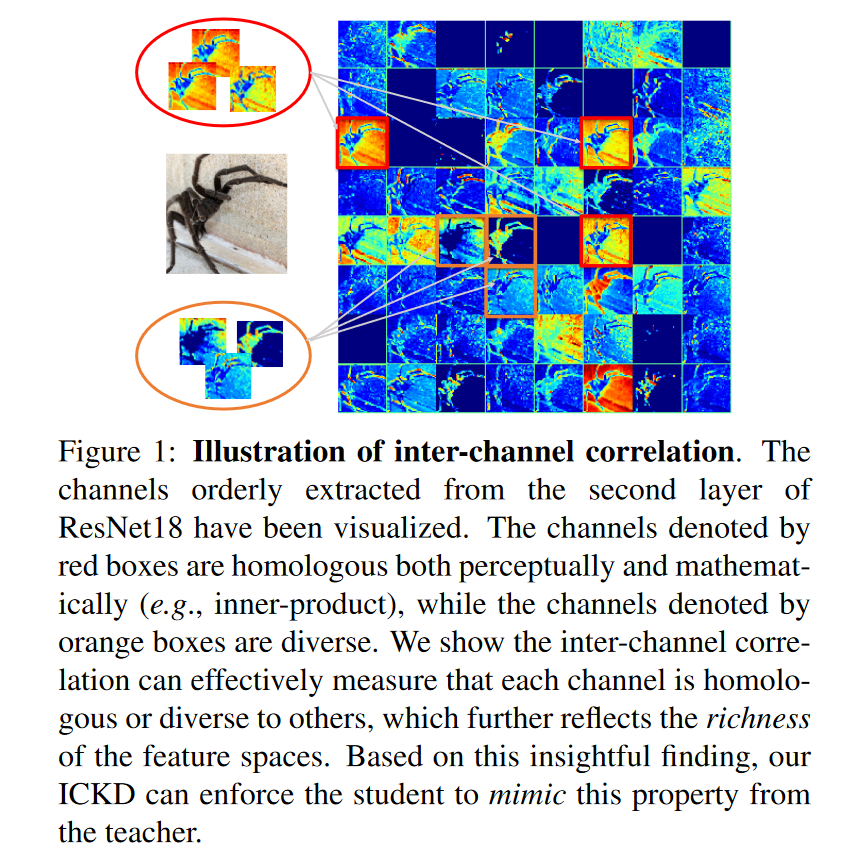
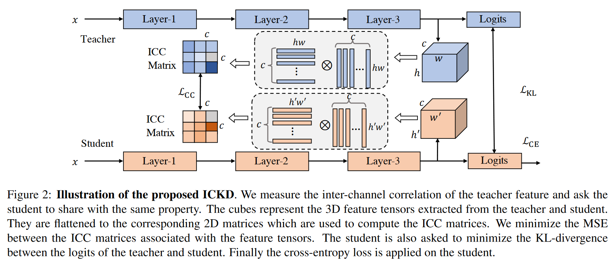
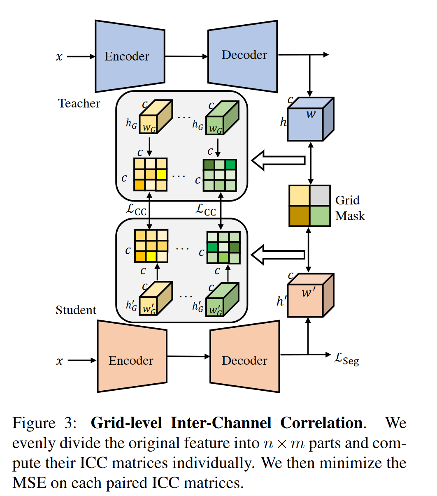

# Exploring Inter-Channel Correlation for Diversity-preserved Knowledge Distillation

**[ICCV 2021](https://openaccess.thecvf.com/content/ICCV2021/html/Liu_Exploring_Inter-Channel_Correlation_for_Diversity-Preserved_Knowledge_Distillation_ICCV_2021_paper.html)	[code in github](https://github.com/ADLab-AutoDrive/ICKD)	ImageNet  CIFAR100  PascalVOC	20240419**

*Li Liu, Qingle Huang, Sihao Lin, Hongwei Xie, Bing Wang, Xiaojun Chang, Xiaodan Lian*

这项工作指出先前的方法没有关注到特征通道之间的相似性，提出ICC通道间相关性，让学生模型去学习模仿教师模型通道间的相似性和多样性，对于分类任务等较小的特征图，直接对每个通道的特征图拉平计算内积得到相似度矩阵，针对密集预测等较大的特征图，提出了分块蒸馏策略，特征图进行分块分别计算相似性，然后对每个块的相似性信息进行聚合。

**2022CVPR Knowledge Distillation via the Target-aware Transformer 认为分块蒸馏丢失了全局信息，失去了长程依赖性，引入锚点蒸馏补充其全局信息**

## Introduction

先前工作专门用于实例级分类的技术可能导致学生主要学习实例级的信息，而不是结构信息，这些方法通常利用实例的相关性来描述特征空间中的几何、相似性或不相似性，我们称之为流行的层级关系知识蒸馏，因为其主要关注层级上探索特征图之间的相关性。我们的工作更关注通道之间的相关性。

现有的工作忽略了特征多样性和同源性的重要性，因此特征多样性与同源性的比例可能与我们的期望不平衡。本文采用通道间相关性ICC作为特征分布多样性和同源性的指标，由于师生模型能力的差异，强迫学生模仿教师的整个特征图是不可行的，因此我们让学生模型从教师那里学习通道间相关性，即通道相关性知识蒸馏ICKD。

> 我们引入了通道间相关性，具有空间维度不变性的特点，来探索和度量特征的多样性和同源性来帮助学生更好的进行表征学习
>
> 引入网格级的通道间相似性，使我们的框架能够胜任密集预测任务
>
> 我们再不同的网络架构、下游任务、数据集上进行了广泛的实验

## Method

$\mathcal{X}^N$表示一组基数为N的不同示例，教师模型T和学生模型S分别用$f^T, f^S$来表示，$F^T\in \R^{c\times h\times w}$表示教师网络的特征向量，同理对学生网络有$F^S\in \R^{c'\times h'\times w'}$

### Formulation

我们介绍通道相关性的公式，给定两个通道，相关指标应返回其相关性的值，高值表示同源性，低值表示多样性：
$$
\mathcal{G}^{F^T}_{m,n} = K(v(F^T_M), v(F^T_n)) \tag{2}
$$
$F^T_m \in \R^{h\times w}$表示通道m的特征图，v(·)将2d特征图转换为一维的特征向量，K(·)表示计算相关性的函数，这里我们使用内积来计算。上式将返回一个标量，因此我们可以重写为矩阵乘法计算所有通道之间的相似性：
$$
\mathcal{G}^{F^T} = f(F^T) · f(F^T)^T \tag{3}
$$
$f(F^T) \in \R^{c\times hw}$，生成的ICC矩阵大小为$c\times c$而与空间维度h和w无关，根据先前工作的经验设置，我们在学生特征之上增加一个线性变换层Cl，由一个1*1卷积和没有激活函数的BN层组成，可以通过该线性变换层调整师生模型通道数的维度匹配，通过L2损失来度量ICC矩阵之间的损失：
$$
\mathcal{L}_{CC} = \frac{1}{c^2}||\mathcal{G}^{C_l(F^S)} - \mathcal{G}^{F^T}||_2^2 \tag{4}
$$
我们将上述方法称为ICKD-C，其主要是为图像分类而开发：
$$
\mathcal{L}_{ICKD-C} = \mathcal{L}_{CE} + \beta_1\mathcal{L}_{KL} + \beta_2\mathcal{L}_{CC} \tag{5}
$$

### Grid-Level Inter-Channel Correlation

Eq3简单的将3D特征转化为相应的2D矩阵来计算ICC，当特征图非常大时例如语义分割任务，其内积会有一个比较小的数量级，很容易受到噪声的影响进而导致不稳定性，受分治法启发，提出对特征图进行拆分然后分别进行蒸馏。

我们引入网格级的通道间相关性，将特征图$F^T$划分为$n\times m$部分，$F^T_{(i, j)}, i=1, 2, ..., n, j=1, 2, ..., m$，每一块的大小为$c \times h_G \times w_G, h_G = h/n, w_G = w/m$，对每一块分别计算ICC然后进行聚合：
$$
\mathcal{G}^{F^T_{(i, j)}} = f(F^T_{(i,j)})·f(F^T_{(i, j)})^T \\
\mathcal{G}^{F^S_{(i, j)}} = f(F^S_{(i,j)})·f(F^S_{(i, j)})^T \\
\mathcal{L}^{n\times m}_{CC} = \frac{1}{n\times m\times c^2}\sum^n_{i}\sum^m_j||\mathcal{G}^{F^T_{(i, j)}} - \mathcal{G}^{F^S_{(i, j)}}||^2_2
$$
我们使用Grid Mask将整个特征图均匀的划分为不同的组，尽管空间维度发生改变，ICC矩阵大小仍取决于通道数，且划分还有助于提取更多的空间和局部信息，这个变体称为ICKD-S主要用于语义分割等密集预测任务：
$$
\mathcal{L}_{ICKD-S} = \mathcal{L}_{Seg} + \alpha\mathcal{L}^{n\times m}_{CC}
$$
