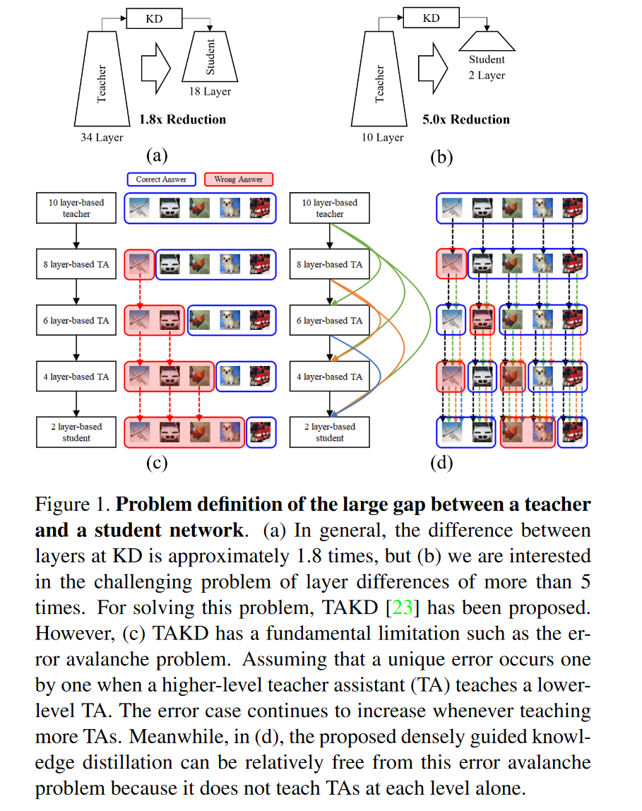
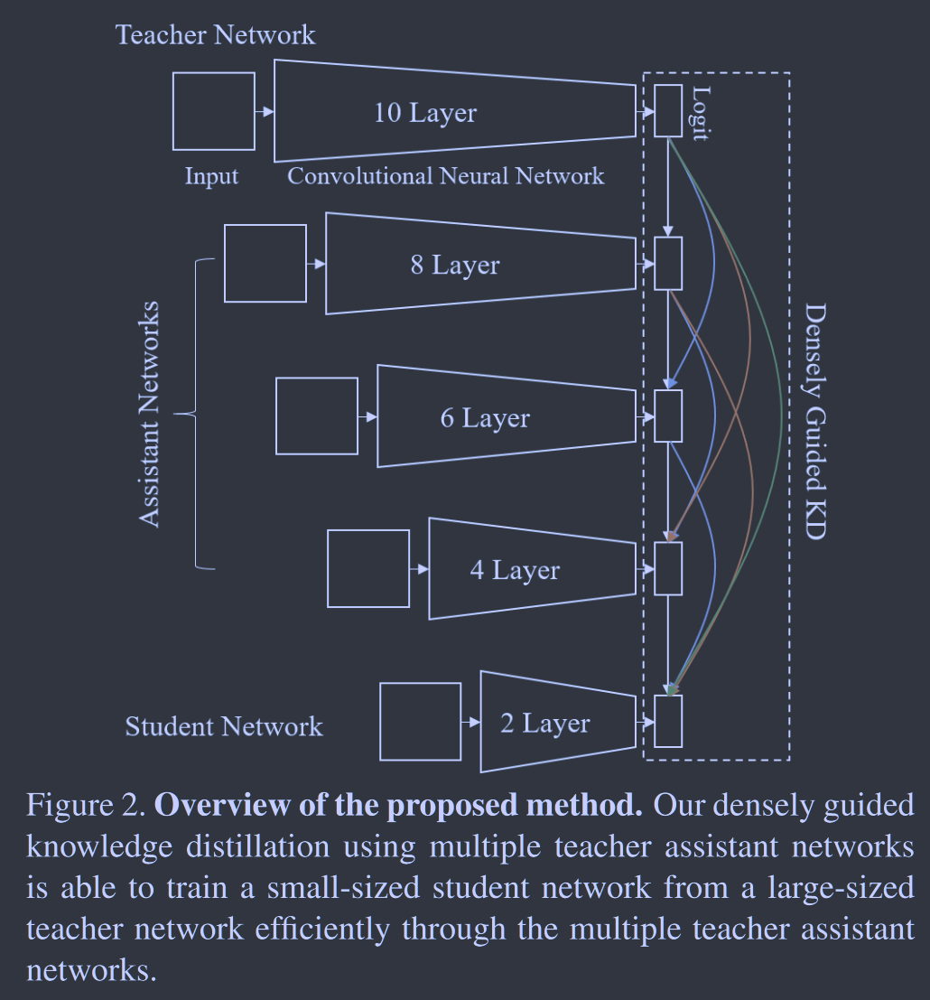
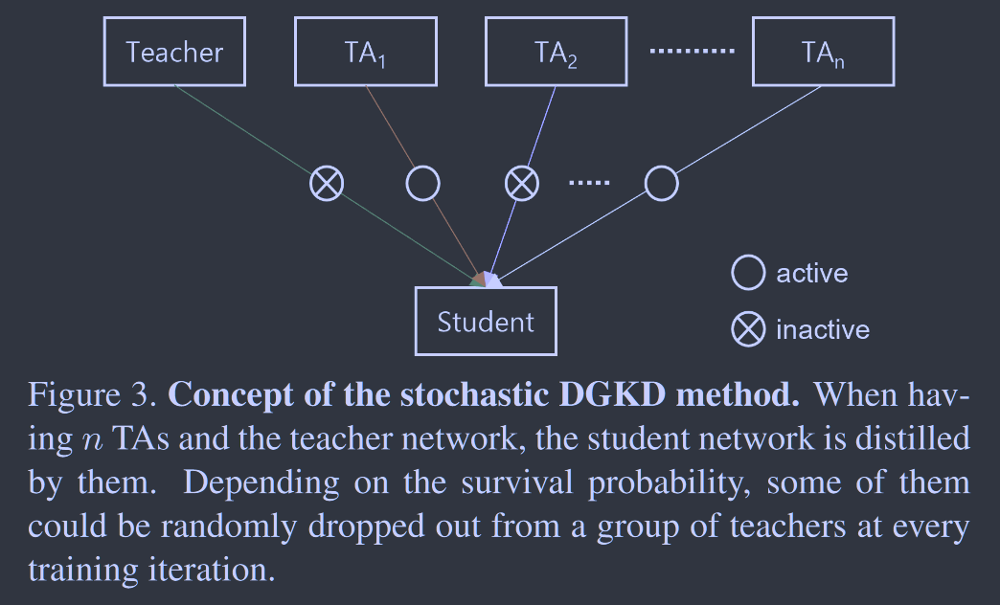

# Densely Guided Knowledge Distillation using Multiple Teacher Assistants

**[ICCV 2021](https://openaccess.thecvf.com/content/ICCV2021/html/Son_Densely_Guided_Knowledge_Distillation_Using_Multiple_Teacher_Assistants_ICCV_2021_paper.html)	[code in github](https://github.com/wonchulSon/DGKD)	CIFAR10/100  ImageNet	20240419**

*Wonchul Son, Jaemin Na, Junyong Choi, Wonjun Hwang*

本文针对师生模型差距较大时学生模型训练不良的问题进行了研究，主要是针对2020AAAI提出的TAKD引入助教来弥合差距这一方法的改进，TAKD有一个问题就是其辅助模型判错时这个错误会一直累计下去造成学生模型的性能不佳，本文借鉴DenseNet的设计思想提出了DGKD，用先前所有的TA和教师模型对学生模型进行蒸馏学习缓解这一问题，并借鉴Dropout的思想对TA进行随机丢弃来缓解过拟合的问题。

***2020AAAI Improved Knowledge Distillation via Teacher Assistant***

## Introduction

学生网络和教师网络差距较大时，很少有研究来解决学生网络学习不良的问题，先前方法TAKD提出引入一个助教来弥补师生模型之间的差距，但是这种方法一旦中间过程出错会一层层的累计传递给后方的学生模型造成性能的下降。

这项工作提出一个密集引导蒸馏DGKD， 使用多个TAs来有效的学习学生模型，与TAKD不同的时，当为目标学生模型学习一个规模逐渐减小的TA时，知识不仅从更高级别的TA中提炼，而是在先前所有的TA教师中抽取，因此通过这种方式先前方法的错误累计问题被缓解，最终模型能获得更好的效果。并且引入随机学习，学生训练过程中随机移除一部分来自训练者的引导知识，作为一种正则化手段来处理过拟合的问题。

> 我们提出DGKD，密集的引导每个TA网络与更高级别的TA和教师，有助于缓解错误累计导致的雪崩问题
>
> 提出随机DGKD算法，有效训练来自教师和多个TA的学生网络

## Method

当师生模型差距较大时，最好的老师并不是总能很好的指导学生，TAKD提出使用助教TA来弥合这种差距，TA比学生更聪明，但比老师更差，TA的知识有限会限制学生的学习，这里就引发了一个矛盾。

#### Densely Guided Knowledge Distillation

我们提出DGKD来解决这一矛盾，使用多个TA依次训练密集引导知识蒸馏，这种结构思想来自于DenseNet，我们可以在辅助模型和学生模型之间使用几个蒸馏损失，假设有两个TA模型A1和A2与教师模型T，则：
$$
L_{A_1} = L_{T \rightarrow A_1}, \\
L_{A_2} = L_{T \rightarrow A_2} + L_{A_1 \rightarrow A_2}
$$
最终学生模型的损失可以表示为：
$$
\begin{aligned}
L_S &= L_{T \rightarrow S} + L_{A_1 \rightarrow S} + L_{A_2 \rightarrow S} \\
& = (1-\lambda_1)L_{CE_S} + \lambda_1L_{KD_{T \rightarrow S}} + (1-\lambda_2)L_{CE_S} + \lambda_2 L_{KD_{A_1 \rightarrow S}} + (1-\lambda_3)L_{CE_S} + \lambda_3 L_{KD_{A_2 \rightarrow S}}
\end{aligned}
$$
若有n个辅助模型，且$\lambda$取相同的值，总损失可以写成：
$$
L_S = (n+1)(1-\lambda)L_{CE_S} + \lambda(L_{KD_{T\rightarrow S}} + \sum^n_{i=1}L_{KD_{A_i \rightarrow S}})
$$
从先前的所有助教网络中提取互补的知识，聚合起来教授给学生，学生模仿从较大的教师网络到较小的TA网络的各种logits分布，导致学生的学习效率在即使有较大的差距时也能得到很好的提高。

#### Stochastic DGKD

提出随机学习策略，由于有多个辅助模型来教授具有较大差距的浅层模型，可能导致过拟合的问题，因此我们从复杂的教师模型和助教模型中抽取知识组合来作为正则化策略，缓解了过拟合的问题。

我们使用伯努利分布来采样决定每一个TA是否启用，即：
$$
L_S = (n+1)(1-\lambda)L_{CE_S} + \lambda(L_{KD_{T\rightarrow S}} + \sum^n_{i=1}b_iL_{KD_{A_i \rightarrow S}})
$$
