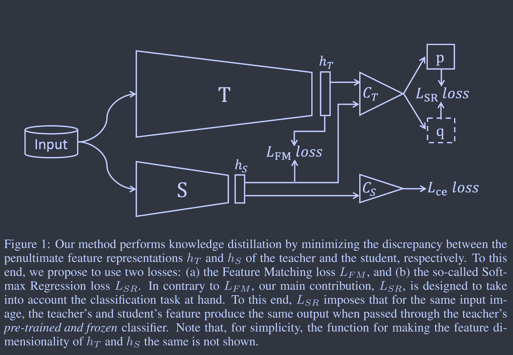
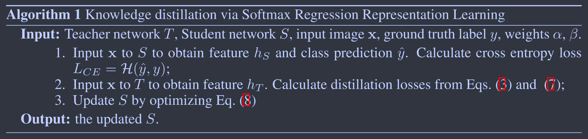

# Knowledge Distillation via Softmax Regression Representation Learning

**[ICLR 2021](https://openreview.net/forum?id=ZzwDy_wiWv)	[code in github](https://github.com/jingyang2017/KD_SRRL)	CIFAR10/100  ImageNet**

*Jing Yang, Brais Martinez, Adrian Bulat, Georgios Tzimiropoulos*

这项工作提出了两个损失函数，第一个直接用来匹配特征，专注于倒数第二层的特征，类似于FitNets；第二个损失计算logits，师生模型都利用教师的分类器计算一个输出，在这里优化一个分类损失来帮助学生模型对教师模型特征层的学习。

这项工作与2022CVPR-SimKD很相似，后者核心观点也是重用教师模型的分类器

## Introduction 

最近的工作中，训练一个输出特征表示丰富且强大的网络，在无监督和有监督学习中都被证明对后续分类任务实现高精度至关重要，本文主张通过优化学生的倒数第二层输出特征，实现基于表征学习的知识蒸馏。

我们提出两个损失函数，第一个直接匹配特征，但只专注于优化学生的倒数第二层特征，由于直接的特征匹配可能会因为学生的表征能力较弱而变得困难，且它脱离了现有的分类任务，因此第二个损失用来将表征学习和分类解耦，利用教师预训练的分类器来训练学生的倒数第二层特征。

## Method

我们用T和S表示教师网络和学生网络，将其分为两个部分，一个卷积特征提取器$F^i_{Net}\in\R^{C^i_{Net}\times H^i\times W^i}$，$h_{Net}=\sum^{H^L}_{h=1}\sum^{W^L}_{w=1}F^L_{Net} \in \R^{C^L_{Net}}$为最后一层的特征表示；一个投影矩阵$W_{Net}\in\R^{C^L_{Net} \times K}$将特征表示$h_{Net}$投影到K类logit$z^i_{Net}， i=1,...,K$中，然后又softmax计算类别概率$s(z^i_{Net}) = \frac{exp(z^i_{Net} / \tau)}{\sum_jexp(z^j_{Net} / \tau)}$

经典的KD Loss:
$$
L_{KD} = -\sum^K_{k=1}s(z^k_T)logs(z^k_S) \tag{1}
$$
FitNets匹配中间层特征表示，对于第i层：
$$
L_{Fit} = ||F^i_T-r(F^i_S)||^2 \tag{2}
$$

我们提出最小化表示hT和hS之间的差异，我们提出两个损失，第一个是L2特征匹配损失：
$$
L_{FM} = ||h_T - h_S||^2	\tag{3}
$$
这是一种简化的FitNet损失，这个特征直接与分类器联系在一起，将学生特征与教师特征相似，可能会对分类精度产生更多的影响。当学生是表征能力较低的网路时，为什么要对其他中间层表征进行优化（FitNets）这是值得商榷的，我们实验证明$L_{FM}$单独具有积极影响，其他层的特征匹配没有帮助。

$L_{FM}$有一个缺点是，所有的特征匹配损失都独立的对待特征空间中的每个通道维度，而忽略了特征表示hs和hT的通道间的依赖关系，因此我们提出第二个损失来优化与分类精度直接相关的hS，我们使用教师预训练的Softmax Regression (SR)分类器。

令p表示教师网络在输入图像x时的输出，让学生网络对同一幅图像进行学习，得到特征为hS(x)，通过教师的SR分类器得到输出q：
$$
L_{SR} = -p\ log\ q	\tag{4}
$$
若p=q，则说明$h_S(x)=h_T(x)$，上式确实可以优化学生的表征，损失可以重写为：
$$
L_{SR} = -s(W'_Th_T)\ log\ s(W'_Th_S)	\tag{5}
$$
以类似的方式重写KD损失：
$$
L_{KD} = -s(W'_Th_T)\ log\ s(W'_sh_S) \tag{6}
$$
对比可知，我们方法唯一的不同在于预训练的冻结的教师模型即用于教师也用于学生，相反在KD中，Ws也得到了优化，这给优化算法提供了更多的自由度，特别是调整特征提取器fs和学生分类器Ws的权重，以尽量减少损失，这阻碍了学生特征表示hs的学习。

实践中，logits之间存在一个l2损失，我们发现其效果优于交叉熵：
$$
L_{SR} = ||W'_Th_T - W'_Th_S||^2 = ||h_T-h_S||^2_{W_T} \tag{7}
$$
最终我们的损失表示为：
$$
L = L_{CE}+\alpha L_{FM} + \beta L_{SR} \tag{8}
$$

