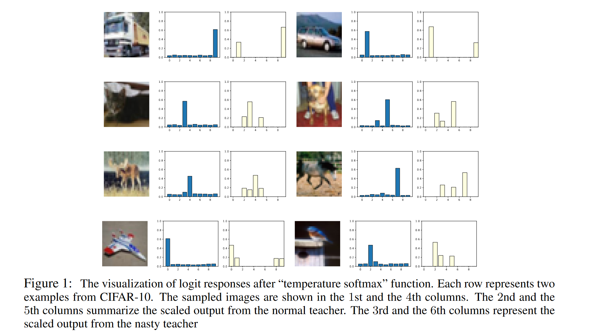

# UnDistillable: Making A Nasty Teacher That Cannot Teach Students

**[ICLR 2021](https://arxiv.org/abs/2105.07381)	[code in github](https://github.com/VITA-Group/Nasty-Teacher)	CIFAR10/100	20240426**

*Haoyu Ma, Tianlong Chen, Ting-Kuei Hu, Chenyu You, Xiaohui Xie, Zhangyang Wang*

这项工作针对logit蒸馏能够随意克隆受保护模型的问题提出了一种教师模型的保护方法，通过引入对抗性的思想，最大化教师模型与预训练模型的KL散度来让教师模型尽可能的获得释放错误信号的能力，创造一个错误的软标签来迷惑学生，这个软标签的次高置信度类别可能与主类没有任何相似性，通过这种方式使其失去蒸馏克隆的能力。

## Introduction

知识蒸馏通过模仿输入输出行为，将拥有的知识从教师网络转移到学生网络。但是这种模式可能对机器学习知识产权带来风险，许多模型仅作为可执行软件或API发行，KD技术提供了一个漏洞，使其可以训练一个学生模型来模仿其行为。

为了缓解这个问题，我们提出一种防御方法，称之为Nasty Teacher讨厌的老师。其表现与正常模型几乎相同，但是能大大降低试图模仿他学习的学生模型性能。

> 可以在不牺牲性能的情况下防止知识泄露和通过未授权的KD进行克隆
>
> 我们通过最大化讨厌老师和正常模型之间的差异来构建模型

## Method

我们的想法是在保证正确分类的基础上，最大限度的干扰其他类别的概率分数，使其无法从logit蒸馏中获得有益的信息，令$f_{\theta_T}(·),f_{\theta_A}(·)$为所期望的讨厌老师和预训练的用于对抗性训练的模型，我们最大化教师模型和对抗性网络之间的KL散度，从而获得一种错误的泛化表示：
$$
\underset{\theta_T}{min} \sum_{(x_i, y_i)\in \mathcal{X}} \mathcal{XE}(\sigma(p_{f_{\theta_T}}(x_i)), y_i) - \omega\tau^2\mathcal{KL}(\sigma_{\tau_A}(p_{f_{\theta_T}}(x_i)), \sigma_{\tau_A}(p_{f_{\theta_A}}(x_i)))
$$
第一项为标准的交叉熵损失来保证教师模型的输出正确，后一项中$f_{\theta_A}(·)$为预训练的模型，在训练中不参与更新，最大化与其的KL散度让讨厌的教师模型尽可能的获得干扰信息使其失去蒸馏的能力。

通过讨厌教师输出的logit有多个高点，**这与蒸馏中的软标签的主要区别在于，这个次高置信度的类别可能与主要类别没有任何关系，从而传递给学生模型错误的信息来干扰其学习。**

这种方式获得的模型与普通模型精度相差小于1%，但使用其蒸馏的学生模型性能下降5%左右甚至是10%。